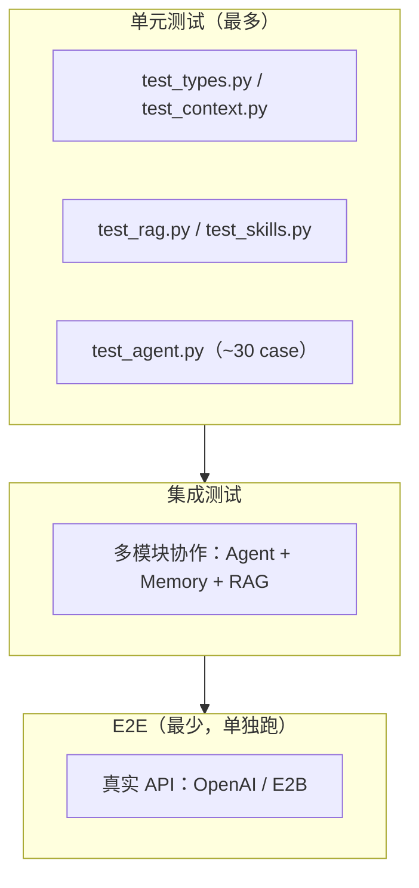
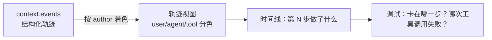

# 附录 3：可视化跟踪与测试

> 本附录基于真实测试方案：`agent-from-scratch_测试方案.md`
> 核心主线：如何为一个异步 Agent 框架建立「离线、分层、可门禁」的测试体系，并用 events 轨迹可视化 Agent 行为

---

## 一、核心问题

前 20 章构建了一个完整的 Agent 框架，但**「能跑」无法证明「跑对了」**。Agent 的难点在于：

1. **异步**：`Agent.run` 是 `async def`，测试必须原生支持异步；
2. **外部依赖多**：OpenAI、E2B、Tavily、ChromaDB——测试不能真连这些服务；
3. **行为不透明**：Agent 的「思考→行动」是内部状态，不可视化就难以调试。

本附录解决三个问题：

1. **怎么测**：三层测试体系（单元 → 集成 → E2E）；
2. **怎么离线**：mock 一切外部调用；
3. **怎么看**：用 `events` 轨迹可视化 Agent 的执行过程。

---

## 二、三层测试体系



**解读**：这是标准的**测试金字塔**——单元测试最多（快、稳定、覆盖核心契约），集成测试次之（验证模块协作），E2E 最少（慢、依赖外部、单独标记不默认跑）。对教学项目，单元测试尤其重要，因为每章都能对应一组可独立验证的用例。

### 2.1 三层定位

| 层 | 范围 | 运行时间 | CI 策略 |
|---|---|---|---|
| 单元 | 单函数/单类，mock 外部 | < 10s | 必跑 |
| 集成 | 多模块协作 | < 30s | 必跑 |
| E2E | 真实 API | 不计入 | 单独 job |

### 2.2 覆盖率门禁

测试方案设定的硬性门禁：

| 指标 | 阈值 |
|---|---|
| 行覆盖率 | `core/` ≥85%；`agent.py`/`llm/`/`memory/`/`tools/` ≥80% |
| 分支覆盖率 | `core/` ≥75% |
| 关键路径 | `Agent.run` 主循环、`LlmClient.generate`、`MemoryTool.process_llm_request` 必须覆盖**全部分支** |

---

## 三、离线默认：mock 一切外部调用

测试方案的第一原则是**「离线默认」**——CI 与本地默认不联网，不调真 API。

| 外部依赖 | mock 方式 |
|---|---|
| LLM（litellm/openai） | `pytest-mock` / `unittest.mock` 替换 `acompletion` |
| Embeddings | mock `get_embeddings` 返回固定向量 |
| E2B 沙箱 | mock `Sandbox.create` / `run_code` |
| Tavily 搜索 | mock 搜索返回 |
| ChromaDB | 用内存模式或 mock `collection` |

**为什么离线是硬原则**：外部调用有**不确定性**（网络抖动、API 限流、费用）和**副作用**（真实创建沙箱、真实消耗 token）。测试一旦依赖它们，就会「时而通过时而失败」，失去「门禁」的意义。

### 3.1 异步测试的配置

框架主体是 `async/await`，测试必须原生支持：

```toml
[tool.pytest.ini_options]
asyncio_mode = "auto"      # pytest-asyncio 自动识别 async 测试函数
```

`asyncio_mode = "auto"` 让 `async def test_...` 无需手动 `@pytest.mark.asyncio` 装饰器。

### 3.2 一个离线单测的范式

```python
import pytest

@pytest.mark.asyncio
async def test_agent_run_with_mocked_llm(mocker):
    # 1. mock LLM 客户端，让它返回预设响应
    mock_llm = mocker.Mock()
    mock_llm.generate.return_value = ...   # 预设的 LlmResponse

    # 2. 构造 agent，注入 mock
    agent = Agent(model=mock_llm, ...)

    # 3. 运行并断言
    result = await agent.run("你好")
    assert result.output is not None
```

**要点**：测试的「输入」是 mock 的预设响应，「断言」是 Agent 的**行为契约**（输出类型、状态、事件数量），而非「真实 LLM 说了什么」。

---

## 四、events 轨迹可视化

### 4.1 为什么 events 是天然的「跟踪日志」

回顾第 5 章：`ExecutionContext.events` 是 Agent 执行过程中**每一步**的记录（`Message` / `ToolCall` / `ToolResult`）。它天然是一份**结构化的执行轨迹**：

```text
Event(author="user", content=[Message(role="user", ...)])
Event(author="agent", content=[ToolCall(name="search_web", ...)])
Event(author="tool", content=[ToolResult(name="search_web", ...)])
...
```

把这份轨迹**可视化**，就能直观看到 Agent 的「思考→行动→观察」闭环。

### 4.2 可视化思路



**解读**：events 是「原料」，可视化是「呈现」。最简单的可视化是**按 `author` 分色打印时间线**（user 一种颜色、agent 的 ToolCall 一种、tool 的 ToolResult 一种），让「Agent 在某一轮调了什么工具、结果如何」一目了然。

### 4.3 一个极简轨迹打印器

```python
def print_trace(context):
    """极简 events 轨迹可视化：按 author 分色打印"""
    for i, event in enumerate(context.events):
        author = event.author
        # 提取事件内容摘要
        summary = str(event.content)[:80]
        print(f"[{i}] {author:6} {summary}")
```

**价值**：在 `Agent.run` 结束后调用 `print_trace(context)`，你能立刻看到整个执行过程——**哪一步调了工具、工具返回了什么、是否重试**。这是比 `verbose=True` 更结构化的调试手段。

### 4.4 可视化与测试的关系

- **测试**验证「**对不对**」（契约是否满足）；
- **可视化**诊断「**为什么不对**」（哪一步偏离了预期）。

二者互补：测试失败时，用 `print_trace(context)` 定位问题步骤；可视化发现的异常，反过来固化为新的测试用例。

---

## 五、自检

- [ ] 我能说清三层测试体系（单元/集成/E2E）各自的定位与 CI 策略。
- [ ] 我理解「离线默认」为什么是硬原则（不确定性 + 副作用）。
- [ ] 我能用 `pytest-asyncio` 的 `asyncio_mode="auto"` 写异步测试。
- [ ] 我理解 events 是「结构化执行轨迹」，可视化是「按 author 分色呈现」。
- [ ] 我能区分「测试验证对不对」和「可视化诊断为什么不对」。
