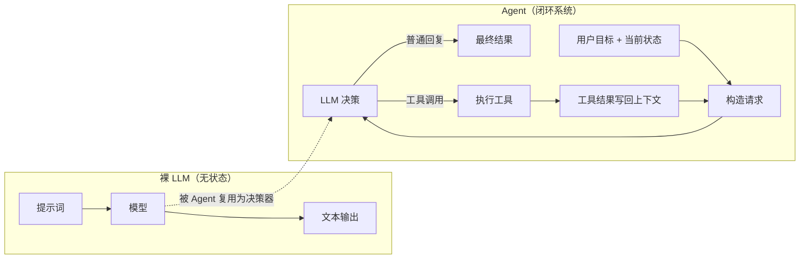
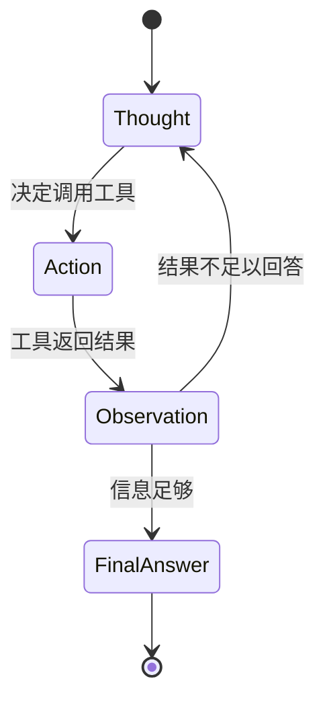

# 第 0 章：智能体（Agent）及 Agent 开发全景

> 本章是全书的概念起点，不涉及写代码。目标是在你动笔搭建项目之前，先建立一张**准确的心智地图**：什么是 Agent？它和"会聊天的 LLM"到底差在哪？自研一个 Agent 需要哪些基本技术？
>
> 后续每一章，都是这张地图上某一个格子的展开。

---

## 0.1 核心问题

**什么是 Agent？它和"会聊天的 LLM"有什么区别？**

这是全书的元问题。如果你能一句话讲清这个区别，你就已经理解了本书后面 20 章要造的那个东西的本质。

---

## 0.2 教学目标

学完本章，你应当能够：

1. **区分** LLM 与 Agent 的本质差异——LLM 是无状态的"大脑"，Agent 是"大脑 + 手脚 + 记忆 + 决策循环"。
2. **认识** 主流 Agent 产品（ChatGPT、Claude、Manus、Perplexity 等）与开发平台（LangChain、LlamaIndex、CrewAI、AutoGen、Dify、Coze 等），了解它们各自的位置。
3. **说出** ReAct 循环的三个环节（Thought → Action → Observation）与一个终止态（Final Answer），以及它们在真实代码中的对应物。
4. **建立** "自研 Agent 需要哪些基本技术"的完整地图，并能把后续 20 章的内容对号入座。

---

## 0.3 原理讲解：LLM 与 Agent 的本质差异

### 0.3.1 LLM 是无状态的"大脑"

一次普通的 LLM 调用，本质是一个**纯函数式的问答**：

```
输入（提示词） → 模型 → 输出（文本）
```

它有三个关键特征，决定了它"单靠自身"做不了复杂任务：

1. **无状态**：每次请求彼此独立。上一轮聊了什么，模型"不知道"——除非你把历史重新塞进这一次的输入里。
2. **无行动能力**：模型只能"生成文字"，不能执行代码、不能查数据库、不能发邮件、不能读写文件。
3. **无自我纠错闭环**：模型给出一个错误答案后，不会主动去"验证"并"修正"，因为它没有手段去获得反馈。

用一个比喻：**LLM 是一位被关在房间里的专家**——它知识渊博，但没有眼睛看外界，没有手去操作，也没有本子记录刚才说过什么。你每问一句，它都像是"第一次见到你"。

### 0.3.2 Agent 是"大脑 + 手脚 + 记忆 + 决策循环"

Agent 不是一种新的模型，而是一套**让模型参与到"感知—决策—行动"闭环里的程序系统**：

```
            ┌──────────────────────────────────────────┐
            │               Agent（程序闭环）            │
            │                                            │
   用户目标  │   感知环境 ──→ 推理决策 ──→ 执行动作       │
      │     │      ↑                        │           │
      │     │      └──────── 观察反馈 ←──────┘           │
      ▼     │                                            │
   最终结果 │   （记忆：把每一轮的历史记录下来）           │
            └──────────────────────────────────────────┘
```

与"裸 LLM"相比，Agent 多了三样东西：

| LLM 缺的 | Agent 补上的 | 对应能力 |
|---|---|---|
| 无状态 | **记忆 / 上下文** | 把历史事件、工具结果存下来，下一次请求带上 |
| 无行动能力 | **工具 / 手脚** | 函数调用、代码执行、搜索、文件操作 |
| 无纠错闭环 | **决策循环** | 拿到工具结果后，继续思考下一步，直到得出最终答案 |

这就是本课程要手写的全部东西。

### 0.3.3 配图：LLM 与 Agent 的对比

> 说明：0.3.2 的"感知环境 → 推理决策 → 执行动作 → 观察反馈"是 Agent 的**抽象闭环**；下面这张图是同一闭环在真实工程中的**落地形态**——"感知环境"具体化为"构造请求"，"推理决策"具体化为"LLM 决策"，"执行动作"具体化为"执行工具"，"观察反馈"具体化为"工具结果写回上下文"。



> **解读**：上半部分是"裸 LLM"——一条直线，进去出来就结束。下半部分是 Agent——一个带反馈回路的环。关键差异在于 `D6 → D2` 这条回路：工具结果会重新成为下一次请求的输入。LLM 只是 Agent 闭环里的"决策器"（`D3`），而非全部。

---

## 0.4 ReAct：Agent 决策循环的直观模型

ReAct（Reasoning + Acting）是理解 Agent 闭环最直观的模型。它把"一次决策"拆成三个环节：

| 环节 | 含义 | 问题 |
|---|---|---|
| **Thought（思考）** | 模型分析当前状态，决定下一步做什么 | "我现在知道什么？还需要什么？" |
| **Action（行动）** | 调用一个工具 | "去搜索、去计算、去读文件" |
| **Observation（观察）** | 拿到工具返回的结果 | "工具返回的结果告诉我什么？" |

三者循环，直到模型认为信息足够了，给出 **Final Answer（最终答案）**。因此完整地说，ReAct 是"**三个环节 + 一个终止态**"：Thought、Action、Observation 循环往复，Final Answer 终止。

### 配图：ReAct 循环



> **解读**：这个状态机是全书最重要的一张图。第 8 章你会亲手用代码实现它——`Thought` 对应模型生成的下一次决策，`Action` 对应 `ToolCall`，`Observation` 对应 `ToolResult`，`FinalAnswer` 对应助手最终回复。

---

## 0.5 Agent SDK 与自研框架的取舍

市面上有两条路：

| 路线 | 代表 | 优点 | 代价 |
|---|---|---|---|
| **用现成 SDK** | LangChain、CrewAI、AutoGen、LlamaIndex、Dify、Coze | 上手快、功能全、有生态 | 遮蔽内部机制，学完只会"调 API"，不会"造" |
| **读源码 + 手写** | 本书路线 | 掌握第一性原理，能 debug、能扩展 | 代码量大、周期长 |

**本课程的立场**：先造，再用。我们把 Agent 拆开，一行一行写出来，理解"模型如何决定下一步、工具如何被描述和执行、上下文如何持续、错误如何回传、多个 Agent 如何协作"。学完后，你回头看 LangChain，会发现它不过是用更工程化的方式包装了同样一套机制——那时你用它，是"选择"，而不是"依赖"。

> **为什么自研？** 因为 Agent 工程的核心难点不在于"调用模型"，而在于**边界**：模型生成的动作不可信，程序如何验证边界、执行副作用、记录事实、决定何时停止？这些只有亲手写一遍，才能形成肌肉记忆。

---

## 0.6 自研 Agent 需要的基本技术地图

下面是**脉络 A（Agent 机制）**的总览——它把"裸 LLM 补全成 Agent"所需的每一块能力列出。你现在不需要懂每一条，只需知道"有这么些格子要填"。第 1 章（项目预览）与第 3 章（Python 工程规范）属于另一条"工程规范"脉络，不在下表内。

| 能力 | 解决的问题 | 对应章节 |
|---|---|---|
| LLM 调用与封装 | 让大脑能"说话" | 第 2 章 |
| 消息类型 | 内部如何表示对话与工具交互 | 第 4 章 |
| 执行上下文 | 一次执行的状态存在哪 | 第 5 章 |
| 消息格式转换 | 内部协议 → 模型 API 格式 | 第 6 章 |
| 工具抽象 | 普通函数 → 模型能调用的工具 | 第 7 章 |
| ReAct 循环 | 大脑 + 手脚 + 循环组装 | 第 8 章 |
| 结构化输出 | 输出是机器可读的校验结果 | 第 9 章 |
| MCP | 接入外部工具生态 | 第 10 章 |
| RAG | 用外部知识增强回答 | 第 11 章 |
| 回调与审批 | 拦截、改写、人工审批动作 | 第 12 章 |
| 会话与长期记忆 | 跨多次运行记住对话与经验 | 第 13~14 章 |
| 上下文优化 | 裁剪超长上下文 | 第 15 章 |
| 规划与反思 | 显式拆解、复盘任务 | 第 16 章 |
| 代码执行沙箱 | 安全执行不可信代码 | 第 17 章 |
| Skills | 渐进式披露专业技能 | 第 18 章 |
| 多智能体编排 | 多个 Agent 协作 | 第 19~20 章 |

> **主线提醒**：这些能力不是 20 个独立 demo，而是**同一个项目**从第 1 章到第 20 章逐层长出来的器官。第 8 章结束时你有一个单智能体最小框架，第 20 章结束时它长成了支持多智能体、沙箱、记忆、技能的全功能框架。

---

## 0.7 动手实验

> 本章不写代码。实验的目标是**用一个真实的 Agent 产品，反向验证本章的概念**。

1. 打开任意一个 Agent 产品（ChatGPT 带工具/联网、Claude with tools、Manus、Perplexity 等）。
2. 让它完成一个**需要多步 + 工具**的任务，例如："帮我查一下当前某城市的气温，然后换算成华氏度。"
3. 观察并记录：
   - 它**调用了哪些工具**？（搜索？计算器？）
   - 它经历了**几轮** Thought → Action → Observation？
   - 它的**最终答案**是基于哪一次工具返回的结果得出的？
4. 试着把它抽象成 0.4 节的状态机：你能把它的行为映射到 `Thought/Action/Observation/FinalAnswer` 吗？

---

## 0.8 本章自检

对照教学目标，确认你能做到：

- [ ] 能用一句话讲清 LLM 与 Agent 的区别（"大脑" vs "大脑 + 手脚 + 记忆 + 循环"）。
- [ ] 能画出 ReAct 状态机，并说出 Thought/Action/Observation 各是什么。
- [ ] 能把"自研 Agent 需要的能力"（0.6 节技术地图）与后续各章对号入座。

如果这三条都满足，你已经带着正确的心智地图，可以进入第 1 章了。

---

