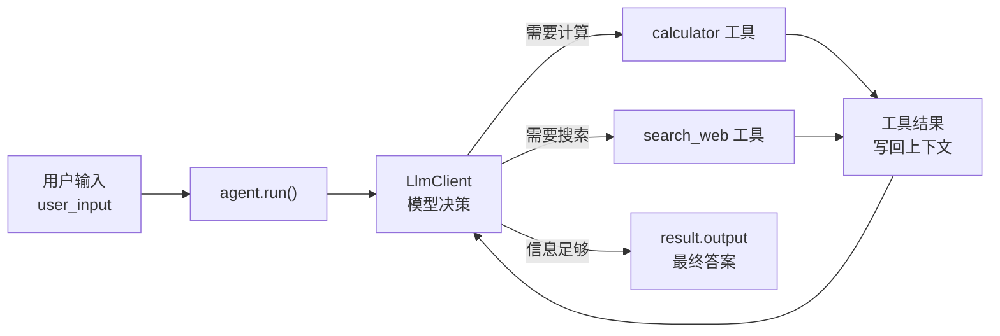

# 第 1 章：agent-from-scratch 项目预览

> 从本章开始，你不再旁观，而是要亲手把项目跑起来。本章目标只有一个：**在动手写代码之前，先把整个项目的全貌看清楚、跑通一个最小 Agent**。
>
> 后续每一章都在"这个项目"上叠加新能力。所以，本章建立的目录结构认知和运行方式，是你后面 19 章的地基。

---

## 1.1 核心问题

**这个项目长什么样？如何跑起来？**

---

## 1.2 教学目标

学完本章，你应当能够：

1. 读懂 `scratchagent` 项目的目录结构与模块边界。
2. 用 `uv sync` 完成环境搭建，并跑通 `examples/basic_agent.py`。
3. 说出顶层公开 API 的核心符号，以及"每章能力 → 源码模块"的映射关系。

---

## 1.3 项目目录结构导读

参考项目位于 `D:\00_persist\agent-from-scratch`。它的真实目录结构如下（与你将要亲手重建的一致）：

```
agent-from-scratch/
├── pyproject.toml              # 依赖、类型检查、测试命令（第 3 章重点）
├── .env.example                # 环境变量模板（API Key 等）
├── README.md                   # 教学说明（第 0 章已引用）
├── LICENSE                     # MIT 协议
├── src/scratchagent/           # ★ 核心包（你将要逐章重建的源码）
│   ├── __init__.py             # 顶层导出：29 个公开符号
│   ├── agent.py                # Agent 主循环（第 8 章）
│   ├── context.py              # ExecutionContext 与 AgentResult（第 5 章）
│   ├── types.py                # Message/ToolCall/ToolResult/Event（第 4 章）
│   ├── rag.py                  # 文本分块、向量检索（第 11 章）
│   ├── skills.py               # Skills 发现与注入（第 18 章）
│   ├── config.py               # 环境变量加载（load_project_env）
│   ├── llm/                    # 模型适配层（第 2 章）
│   │   ├── __init__.py
│   │   ├── _client.py          # LlmClient：请求/响应适配
│   │   └── _config.py          # Provider 与环境变量解析
│   ├── tools/                  # 工具系统（第 7、12、17 章）
│   │   ├── _base.py            # BaseTool / FunctionTool / @tool
│   │   ├── _helpers.py         # 函数 → 工具 schema 的辅助函数
│   │   ├── _calculator.py      # 计算器示例工具
│   │   ├── _search.py          # Tavily 搜索工具
│   │   ├── _callbacks.py       # 审批与结果压缩回调
│   │   ├── _file_tools.py      # 文件读写/删除/解压
│   │   ├── _memory_tool.py     # 记忆注入工具
│   │   └── _code_execution.py  # E2B 沙箱工具
│   ├── memory/                 # 记忆系统（第 13~15 章）
│   │   ├── _session.py         # 会话抽象与内存实现
│   │   ├── _long_term.py       # 任务长期记忆
│   │   └── _context_optimizer.py # 上下文优化
│   ├── orchestration/          # 多智能体编排（第 16、19、20 章）
│   │   ├── _sequential.py      # 顺序工作流
│   │   ├── _parallel.py        # 并行工作流
│   │   ├── _loop.py            # 循环工作流
│   │   ├── _transfer.py        # Agent 转移
│   │   └── _planning_reflection.py # 规划与反思
│   └── sandbox/                # E2B 沙箱生命周期（第 17 章）
│       └── _e2b_sandbox.py
├── examples/
│   └── basic_agent.py          # ★ 最小可运行示例（本章动手实验）
├── docs/                       # 四层文档：concepts/how-to/reference/tutorials
├── tests/                      # 测试（附录 3 展开）
├── labs/                       # 预留的实验目录（当前为空）
└── notebooks/                  # 预留的交互式学习路径
```

### 配图：scratchagent 包结构（一图看懂分层）

```mermaid
flowchart TD
    Root["src/scratchagent/"] --> Core["核心层"]
    Root --> LLM["llm/ 模型适配层"]
    Root --> Tools["tools/ 工具系统"]
    Root --> Mem["memory/ 记忆系统"]
    Root --> Orch["orchestration/ 编排层"]
    Root --> SB["sandbox/ 沙箱层"]

    Core --> A1["agent.py（主循环）"]
    Core --> A2["context.py（执行上下文）"]
    Core --> A3["types.py（消息类型）"]
    Core --> A4["rag.py / skills.py / config.py"]

    LLM --> B1["_client.py（LlmClient）"]
    LLM --> B2["_config.py（Provider 解析）"]

    Tools --> C1["_base.py（BaseTool/@tool）"]
    Tools --> C2["_calculator.py / _search.py"]
    Tools --> C3["_callbacks.py / _code_execution.py"]

    Mem --> D1["_session.py"]
    Mem --> D2["_long_term.py"]
    Mem --> D3["_context_optimizer.py"]

    Orch --> E1["_sequential.py / _parallel.py / _loop.py"]
    Orch --> E2["_transfer.py / _planning_reflection.py"]

    SB --> F1["_e2b_sandbox.py"]
```



> **解读**：`scratchagent` 是典型的 **src-layout** 分层包。注意两点：① 各子包内模块以下划线开头（`_client.py`、`_base.py`），表示"模块私有"，由各自 `__init__.py` 选择性导出——这是 numpy/pandas 也采用的通行做法；② 六条能力线（核心/LLM/工具/记忆/编排/沙箱）分别对应后续某一组章节，你在学习时可以"按线"回顾。

---

## 1.4 运行方式：三步跑起来

### 第一步：同步依赖

项目用 `uv` 管理依赖，Python 版本锁定在 `>=3.13.0, <3.14`：

```bash
uv sync              # 安装运行时依赖
uv sync --extra dev  # 追加安装开发依赖（pytest/mypy/black 等）
```

### 第二步：配置环境变量

```bash
copy .env.example .env   # Windows
# cp .env.example .env   # macOS / Linux
```

`.env` 里需要填写模型服务商的 API Key 与 Base URL（第 2 章详解）。核心是：

```text
OPENAI_API_KEY=你的密钥
OPENAI_BASE_URL=https://api.openai.com/v1
```

> **安全提醒**：`.env` 包含真实密钥，**绝不能提交到 Git**。项目根目录的 `.gitignore` 已忽略它。

### 第三步：运行最小示例

```bash
uv run python examples/basic_agent.py
```

如果一切正常，你会看到 Agent 调用搜索工具与计算工具，最终打印出答案。

---

## 1.5 源码精读：最小 Agent 是怎么组装的

`examples/basic_agent.py` 是全书第一个要读懂的源码。它只有 40 行，却浓缩了 Agent 的全部要素：

```python
from scratchagent import Agent
from scratchagent.llm import (
    LlmClient,
    Provider,
    resolve_model_config,
)
from scratchagent.tools import (
    FunctionTool,
    calculator,
    search_web,
)


async def basic_agent() -> None:
    openai_client = LlmClient(
        default_config=resolve_model_config(
            provider=Provider.OPENAI_COMPAT, model="gpt-5.5"
        )
    )

    user_input = (
        "最新奥运会百米赛跑的冠军速度是多少？用这个速度，从地球跑到月球要多长时间？"
    )

    agent = Agent(
        model=openai_client,
        tools=[FunctionTool(calculator), FunctionTool(search_web)],
        instruction="You are a helpful assistant",
    )

    result = await agent.run(user_input)
    print(f"最终结果是：{result.output}")


if __name__ == "__main__":
    asyncio.run(basic_agent())
```

逐段拆解：

1. **`LlmClient(...)`**：创建模型客户端。`resolve_model_config(provider=..., model=...)` 负责把"抽象 Provider + 模型名"解析成具体配置（第 2 章详解）。
2. **`FunctionTool(calculator)`**：把普通 Python 函数 `calculator` 包装成"模型能看懂、Agent 能调用"的工具（第 7 章详解）。`search_web` 同理。
3. **`Agent(...)`**：组装大脑（`model`）+ 手脚（`tools`）+ 指令（`instruction`）。
4. **`await agent.run(user_input)`**：启动 ReAct 循环。这是 Agent 的全部执行逻辑入口（第 8 章详解）。
5. **`result.output`**：`AgentResult` 里的最终答案。注意 `result` 里不只有答案，还有完整的执行轨迹（第 5 章详解）。

### 配图：最小 Agent 的运行数据流



> **解读**：这张图就是第 0 章"Agent 闭环"在 `basic_agent.py` 里的具体化。`run()` 在 `LlmClient` 与两个工具之间反复循环，直到模型认为信息足够，吐出 `result.output`。

---

## 1.6 顶层公开 API：9 个核心符号

`scratchagent` 顶层共导出 **29 个公开符号**（由 `__init__.py` 的 `__all__` 声明，附录 2 会讲它的审计故事）。其中 9 个是你最常接触的核心符号：

| 符号 | 作用 | 详解章节 |
|---|---|---|
| `Agent` | 组装大脑+手脚+循环的核心类 | 第 8 章 |
| `LlmClient` | 模型调用客户端 | 第 2 章 |
| `Message` | 普通文本消息类型 | 第 4 章 |
| `ExecutionContext` | 执行期状态容器 | 第 5 章 |
| `AgentResult` | run() 的返回值 | 第 5 章 |
| `LoopWorkFlow` | 循环编排工作流 | 第 19 章 |
| `SequentialWorkFlow` | 顺序编排工作流 | 第 19 章 |
| `ParallelWorkFlow` | 并行编排工作流 | 第 19 章 |
| `SkillInfo` | 技能信息结构 | 第 18 章 |

> 其余 20 个符号（如 `ToolCall`、`ToolResult`、`ContentItem`、`Event`、`create_tasks`、`reflection` 等）会在各自章节出现时逐一讲解，这里不必强记。

---

## 1.7 全书章节脉络总览

把 20 章能力映射到源码模块，形成一张"每章写什么、对应哪个文件"的总表（这是你后面 19 章的导航图）：

| 章节 | 主题 | 新增源码模块 |
|---|---|---|
| 第 2 章 | LLM 调用与 Provider 抽象 | `llm/_client.py`、`llm/_config.py`、`llm/__init__.py` |
| 第 3 章 | 脚手架与工程规范 | `pyproject.toml`（无新模块，规范为主） |
| 第 4 章 | 核心消息类型 | `types.py` |
| 第 5 章 | 执行上下文 | `context.py` |
| 第 6 章 | 消息格式转换 | `llm/_client.py` §build_messages |
| 第 7 章 | 工具抽象 | `tools/_base.py`、`tools/_helpers.py` |
| 第 8 章 | **ReAct Agent** | `agent.py`（里程碑） |
| 第 9 章 | 结构化输出 | `agent.py` §output_type |
| 第 10 章 | 外部工具接入与 MCP | `pyproject.toml` 已声明 `mcp`/`fastmcp` 依赖，源码层为预留扩展点（详见第 10 章说明） |
| 第 11 章 | RAG | `rag.py` |
| 第 12 章 | 回调与审批 | `tools/_callbacks.py` |
| 第 13 章 | 会话持久化 | `memory/_session.py` |
| 第 14 章 | 长期记忆 | `memory/_long_term.py`、`tools/_memory_tool.py` |
| 第 15 章 | 上下文优化 | `memory/_context_optimizer.py` |
| 第 16 章 | 规划与反思 | `orchestration/_planning_reflection.py` |
| 第 17 章 | E2B 沙箱 | `sandbox/_e2b_sandbox.py`、`tools/_code_execution.py` |
| 第 18 章 | Skills | `skills.py` |
| 第 19 章 | 多智能体编排 | `orchestration/_sequential.py`、`_parallel.py`、`_loop.py` |
| 第 20 章 | Transfer | `orchestration/_transfer.py`（里程碑） |

---

## 1.8 动手实验

### 实验目标
跑通最小 Agent，观察 `AgentResult` 的结构。

### 实验步骤
1. 进入项目目录，执行 `uv sync`。
2. 配置 `.env`（填入你的 API Key 与 Base URL）。
3. 运行 `uv run python examples/basic_agent.py`。
4. 修改 `user_input`，换成你自己的多步问题（例如"查一下今天北京和上海的气温，算出差值"），再次运行，观察 Agent 的调用过程。

### 思考题
- `result.output` 只是最终答案。你能通过 `result.context.events` 看到 Agent 在得出答案前，经历了哪些工具调用吗？（提示：先 `print(result.context.events)` 看看，第 5 章会正式讲它。）

---

## 1.9 本章自检

对照教学目标，确认你能做到：

- [ ] 能默画出 `scratchagent` 的六层目录结构，并说出每层对应哪一组章节。
- [ ] 能跑通 `examples/basic_agent.py`，并解释 `LlmClient`、`FunctionTool`、`Agent`、`agent.run()` 四者各自扮演的角色。
- [ ] 能说出顶层 9 个核心符号，并对号入座到各自章节。

---

## 1.10 延伸阅读

- `D:\00_persist\agent-from-scratch\README.md` §四「快速开始」、§十一「代码结构」。
- `D:\workbuddy_ws\07_python工程\scratch_agent\technical-architecture.md` §4「架构分层」。
- `D:\workbuddy_ws\07_python工程\scratch_agent\实操详细笔记\01 项目环境搭建.md`——真实的 uv 搭建过程记录。
