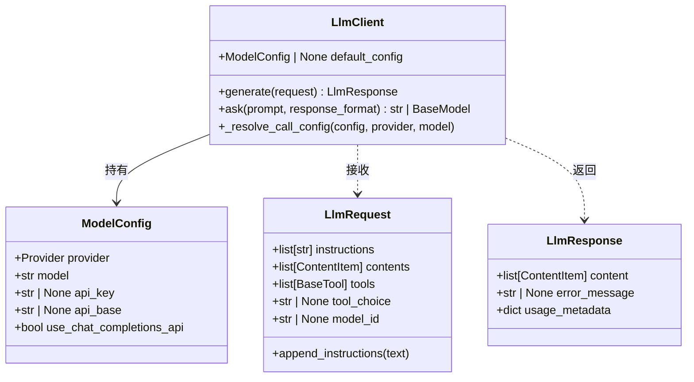
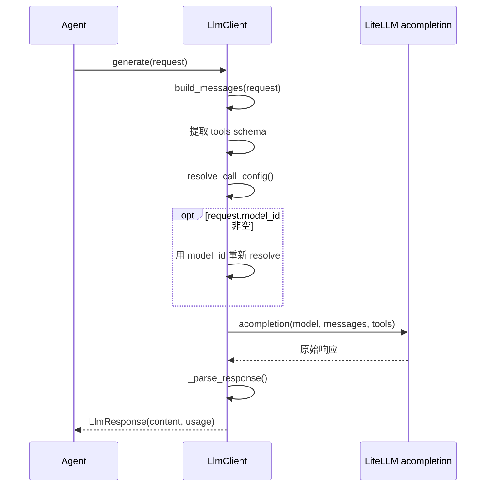
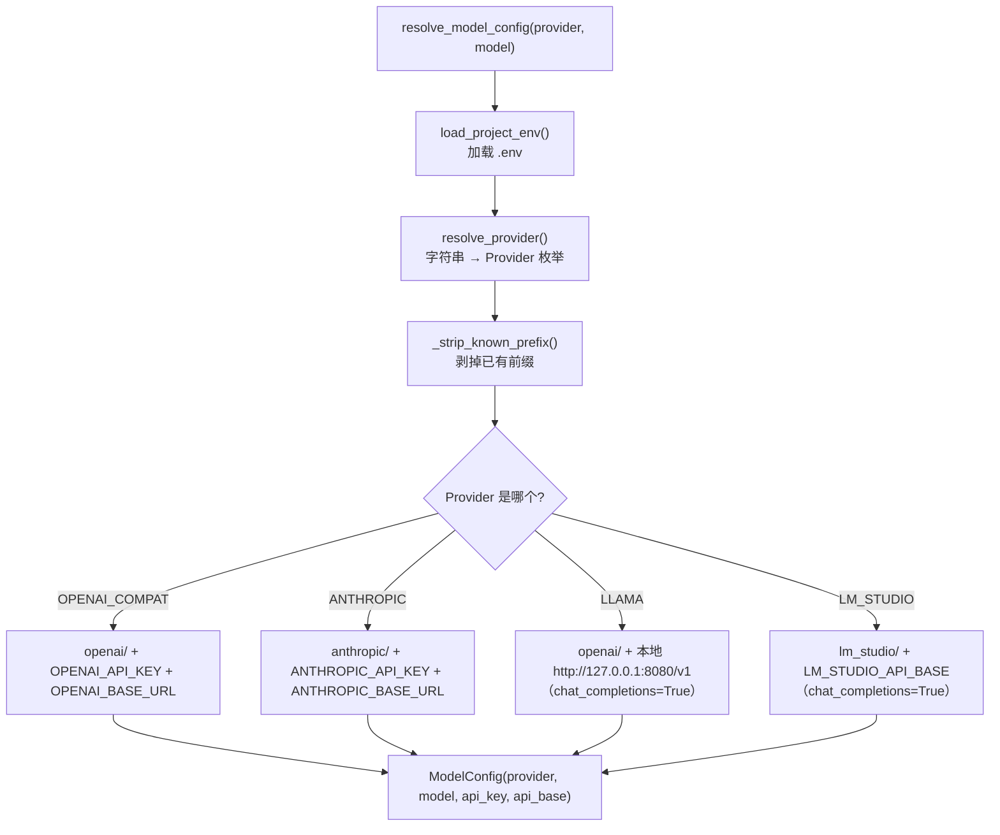

# 第 2 章：大模型 LLM API 调用与 LiteLLM 封装

> 第 1 章你跑通了 `basic_agent.py`，但里面的 `LlmClient` 到底做了什么、为什么它能"一条代码切换不同模型厂商"，本章揭晓。
>
> 这是 Agent 的"大脑接入层"：**没有它，后面所有的 ReAct、工具调用、记忆都无从谈起**。

---

## 2.1 核心问题

**Agent 的"大脑"如何接入？如何屏蔽不同模型厂商的差异？**

---

## 2.2 学习目标

学完本章，你应当能够：

1. 讲清 LLM API 的**无状态**特征，以及一次请求从"发送"到"拿到回复"的完整流程。
2. 理解 `LlmRequest` / `LlmResponse` / `LlmClient` 三个核心对象的分工。
3. 理解 LiteLLM 如何用"模型字符串前缀"屏蔽 Provider 差异，以及这种屏蔽的**边界**在哪。

---

## 2.3 原理讲解：从裸 API 到封装

### 2.3.1 一次 LLM 调用的本质

无论是 OpenAI、Anthropic 还是 Gemini，一次 LLM 调用在底层都是同一件事：

```
请求（messages + 模型 + 参数） → API → 响应（content + usage）
```

它有三个必须牢记的特征：

1. **无状态**：每次请求独立，历史要你自己带上。
2. **有 token 成本**：响应里的 `usage` 告诉你这次花了多少 token（输入 + 输出），这是 Agent 工程里"省钱"优化的依据。
3. **可能失败**：网络超时、限流、参数错误、模型拒答……失败是常态，不是异常。

### 2.3.2 为什么需要封装

直接调用不同厂商的 API，代码差异很大：OpenAI 用 `openai` SDK，Anthropic 用 `anthropic` SDK，本地模型用 `llama.cpp`……如果你每换一个模型就重写一遍调用逻辑，Agent 代码会迅速腐化。

**LiteLLM** 的做法是：用一条 `acompletion()` 函数 + **模型字符串前缀**统一所有 Provider：

```python
"openai/gpt-4o-mini"     # OpenAI
"anthropic/claude-3-5"   # Anthropic
"lm_studio/qwen2.5"      # 本地 LM Studio
```

`scratchagent` 的 `LlmClient` 就是对 LiteLLM 的再封装——它把"解析配置"和"发起调用"分离开，让 Agent 层拿到的是一个稳定的 `generate(request) -> response` 接口。

### 2.3.3 配图：三个核心对象的类图



> **解读**：`LlmClient` 是唯一的"门面"。它持有 `ModelConfig`（配好 `api_key`/`api_base`），接收 `LlmRequest`（你要问什么、带什么工具），返回 `LlmResponse`（模型答了什么、花了多少 token）。Agent 层只跟这三个对象打交道，永远不直接碰 LiteLLM 的 `acompletion`。

---

## 2.4 源码精读：`LlmClient` 的三个关键方法

### 2.4.1 `generate()`：核心调用

```python
async def generate(self, request: LlmRequest) -> LlmResponse:
    try:
        messages = build_messages(request)          # ① 转消息格式（第 6 章详解）
        tools = [
            tool_definition
            for tool in request.tools
            if (tool_definition := tool.tool_definition) is not None
        ] or None                                    # ② 提取工具 schema
        resolved = self._resolve_call_config(
            config=None, provider=None, model=None
        )                                            # ③ 解析用哪个模型
        if request.model_id is not None:
            resolved = resolve_model_config(
                provider=resolved.provider, model=request.model_id
            )

        response = await cast(Any, acompletion)(
            model=resolved.model,
            messages=messages,
            api_key=resolved.api_key,
            api_base=resolved.api_base,
            tools=tools,
            tool_choice=request.tool_choice,
        )                                            # ④ 真正发起调用
        return _parse_response(response)             # ⑤ 归一化响应
    except Exception as exc:
        return LlmResponse(error_message=str(exc))   # ⑥ 失败转错误对象，不抛异常
```

逐点理解：

- **① `build_messages()`**：把内部的 `ContentItem` 列表转成 API 能读的 `messages` 列表（第 6 章重点，这里先记住它存在）。
- **② 工具 schema 提取**：`request.tools` 里的每个工具，取其 `tool_definition`（JSON Schema），生成 `tools` 参数；海象运算符 `:=` 让"取值 + 判空"一步完成。
- **③ `_resolve_call_config()`**：决定这次调用用哪个模型配置（见 2.4.3）。
- **⑥ 失败转错误对象**：这是关键设计——`generate()` **从不抛异常**，而是把错误塞进 `LlmResponse.error_message`。这样 Agent 循环可以统一处理，不会因一次 LLM 失败而崩溃。

### 2.4.2 `ask()`：一次性问答的便捷方法

```python
async def ask(self, prompt: str, response_format=None) -> str | BaseModel:
    ...
    request = LlmRequest(
        instructions=[instruction],
        contents=[CoreMessage(role="user", content="Please respond.")],
    )
    response = await self.generate(request)
    ...
```

`ask()` 是 `generate()` 的薄封装：你给它一句话，它帮你拼一个最简 `LlmRequest`，直接返回文本。适合"调一次拿个结果"的场景，不适合 Agent 循环（Agent 需要精细控制 `contents` 和 `tools`）。

> **注意一个关键差异**：`ask()` 与 `generate()` 的异常处理策略**相反**。`generate()` 把错误塞进 `LlmResponse.error_message` 而不抛异常；但 `ask()` 在检测到 `error_message` 时会 `raise RuntimeError(...)`——因为它面向"一次性调用"，失败就该立刻让调用方知道，而不是静默返回一个错误对象。

### 2.4.3 `_resolve_call_config()`：配置的三级优先级

```python
def _resolve_call_config(self, *, config, provider, model) -> ModelConfig:
    if config is not None:                        # ① 显式传入配置：最高优先
        return config
    if provider is not None and model is not None:  # ② 传入 provider+model：现场解析
        return resolve_model_config(provider=provider, model=model)
    if self.default_config is not None:           # ③ 用默认配置
        return self.default_config
    raise LLMConfigError(...)                     # ④ 都没有：报错
```

这个优先级设计很实用：**默认配置**适合单模型脚本（如 `basic_agent.py`），而**每次调用单独指定 provider+model** 适合一个进程里调多个不同模型的高级场景。

### 2.4.4 配图：`generate()` 的时序图



> **解读**：`LlmClient` 是一个"翻译官"——把 Agent 的内部请求翻译成 LiteLLM 能懂的调用，再把原始响应翻译回 `LlmResponse`。Agent 永远不需要知道背后是 OpenAI 还是本地模型。

---

## 2.5 源码精读：`resolve_model_config()` 与 Provider 路由

`resolve_model_config(provider, model)` 是"模型字符串 → 完整配置"的核心函数。它做的事可以概括为一句话：**根据 Provider 枚举，给模型名加前缀、填上对应的 API Key 和 Base URL**。

```python
class Provider(StrEnum):
    OPENAI_COMPAT = "openai_compat"
    ANTHROPIC = "anthropic"
    LLAMA = "llama_cpp"
    LM_STUDIO = "lm_studio"
```

以 `OPENAI_COMPAT` 为例：

```python
if resolved_provider is Provider.OPENAI_COMPAT:
    return ModelConfig(
        provider=resolved_provider,
        model=f"openai/{clean_model}",            # 加前缀
        api_key=_require_env("OPENAI_API_KEY", ...),
        api_base=_require_env("OPENAI_BASE_URL", ...),
    )
```

两个值得注意的设计：

1. **`_strip_known_prefix()`**：你既可以传 `"gpt-4o-mini"`，也可以传 `"openai/gpt-4o-mini"`——函数会先把已知前缀剥掉，再加回标准前缀，避免重复。
2. **环境变量分"必须"和"可选"**：`OPENAI_API_KEY` 是必须的（`_require_env`），缺失直接报 `LLMConfigError`；而 `LLAMA_API_KEY` 是可选的（`_optional_env`），缺了就填 `"dummy-key"`——因为本地模型通常不需要 key。

### 配图：Provider → 配置的路由流程



> **解读**：这是"屏蔽差异"的真相——**不是真的无关，而是把差异显式地集中在了一个路由函数里**。新增一个 Provider，就是在这个 `if` 链里加一个分支。

---

## 2.6 正反例：Provider 中立性的诚实边界

这是本章最重要的一课，也是本项目最诚实的地方。**`LlmClient` 并没有做到"完全 Provider 无关"**，它有明确的边界：

| 假设 | 事实 | 影响 |
|---|---|---|
| 工具 schema 是通用的 | 工具 schema 是 **OpenAI-compatible** 格式 | 非 OpenAI 模型可能不完全兼容 |
| token 计数精确 | 用 OpenAI 的 `prompt_tokens`/`completion_tokens` | 对非 OpenAI 模型只是**近似** |
| embedding 通用 | embedding 默认偏 OpenAI（第 11、14 章涉及，本章源码未出现） | 换 embedding 模型需额外适配 |

**反面例子（错误认知）**：以为 `LlmClient` 封装后就能"无脑切换任意模型"。实际上，一个依赖了 OpenAI 特有工具调用格式的 Agent，切到某些本地模型时工具调用会失效。

**正面认知**：`LlmClient` 的价值在于**把差异收敛到一处**，而不是消灭差异。当你需要支持新 Provider 时，改动被限制在 `resolve_model_config()` 的 `if` 链里，而不是散落在 Agent 代码的每个角落。

---

## 2.7 动手实验

### 实验目标
分别用原生方式与 `LlmClient` 调用同一模型，对比代码量；尝试切换 Provider。

### 实验步骤
1. 写一段用 `openai` SDK 直接调用模型的代码（20 行左右）。
2. 再写一段用 `LlmClient.ask()` 完成同样调用的代码（5 行左右）。
3. 对比两者：`LlmClient` 省掉了哪些样板代码（认证、URL、格式）？
4. 尝试把 `Provider.OPENAI_COMPAT` 换成 `Provider.LM_STUDIO`，改 `.env` 指向本地模型端点，观察代码是否需要改动。

### 思考题
- `generate()` 为什么"从不抛异常"，而是返回带 `error_message` 的 `LlmResponse`？这对后面的 Agent 循环有什么好处？
- 如果你要支持一个新的 Provider（比如 Gemini），你需要在 `resolve_model_config()` 里改什么？

---

## 2.8 本章自检

对照教学目标，确认你能做到：

- [ ] 能画出 `LlmRequest → LlmClient → LlmResponse` 的调用链路。
- [ ] 能说出 `generate()` 的六个步骤，以及"失败转错误对象"的设计意义。
- [ ] 能讲清 LiteLLM 用"模型前缀"屏蔽差异的原理，以及这种屏蔽的**三条边界**。

---