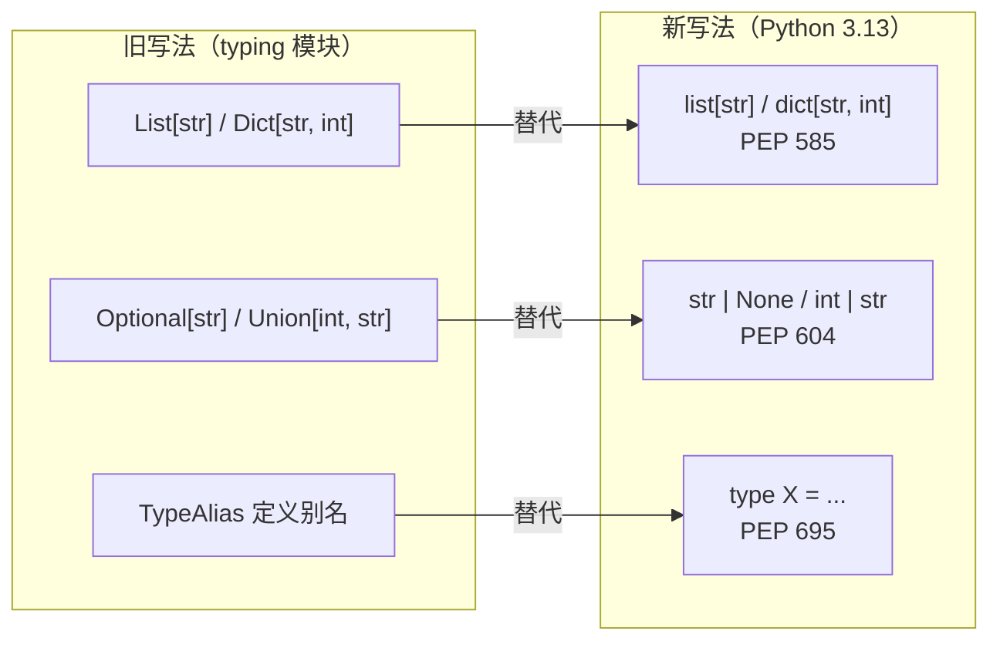
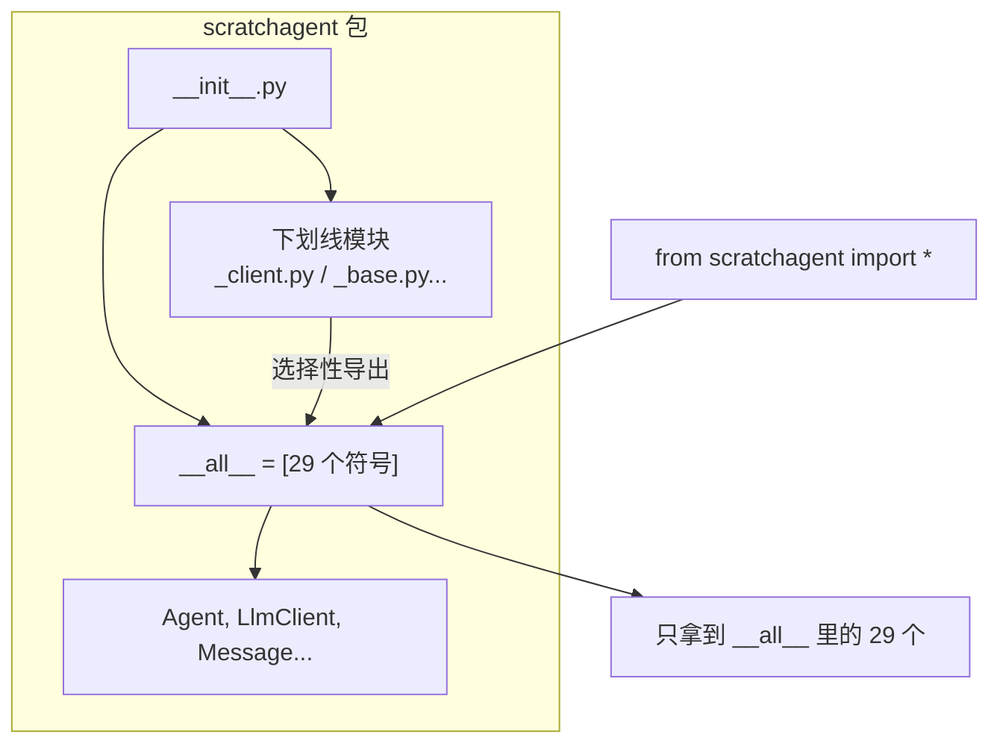

# 第 3 章：项目脚手架与 Python 工程规范

> 第 1、2 章你看到了"能跑"的代码。本章回答一个更根本的问题：**一个"能上运行、能教学、经得起审计"的 Python 项目，是怎么搭出来的？**
>
> 这是全书的"第二条主线"（脉络 B）的开端。它不产生新功能，却决定了你后面 17 章写出的每一行代码的**质量下限**。

---

## 3.1 核心问题

**如何用 `uv` 搭一个规范的 Python 项目？Python 3.13 的类型注解"新语法"到底怎么用？**

---

## 3.2 学习目标

学完本章，你应当能够：

1. 用 `uv` 从零初始化一个项目、锁定 Python 版本、管理依赖。
2. 掌握 PEP 585 / 604 / 695 三种类型注解新语法，并能说出它们各自替代了什么旧写法。
3. 理解 `pyproject.toml` 的关键字段，以及 `__all__` 导出边界的重要性。参阅文档《pyproject_analysis.md》

---

## 3.3 原理讲解：为什么"规范"是教学内容

很多人把"工程规范"当成可有可无的装饰。但在本项目里，规范是**硬资产**：

- 这个项目经历多轮代码审计，综合评分从 **78 分（v4）→ 84 分（v5）→ 93 分（v6）**，mypy 错误从 **19 个降到 0 个**。每一次提升，都是"规范"在起作用。
- 类型注解有一种"照妖镜"效应：**当你把类型写精确，它会把隐藏的逻辑矛盾照出来**。本书后续章节会反复用到这个洞察。

所以本章不是"教你背 PEP 条款"，而是"教你搭出一个让错误无处遁形的工程骨架"。

---

## 3.4 源码精读：`pyproject.toml` 关键字段

项目根目录的 `pyproject.toml` 是工程的"总开关"。我们只看其中影响最大的几段：

### 3.4.1 `[project]` 段：项目元信息

```toml
[project]
name = "scratchagent"
version = "0.1.0"
description = "A minimal AI Agent from scratch for educational purposes"
readme = "README.md"
license = "MIT"
requires-python = ">=3.13.0, <3.14"
dependencies = [
    "python-dotenv>=1.2.3",
    "pydantic>=2.0.0",
    "openai>=2.46.0",
    "faiss-cpu>=1.15.0",
    "fastmcp>=3.4.6",
    "litellm>=1.93.0",
    # ... 其余依赖省略
]
```

关键点：`requires-python = ">=3.13.0, <3.14"` 把 Python 版本**锁定**在 3.13。这很重要——本项目全面采用 Python 3.9 起陆续引入的新式注解语法（PEP 585/604/695），版本锁定能保证这些语法在所有环境下行为一致。

### 3.4.2 `[tool.mypy]` 段：类型检查的"严格档"

```toml
[tool.mypy]
python_version = "3.13"
warn_return_any = true
warn_unused_configs = true
warn_redundant_casts = true
warn_unused_ignores = false
warn_no_return = true
warn_unreachable = true
strict_equality = true
show_error_codes = true
pretty = true
disallow_untyped_defs = false
ignore_missing_imports = true
```

值得注意的两个开关：

- **`disallow_untyped_defs = false`**：这是"教学宽容档"——允许函数不写返回类型。对生产项目这是扣分项，但对教学项目，它允许"先跑起来，再逐步补类型"。
- **`ignore_missing_imports = true`**：第三方库没有类型存根时（如 `chromadb`），mypy 不报错。否则会淹没在无关的第三方告警里。

### 3.4.3 `[tool.poe.tasks]` 段：一键质量检查

```toml
[tool.poe.tasks]
mypy = "mypy src/"
format-black = "black src/ examples/ tests/"
format-isort = "isort src/ examples/ tests/"
```

`poe`（poethepoet）把分散的质量命令收敛成**具名任务**，一条 `uv run poe mypy` 就能跑类型检查。这是"规范落地"的最后一公里。

---

## 3.5 PEP 585 / 604 / 695：三种新语法

Python 3.13 时代，类型注解有了三个"新写法"，本项目全面采用。理解它们，你才能读懂后面所有源码。

### 3.5.1 PEP 585：内置泛型，告别 `typing` 老类型

**旧写法**（Python 3.9 之前）：

```python
from typing import List, Dict, Tuple

def process(items: List[str]) -> Dict[str, int]:
    ...
```

**新写法**（PEP 585）：

```python
def process(items: list[str]) -> dict[str, int]:
    ...
```

直接用小写的内置类型 `list`/`dict`/`tuple`/`type` 当泛型，**不再需要从 `typing` 导入 `List`/`Dict` 等**。本项目的 `LlmRequest.instructions: list[str]` 就是典型例子。

### 3.5.2 PEP 604：联合类型，告别 `Optional`

**旧写法**：

```python
from typing import Optional, Union

def find(name: str) -> Optional[str]:
    ...
```

**新写法**（PEP 604）：

```python
def find(name: str) -> str | None:
    ...
```

用竖线 `|` 表达"或"。`str | None` 等价于旧的 `Optional[str]`，`int | str` 等价于 `Union[int, str]`。本项目的 `LlmRequest.tool_choice: str | None` 就是例子。

### 3.5.3 PEP 695：`type` 别名，比 `TypeAlias` 更简洁

PEP 695 引入了 `type` 语句定义类型别名。本项目的 `types.py` 里有一处（也是全书唯一一处）：

```python
type ContentItem = Message | ToolCall | ToolResult | SummaryMessage
```

它等价于旧的 `TypeAlias` 写法，但语法更清晰。**注意**：`ContentItem` 不是新类型，而是"联合类型"的别名——它让一个变量可以同时承载消息、工具调用、工具结果、摘要四类东西（第 4 章详解）。

### 配图：三种新语法的对照



> **解读**：三种新语法都指向同一个目标——**少 import、少样板、更贴近直觉**。记住口诀：泛型用小写（585）、或然用竖线（604）、别名用 `type`（695）。

---

## 3.6 `__all__`：包导出边界的审计故事

`__all__` 定义了 `from package import *` 时"哪些符号会被导出"。它不是装饰，而是**包的公开 API 契约**。

本项目顶层的 `__init__.py` 声明了 **29 个公开符号**，并经历了审计的严格检验：

| 审计维度 | 结果 |
|---|---|
| 顶层 `__all__` 29 个符号全部可访问 | ✅ 实测 0 缺失 |
| `from scratchagent import *` 与 `__all__` 完全一致 | ✅ 返回 `True` |
| 5 个子包 `__all__` 全部无死链接 | ✅（tools=19/llm=9/orchestration=6/memory=12/sandbox=3） |

**一个真实的教训**：在审计过程中，曾发现"导入了符号、却忘记写进 `__all__`"的 bug——某个符号能被 `from scratchagent import xxx` 访问，但 `from scratchagent import *` 会**静默跳过**它。这种"半公开"状态是隐蔽的坑，审计时被揪出来修掉了。

### 配图：`__all__` 的导出边界



> **解读**：下划线模块（`_client.py` 等）是"私有"的，但它们里面的**部分**符号通过 `__init__.py` 被**选择性公开**。`__all__` 就是这个"选择性公开"的白名单。这是 numpy/pandas 也采用的通行做法。

---

## 3.7 `load_project_env()`：一个 DRY 重构的活教材

`config.py` 里有个不起眼但教学价值极高的函数：

```python
_ENV_LOADED = False

def load_project_env() -> None:
    global _ENV_LOADED
    if _ENV_LOADED:
        return
    env_file = find_dotenv(usecwd=True)
    if env_file:
        load_dotenv(env_file, override=False)
        _ENV_LOADED = True
```

它的故事是这样的：**早期版本里，加载 `.env` 的逻辑在 4 个文件里重复定义了 4 遍**（分布在 LLM 配置、文件工具、RAG、沙箱等模块中）。审计时这被标记为 DRY（Don't Repeat Yourself）最严重的反例，评分一度只有 55/100。

重构后，4 处重复收敛为 `config.py` 里的**这一处**，还加了 `_ENV_LOADED` 单例标志，避免重复加载。DRY 评分从 55 一路提升（v5 达到 90，v6 因 `cast(Any, ...)` 三处残留微降至 88）。

> **正面认知**：DRY 不是"少写几行"的洁癖，而是"**当逻辑要改时，只改一处**"。如果 `.env` 加载逻辑要加个开关，散落 4 处时你得改 4 遍，还容易漏。

---

## 3.8 动手实验

### 实验目标
从零用 `uv` 搭一个规范的空包，跑通类型检查。

### 实验步骤
1. 新建目录，执行 `uv python pin 3.13`。 # 锁定版本，系统上安装过 python 3.13
2. `uv init` 初始化项目文件夹。会自动生成 pyproject.toml 项目配置文件。
3. `uv venv` 初始化python 虚拟环境。
3. `uv add pydantic` 添加一个依赖，观察 `.venv` 的创建和 `pyproject.toml` 的变化。
4. 写一个用了 PEP 585/604 语法的模块，配置 mypy，跑 `uv run mypy src/`。
5. 在包顶层的 `__init__.py` 里写 `__all__`，测试 `from 你的包 import *` 是否只导出白名单符号。

### 思考题
- 如果把 `__all__` 漏写一个符号，`import *` 会发生什么？你能设计一个测试把它揪出来吗？
- `disallow_untyped_defs = false`（教学宽容档）和 `true`（生产严格档）的取舍是什么？

---

## 3.9 本章自检

对照教学目标，确认你能做到：

- [ ] 能默写出 `uv python pin 3.13`→ `uv init`→ `uv venv` → `uv add` → `uv sync` 的完整流程。
- [ ] 能各举一例 PEP 585 / 604 / 695，并说出它们替代的旧写法。
- [ ] 能讲清 `__all__` 的"公开 API 契约"意义，以及"漏写符号"的坑。

---