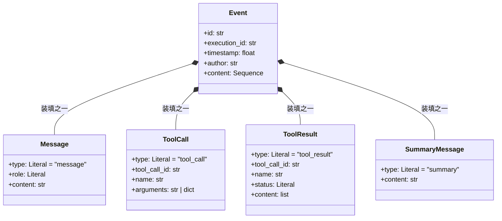

# 第 4 章 核心消息类型

## 4.1 核心问题

一个 Agent 的每次"思考"和"行动"，都会产生各种不同的信息——用户说的话、模型回复的文本、模型要求调用工具的请求、工具返回的结果……这些信息形态各异，却要在同一条执行流水线上流转。

**本章回答的问题是：如何用一套统一的数据类型，把 Agent 执行过程中产生的所有信息都"装"起来？**

## 4.2 教学目标

学完本章，你应当能够：

1. **说出** `scratchagent` 核心的 4 种消息类型（`Message` / `ToolCall` / `ToolResult` / `SummaryMessage`）各自表达什么、字段是什么。
2. **理解** `ContentItem` 这个 PEP 695 类型别名如何用 PEP 604 联合类型把 4 种消息"打包"成一个可流转的单元。
3. **理解** `Event` 作为"执行记录"的设计——为什么它的 `content` 是 `Sequence[ContentItem]`（协变），而非 `list`。
4. **能独立定义** 一套基于 Pydantic 的消息类型，并说明为什么用 `Literal` 来区分 `type`。

## 4.3 原理讲解

### 4.3.1 为什么需要"统一消息类型"

Agent 循环里，信息形态非常杂。用自然语言描述就是：

- 用户发来一句话 → 这是**文本**；
- 模型决定"我要调一个计算器工具" → 这是**一个工具调用请求**（含工具名 + 参数）；
- 工具执行完返回"结果是 42" → 这是**一个工具结果**；
- 几轮之后，系统想把前面的历史压缩成一段摘要 → 这是**一个摘要**。

如果每种信息各用各的结构，Agent 主循环就得写一堆 `if isinstance(...)` 分支去区分处理。`scratchagent` 的做法是：**把 4 种消息统一抽象成有共同 `type` 字段的 Pydantic 模型，再用一个联合类型别名把它们串起来**。

这就构成了后续所有章节（消息转换、ReAct 循环、会话持久化）的数据地基。

### 4.3.2 配图：四种消息类型与打包关系

> 下图展示了 4 种消息类型的字段，以及它们如何通过 `ContentItem` 别名打包成 `Event` 的内容。



**解读**：注意这张图**故意没有**画出 `ContentItem` 这个节点——因为它不是类，而是一个**联合类型别名**（`Message | ToolCall | ToolResult | SummaryMessage`），无法用类图里的继承或组合关系准确表达。图中用 `Event *-- ...` 组合箭头表达"`Event.content` 可以装填这四种消息中的任意一种"这一实质关系。

## 4.4 源码精读

### 4.4.1 `Message` —— 纯文本消息

```python
class Message(BaseModel):
    """在会话中的一个文本消息 Message"""

    type: Literal["message"] = "message"
    role: Literal["system", "user", "assistant"]
    content: str
```

三个要点：

1. **`type` 用 `Literal["message"] = "message"`**：既限制了这个字段只能是字符串 `"message"`，又给了默认值。这样任何 `Message()` 实例的 `type` 一定是 `"message"`，下游可以用 `msg.type` 快速判别，而不必用 `isinstance`。
2. **`role` 是 `Literal["system", "user", "assistant"]`**：严格限定角色只能是这三种，杜绝拼写错误（比如 `"usr"`）。注意这里**没有** `"tool"` 角色——工具结果单独用 `ToolResult` 表达，而不是塞进 `Message`。
3. **`content: str`**：消息体是纯字符串。文本消息不承载结构化数据。

### 4.4.2 `ToolCall` —— 模型请求调用工具

```python
class ToolCall(BaseModel):
    """LLM 请求执行一个 tool . API Role 是 assistant"""

    type: Literal["tool_call"] = "tool_call"
    tool_call_id: str
    name: str
    arguments: str | dict[str, Any]
```

关键设计：**`arguments` 是 `str | dict[str, Any]`**。这是因为不同 LLM Provider 返回的工具参数格式不一——有的返回已解析的 JSON 对象（`dict`），有的返回原始 JSON 字符串（`str`）。用联合类型兼容两者，避免在边界处强行转换。

`tool_call_id` 是本次调用的唯一标识，用于后续把 `ToolResult` 关联回对应的 `ToolCall`。

### 4.4.3 `ToolResult` —— 工具执行的结果

```python
class ToolResult(BaseModel):
    """Tool 工具执行的结果. API Role is tool"""

    type: Literal["tool_result"] = "tool_result"
    tool_call_id: str
    name: str
    status: Literal["success", "error"]
    content: list[str | list[str] | list[dict]]
```

三个要点：

1. **`status: Literal["success", "error"]`**：工具结果明确区分成功与失败。这比"让工具抛异常"更可控——Agent 循环可以拿到一个"带 status 的结果对象"而不是被异常打断。
2. **`content` 是 `list[str | list[str] | list[dict]]`**：一个工具可能返回多段内容，每段又可能是纯文本（`str`）、文本列表（`list[str]`）、或结构化字典列表（`list[dict]`，如搜索返回的多条结果）。这是对"工具输出形态不定"的诚实建模。
3. **`tool_call_id` 与 `ToolCall.tool_call_id` 对应**：这是"请求—响应"关联的关键，下游据此知道"这个结果回答的是哪次调用"。

### 4.4.4 `SummaryMessage` —— 历史摘要标记

```python
class SummaryMessage(BaseModel):
    """包含执行历史摘要的持久标记."""

    type: Literal["summary"] = "summary"
    content: str
```

它只有 `content` 一个业务字段（外加带默认值的 `type` 标记）。作用是在长会话中，用一段摘要替代冗长的历史消息，作为"持久标记"注入后续上下文（第 15 章上下文优化会展开）。它是 4 种消息里最"轻"的一种。

### 4.4.5 `ContentItem` —— 联合类型别名（PEP 695 + PEP 604）

```python
# 对四种类型信息的一个打包封装，构成一个 ContentItem，可以表示4个类型当中的任何一种
# PEP-695 类型别名 + PEP-604 联合类型
type ContentItem = Message | ToolCall | ToolResult | SummaryMessage
```

这一行是本章的**核心**，集中体现了两个 Python 3.13 新语法：

- **PEP 604（联合类型）**：`A | B | C` 替代旧式 `Union[A, B, C]`，更简洁直观。
- **PEP 695（类型别名）**：`type X = ...` 是 3.12 引入的类型别名声明语句，替代旧式 `X: TypeAlias = ...` 的写法。相比赋值式的别名，`type` 语句对类型检查器的语义更明确（例如支持泛型别名 `type X[T] = list[T]`），也更易读。

> **关于"运行时行为"的澄清**：需要区分两层——
> - 就**联合类型本身**而言，Python 3.10 起 `A | B` 与 `Union[A, B]` 在运行时是等价的，都产生一个 `types.UnionType` 对象。所以"旧式 `Union` 不是运行时对象"的说法是**错误**的。
> - `type X = ...` 与 `X = ...` 的差别不在"运行时不运行时"，而在于**类型检查器如何理解这个别名**：`type` 语句是显式的"类型别名声明"，语义更清晰、更利于静态分析。
>
> 简言之：**PEP 604 改变的是"联合类型的写法"（`|` vs `Union`），PEP 695 改变的是"类型别名的声明方式"（`type X =` vs `X =`）。** 两者是正交的，不要混为一谈。

### 4.4.6 `Event` —— 执行记录

```python
class Event(BaseModel):
    """一个Agent 智能体的执行记录."""

    id: str = Field(default_factory=lambda: str(uuid.uuid4()))
    execution_id: str
    timestamp: float = Field(default_factory=lambda: datetime.now().timestamp())
    author: str  # "user" or agent name
    content: Sequence[ContentItem] = Field(default_factory=list)
```

四个关键点：

1. **`id` 用 `uuid4` 默认工厂**：每条事件有全局唯一 ID，便于追踪、去重、排序。
2. **`execution_id` 是必填**：把事件归到"哪一次执行"。同一 Agent 多次 run，`execution_id` 不同，用于跨 run 关联（第 13 章会话持久化的基础）。
3. **`author` 区分来源**：`"user"` 或 Agent 名字。这为多智能体编排（第 19、20 章）预留了"事件是谁产生的"信息。
4. **`content: Sequence[ContentItem]` 是协变的关键设计**：

> 为什么用 `Sequence` 而不是 `list`？这是本项目审计过程中沉淀的"类型协变"要点：
> - `list` 是**不变（invariant）**的：`list[ToolResult]` 不能赋给 `list[ContentItem]`，即使 `ToolResult` 是 `ContentItem` 的子类型。
> - `Sequence` 是**协变（covariant）**的：`Sequence[ToolResult]` 可以赋给 `Sequence[ContentItem]`。
>
> 在 Agent 循环里，某一轮工具执行产生的是 `list[ToolResult]`，它需要被放进 `Event.content`（类型是 `Sequence[ContentItem]`）。若 `content` 声明为 `list[ContentItem]`，这里就会类型报错；声明为 `Sequence[ContentItem]`，则 `list[ToolResult]` 能自然协变进来。这是 `Sequence` 协变特性的一个典型应用场景。

## 4.5 动手实验

**目标**：在你的项目里独立定义这套消息类型，并验证联合类型与协变行为。

1. 新建 `types.py`，用 Pydantic 定义 `Message`、`ToolCall`、`ToolResult`、`SummaryMessage` 四个模型（字段与本章一致）。
2. 用 PEP 695 语法定义 `type ContentItem = Message | ToolCall | ToolResult | SummaryMessage`。
3. 定义 `Event`，`content` 字段标注为 `Sequence[ContentItem]`。
4. 写一段验证代码：

```python
from collections.abc import Sequence
from types import Message, ToolCall, ToolResult, SummaryMessage, Event  # 这里 types 指你新建的 types.py

# 构造一条完整的执行记录：用户提问 → 模型调工具 → 工具返回 → 模型总结
evt = Event(
    execution_id="run-001",
    author="assistant",
    content=[
        Message(role="user", content="1+1 等于几？"),
        ToolCall(tool_call_id="c1", name="calculator", arguments={"operator": "+", "first_number": 1, "second_number": 1}),
        ToolResult(tool_call_id="c1", name="calculator", status="success", content=["2"]),
        Message(role="assistant", content="结果是 2"),
    ],
)
print(evt.content[1].type)   # 应输出 tool_call
print(evt.content[2].status) # 应输出 success
```

5. **验证协变**：写一个返回 `list[ToolResult]` 的函数，看它能否赋值给 `Sequence[ContentItem]` 类型（应能通过 mypy），再尝试赋值给 `list[ContentItem]`（应报错）。

## 4.6 本章自检

- [ ] 能说出 4 种消息类型各自的 `type` 字面值和核心字段。
- [ ] 能解释 `ContentItem = Message | ToolCall | ToolResult | SummaryMessage` 用了哪两个 PEP 语法，各解决了什么。
- [ ] 能说清 `Event.content` 用 `Sequence[ContentItem]` 而非 `list` 的原因（协变）。
- [ ] 能解释 `ToolCall.arguments` 为什么是 `str | dict[str, Any]`（跨 Provider 兼容）。
- [ ] 独立写出的 `types.py` 能通过上述验证代码，且 mypy 无类型错误。
