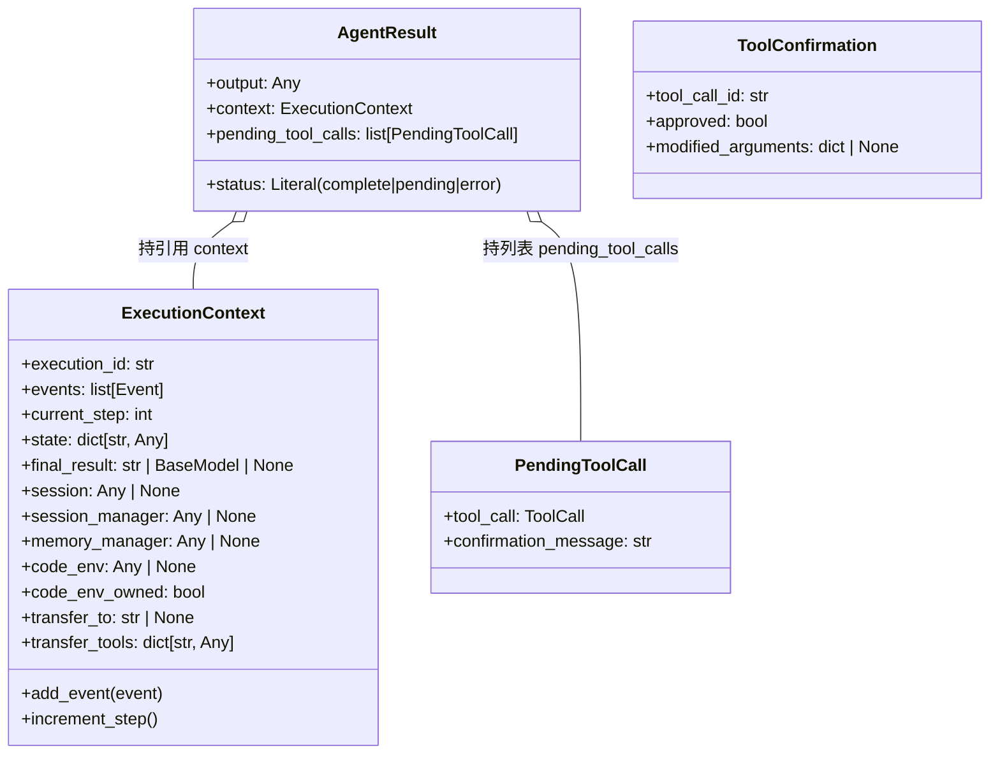

# 第 5 章 执行上下文

## 5.1 核心问题

上一章定义了消息类型，但它们只是"数据"，还缺一个"容器"把它们组织起来、并在执行过程中持续维护状态。

**本章回答的问题是：Agent 执行过程中，那些"需要跨步骤保持"的状态（执行 ID、事件历史、当前步数、最终结果、会话/记忆/沙箱句柄、转交目标……）该放在哪里、如何组织？**

## 5.2 学习目标

学完本章，你应当能够：

1. **说出** `ExecutionContext` 的职责——它是"所有运行期间执行状态的存储中心"，并列出它的关键字段。
2. **区分** `ExecutionContext` 为什么用 `dataclass`（可变状态容器）而非 `BaseModel`（校验数据模型）。
3. **理解** 三类"结果/确认"类型的协作关系：`AgentResult`（执行结果）、`PendingToolCall`（待确认调用）、`ToolConfirmation`（用户确认响应）。
4. **理解** `status: Literal["complete", "pending", "error"]` 三态如何支撑"人工审批（HITL）"流程。

## 5.3 原理讲解


### 5.3.1 为什么需要"执行上下文"

Agent 的 `run()` 是一个**多步循环**（第 8 章展开）。循环中每一步都要：

- 读取"我现在走到第几步了"（`current_step`）；
- 把本步产生的事件追加进历史（`events`）；
- 可能需要访问会话、记忆、沙箱等外部句柄；
- 最终把结果写回某个地方（`final_result`）。

如果这些状态散落在 `run()` 方法的局部变量里，方法会非常臃肿，也无法在多智能体转交时传递。`ExecutionContext` 的职责，就是**把这些跨步骤状态收拢到一个对象里，作为"执行过程的主线载体"**。

### 5.3.2 配图：执行上下文与结果/确认类型的协作

> 下图展示 `ExecutionContext` 承载的状态，以及 `AgentResult` / `PendingToolCall` / `ToolConfirmation` 三者的关系。



**解读**：`AgentResult` 是执行的"出口"——它同时携带最终 `output`、完整的 `context`（便于事后回溯）、三态 `status`、以及需要人工介入的 `pending_tool_calls`。图中用聚合箭头 `o--`（持引用）而非组合 `*--`（拥有），因为 `AgentResult` 只是**持有**这些对象，不负责它们的生命周期。`PendingToolCall` 与 `ToolConfirmation` 在源码中并不互相引用——它们的配对由编排层（`agent.py`）负责，故图中不画连接箭头。

## 5.4 源码精读

文件位置：src/scratchagent/context.py

### 5.4.1 `ExecutionContext` —— 状态存储中心

```python
@dataclass
class ExecutionContext:
    """所有运行期间执行状态的存储中心"""

    execution_id: str = field(default_factory=lambda: str(uuid.uuid4()))
    events: list[Event] = field(default_factory=list)
    current_step: int = 0
    state: dict[str, Any] = field(default_factory=dict)
    final_result: str | BaseModel | None = None

    # 会话管理
    session: Any | None = None
    session_manager: Any | None = None
    # 记忆管理
    memory_manager: Any | None = None

    # 代码执行环境 "Sandbox" 沙箱
    code_env: Any | None = None
    # 仅当此智能体创建该沙箱并拥有其清理权限时，值为真.
    code_env_owned: bool = False
    # Multi-Agent 中 转移模式
    transfer_to: str | None = None
    transfer_tools: dict[str, Any] = field(default_factory=dict)

    def add_event(self, event: Event) -> None:
        """追加一个event 到执行历史中"""
        self.events.append(event)

    def increment_step(self) -> None:
        """移到下一步，计数器+1"""
        self.current_step += 1
```

设计要点：

1. **用 `@dataclass` 而非 `BaseModel`**：这是关键取舍。`ExecutionContext` 是**运行期可变的状态容器**——字段会被频繁修改（`events` 追加、`current_step` 递增、`final_result` 写入）。`dataclass` 轻量、无校验开销、字段天然可变；而 `BaseModel` 更侧重"数据校验 + 序列化"，用在这里是"杀鸡用牛刀"。对比上一章 `Message`/`Event` 用 `BaseModel`——因为它们是要被序列化、校验、跨进程传递的"数据"，不是"可变状态"。

2. **可变默认值用 `field(default_factory=...)`**：`events`/`state`/`transfer_tools` 都是可变容器，必须用工厂函数，否则所有实例共享同一个 list/dict（经典 Python 陷阱）。

3. **外部句柄统一 `Any | None = None`**：`session`/`session_manager`/`memory_manager`/`code_env` 都是"可选的外部依赖"，源码**直接标注为 `Any`，并不导入具体类型**（`context.py` 顶部只 `from .types import Event, ToolCall`，没有 `TYPE_CHECKING` 导入）。这样做的效果是：`ExecutionContext` 不依赖 `Session`/`MemoryManager`/`E2BSandbox` 的具体类型定义，避免了潜在的类型导入耦合。

   > **说明**：`Any` 的具体动机源码未加注释，属**合理推断**——这些句柄的类型各自定义在 `memory/_session.py`、`memory/_long_term.py`、`sandbox/_e2b_sandbox.py` 等模块里，若在此导入其具体类型会增加模块间耦合。注意这与项目里"另外 4 个文件用 `TYPE_CHECKING` 延迟导入"是**两种不同策略**：`context.py` 采用的是更简单的"直接 `Any` 占位"，而非 `TYPE_CHECKING`。二者不可混为一谈。

4. **多智能体预留字段**：`transfer_to`（转交目标 Agent 名）和 `transfer_tools`（转交工具表）为第 20 章的多智能体 handoff 预留。`code_env`/`code_env_owned` 为第 17 章 E2B 沙箱预留（`code_env_owned` 的注释明确说明了"谁创建谁清理"的所有权语义）。

5. **两个极简方法**：`add_event` 和 `increment_step` 是仅有的两个方法，各自一行。它们把"追加事件""步数 +1"这两个高频操作封装成语义化命名，让调用方（`agent.py` 的 `step()`）读起来更清晰，也避免直接操作 `events.append` 这种细节泄漏。

### 5.4.2 `PendingToolCall` —— 等待确认的工具调用

```python
class PendingToolCall(BaseModel):
    """等待用户确认的工具调用 (human-in-the-loop)."""

    tool_call: "ToolCall"
    confirmation_message: str
```

它组合了一个 `ToolCall` 和一段"请求确认的话"。当工具需要人工审批（第 12 章回调与人工审批展开），Agent 不直接执行，而是把这次调用挂起，带着 `confirmation_message` 问用户"是否允许执行这个调用"。

### 5.4.3 `AgentResult` —— 执行结果

```python
@dataclass
class AgentResult:
    """智能体执行结果。"""

    output: Any  # str | BaseModel
    context: ExecutionContext
    # status: str = "complete"  # "complete" | "pending" | "error"
    status: Literal["complete", "pending", "error"]
    pending_tool_calls: list[PendingToolCall] = field(default_factory=list)
```

三个要点：

1. **`output: Any`**：源码注释 `# str | BaseModel` 标注了两种可能——如果没设 `output_type`（第 9 章结构化输出），结果是字符串；设了，结果是 `BaseModel` 实例。这里用 `Any` 是"承认两种可能"的折中（注释里已提示本可写 `str | BaseModel`，属可优化点）。

2. **`status` 三态是 HITL 的核心**：
   - `complete`：正常完成，`output` 有效；
   - `pending`：执行中遇到需要人工确认的工具，`pending_tool_calls` 非空，等待用户回应；
   - `error`：执行出错。
   
   这三态让 `run()` 的调用方（尤其是上层编排器）能区分"完成 / 等待输入 / 失败"，从而决定下一步动作。

3. **`context` 被整体带回**：`AgentResult` 持有整个 `ExecutionContext`，意味着执行结果不仅是"一句话答案"，还附带完整的事件历史，便于审计、回放、多智能体间传递上下文。

### 5.4.4 `ToolConfirmation` —— 用户确认响应

```python
class ToolConfirmation(BaseModel):
    """用户对待处理工具调用的响应 (human-in-the-loop)."""

    tool_call_id: str
    approved: bool
    modified_arguments: dict | None = None
```

它是 `PendingToolCall` 的"回应"：

- `tool_call_id` 关联回被挂起的那个调用；
- `approved` 表示同意 / 拒绝；
- `modified_arguments` 允许用户**在确认时修改参数**（可选，`None` 表示不改）。

> **正例 vs 反例**：`modified_arguments` 的设计是 HITL 的亮点——
> - **反例**：只让用户"同意/拒绝"二选一，用户想微调参数（如"金额改成 500 而不是 1000"）就得重来一遍。
> - **正例**：允许 `modified_arguments` 在确认的同时改参数，一次交互完成"审批 + 修正"，这正是生产级 HITL 的常见需求。

## 5.5 动手实验

**目标**：在你的项目里定义 `ExecutionContext` 及结果/确认类型，并模拟一次"人工审批"流程。

1. 新建 `context.py`，定义 `ExecutionContext`（`@dataclass`，字段与本章一致）、`PendingToolCall`（`BaseModel`）、`AgentResult`（`@dataclass`）、`ToolConfirmation`（`BaseModel`）。
2. 复用第 4 章的 `types.py`，写一段验证代码：

```python
from scratchagent.context import ExecutionContext, AgentResult, PendingToolCall, ToolConfirmation  # context 指你新建的 context.py
from scratchagent.types import Event, Message, ToolCall  # types 指第 4 章新建的 types.py

# 1. 创建执行上下文，模拟一次执行
ctx = ExecutionContext()
ctx.add_event(Event(execution_id=ctx.execution_id, author="user",
                    content=[Message(role="user", content="删掉 /tmp 下所有文件")]))
ctx.increment_step()
print(ctx.current_step)  # 应输出 1

# 2. 模拟一个需要人工确认的危险工具调用
pending = PendingToolCall(
    tool_call=ToolCall(tool_call_id="c2", name="delete_files", arguments={"path": "/tmp"}),
    confirmation_message="此操作将删除 /tmp 下所有文件，是否继续？",
)
result = AgentResult(output=None, context=ctx, status="pending", pending_tool_calls=[pending])
print(result.status)  # 应输出 pending

# 3. 用户回应：同意但修改参数
confirm = ToolConfirmation(tool_call_id="c2", approved=True, modified_arguments={"path": "/tmp/cache"})
print(confirm.approved, confirm.modified_arguments)  # 应输出 True {'path': '/tmp/cache'}
```

3. **思考题**：为什么 `ExecutionContext` 用 `dataclass` 而 `PendingToolCall`/`ToolConfirmation` 用 `BaseModel`？写一句话说明你的理解，再对照本章 5.4.1 的结论。

## 5.6 本章自检

- [ ] 能说出 `ExecutionContext` 是"运行期间执行状态的存储中心"，并列出至少 5 个字段及其用途。
- [ ] 能解释 `ExecutionContext` 用 `dataclass` 而非 `BaseModel` 的原因（可变状态容器 vs 校验数据模型）。
- [ ] 能解释 `session`/`memory_manager`/`code_env` 等句柄为什么标注为 `Any | None`（打破循环依赖）。
- [ ] 能说清 `AgentResult.status` 三态（complete/pending/error）各自含义，及它们与 HITL 的关系。
- [ ] 能解释 `ToolConfirmation.modified_arguments` 在"审批 + 修正"中的作用。
- [ ] 独立写出的 `context.py` 能通过上述验证代码。
