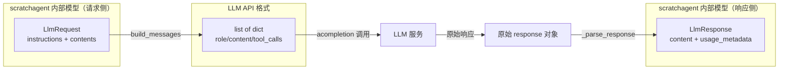

# 第 6 章 消息转换

## 6.1 核心问题

第 4 章定义了 `scratchagent` 自己的消息类型（`Message`/`ToolCall`/`ToolResult`/`SummaryMessage`），但真正调用 LLM 时，LiteLLM / OpenAI 的 API 期望的是**另一种格式**——`[{"role": "system", "content": "..."}, ...]` 这样的字典列表，其中工具调用要嵌在 `assistant` 消息的 `tool_calls` 字段里，工具结果要用 `role: "tool"` 加 `tool_call_id`。

**本章回答的问题是：如何在自己的消息类型和 LLM API 的消息格式之间做双向转换？**

## 6.2 教学目标

学完本章，你应当能够：

1. **说出** `build_messages` 的职责——把 `LlmRequest` 转换为 LLM API 期望的 `list[dict]` 格式，并列举它对 4 种 `ContentItem` 的不同处理。
2. **理解** 工具调用的"并入前一条 assistant 消息"这一关键细节，以及为什么这样设计。
3. **说出** `_parse_response` 的职责——反向把 API 响应转回 `LlmResponse`，并理解它如何提取文本与工具调用。
4. **能独立实现** 双向转换，并说明工具参数（`arguments`）在这条链路中"保持原样透传"的设计。

## 6.3 原理讲解

### 6.3.1 为什么需要"转换层"

`scratchagent` 面向 Agent 循环设计了自己的消息模型（第 4 章），而 LLM API 有它自己的协议。这两者不是一回事：

- **自己的模型**：`ToolCall` 是独立的顶层对象，和 `Message` 平级，都装进 `Event.content` 的 `Sequence[ContentItem]` 里。
- **API 的格式**：工具调用不是独立消息，而是**嵌在 assistant 消息的 `tool_calls` 数组里**；工具结果则是 `role: "tool"` 的消息。

这个差异决定了必须有一层"翻译"——`build_messages` 负责"出去"（自己的模型 → API 格式），`_parse_response` 负责"回来"（API 响应 → 自己的模型）。二者合起来，就是隔离"内部模型"与"外部协议"的边界（注意：这个边界是**非严格对称**的，详见 6.4.2 末尾）。

### 6.3.2 配图：双向转换的数据流

> 下图展示 `LlmRequest` 如何经 `build_messages` 变成 API 格式，以及 API 响应如何经 `_parse_response` 变回 `LlmResponse`。



**解读**：`build_messages` 和 `_parse_response` 是两个方向相反的转换函数，构成"内部模型 ↔ 外部协议"的对称边界。中间调用 `acompletion` 时传的是 API 格式，拿到的是原始响应对象，再解析回内部模型。

## 6.4 源码精读

### 6.4.1 `build_messages` —— 出去的方向

> **术语说明**：在 `llm/_client.py` 里，第 4 章的 `Message` 被以别名 `CoreMessage` 导入（`from ..types import Message as CoreMessage`），以避免与"API 消息字典"概念混淆。本章代码里的 `CoreMessage` 就是第 4 章的 `Message`。

```python
def build_messages(request: LlmRequest) -> list[dict[str, Any]]:
    """将大模型请求（LlmRequest）转换为接口消息格式."""
    messages: list[dict[str, Any]] = []

    for instruction in request.instructions:
        messages.append({"role": "system", "content": instruction})

    for item in request.contents:
        if isinstance(item, CoreMessage):
            messages.append({"role": item.role, "content": item.content})
        elif isinstance(item, ToolCall):
            tool_call_dict = {
                "id": item.tool_call_id,
                "type": "function",
                "function": {
                    "name": item.name,
                    "arguments": item.arguments,
                },
            }
            if messages and messages[-1]["role"] == "assistant":
                messages[-1].setdefault("tool_calls", []).append(tool_call_dict)
            else:
                messages.append(
                    {
                        "role": "assistant",
                        "content": None,
                        "tool_calls": [tool_call_dict],
                    }
                )
        elif isinstance(item, ToolResult):
            messages.append(
                {
                    "role": "tool",
                    "tool_call_id": item.tool_call_id,
                    "content": str(item.content[0]) if item.content else "",
                }
            )
        elif isinstance(item, SummaryMessage):
            messages.append({"role": "system", "content": item.content})

    return messages
```

逐段拆解，`build_messages` 对 4 种 `ContentItem` 的处理各不相同：

**① `instruction` → `system` 消息**：`LlmRequest.instructions` 是系统指令列表，每条转成一条 `{"role": "system", "content": ...}`。注意这是**先处理**的——system 消息在对话最前面。

**② `CoreMessage` → 直接映射**：`{"role": item.role, "content": item.content}`，`role`（system/user/assistant）原样透传，无歧义。

**③ `ToolCall` → 并入 assistant 消息（关键细节）**：

这是最讲究的一处。API 协议要求：**工具调用必须附着在一条 `role: "assistant"` 的消息上**，通过 `tool_calls` 数组表达。代码据此分两种情况：

- 如果前一条消息已经是 `assistant`（典型场景：模型先说了句话，紧接着调用工具），就把这个 `tool_call_dict` **追加**到它的 `tool_calls` 数组里——用 `setdefault("tool_calls", []).append(...)`。
- 否则（前面不是 assistant），就**新建**一条 `{"role": "assistant", "content": None, "tool_calls": [...]}` 消息。

> **正例 vs 反例**：这个"并入"逻辑是 API 协议的硬约束——
> - **反例**：把每个 `ToolCall` 都单独转成一条独立消息（如 `{"role": "tool_call", ...}`）。但 API 根本不认识 `tool_call` 这个 role，会直接报错。
> - **正例**：严格遵守"工具调用嵌在 assistant 的 `tool_calls` 里"这一协议，并处理了"前一条是否 assistant"的边界情况，保证生成的消息序列始终合法。

**④ `ToolResult` → `tool` 消息**：转成 `{"role": "tool", "tool_call_id": item.tool_call_id, "content": ...}`。两个细节：

- `tool_call_id` 原样透传，用于让 API 关联回对应的工具调用；
- `content` 取 `item.content[0]`（第一段）并转成字符串——`ToolResult.content` 是 `list[str | list[str] | list[dict]]`（单层 list，元素可能是字符串或内层 list），但 API 的 tool 消息 `content` 期望字符串，这里做了简化（取第一段、`str()` 强转）。这是"内部富结构 → 外部简结构"的折中。

  > **正例 vs 反例（信息损失视角）**：注意这个转换是**有损**的——`ToolResult` 的 `name` 和 `status` 字段在转成 API 消息时**被丢弃了**（API 的 tool 消息只需要 `tool_call_id` 和 `content`），且多段 `content` 只保留了第一段。这不是 bug，而是"内部模型信息量 > 外部协议能承载的信息量"时的必然取舍。理解哪些信息在边界处被保留、哪些被丢弃，是掌握消息转换的关键。

**⑤ `SummaryMessage` → `system` 消息**：摘要被注入为新的 system 消息（与第 4 章"摘要作为持久标记注入上下文"呼应）。

### 6.4.2 `_parse_response` —— 回来的方向

```python
def _parse_response(response: Any) -> LlmResponse:
    """将 API 响应转换为 LlmResponse."""
    choices = getattr(response, "choices", None) or []
    if not choices:
        return LlmResponse(error_message="LLM response did not contain any choices")

    message = getattr(choices[0], "message", None)
    if message is None:
        return LlmResponse(error_message="LLM response did not contain a message")

    content_items: list[ContentItem] = []
    message_content = getattr(message, "content", None)
    if isinstance(message_content, str) and message_content:
        content_items.append(CoreMessage(role="assistant", content=message_content))

    for tool_call in getattr(message, "tool_calls", None) or []:
        function = getattr(tool_call, "function", None)
        tool_name = getattr(function, "name", None)
        tool_arguments = getattr(function, "arguments", None)
        if not isinstance(tool_name, str) or tool_arguments is None:
            continue
        content_items.append(
            ToolCall(
                tool_call_id=str(getattr(tool_call, "id", "")),
                name=tool_name,
                arguments=tool_arguments,
            )
        )

    usage = getattr(response, "usage", None)
    return LlmResponse(
        content=content_items,
        usage_metadata={
            "input_tokens": getattr(usage, "prompt_tokens", 0),
            "output_tokens": getattr(usage, "completion_tokens", 0),
        },
    )
```

三个要点：

1. **防御式解析**：全程用 `getattr(...)` 而非直接属性访问，每层都处理了"字段可能缺失"的情况。开头两处"无 choices / 无 message"直接返回带 `error_message` 的 `LlmResponse`，而不是抛异常——这与 `generate()` 的"不抛异常、转 error_message"策略一致（第 2 章已讲）。

2. **文本与工具调用分开提取**：
   - 若 `message.content` 是非空字符串，转成 `CoreMessage(role="assistant", content=...)`；
   - 遍历 `message.tool_calls`，把每个工具调用转成 `ToolCall`，其中 `arguments` **原样透传**（API 返回的 `arguments` 是 JSON 字符串，正好对应第 4 章 `ToolCall.arguments: str | dict` 里的 `str` 分支）。
   - **跳过守卫**：`if not isinstance(tool_name, str) or tool_arguments is None: continue` —— 当工具名不是字符串、或参数缺失时，跳过这个调用而不崩溃。这是防御式解析的又一体现：宁可漏掉一个畸形的工具调用，也不让整个解析失败。

3. **usage 映射**：`prompt_tokens`→`input_tokens`、`completion_tokens`→`output_tokens`。这是把 API 的字段名翻译成内部统一的命名。

> **关键观察——双向是"对称但非严格逆"的**：`build_messages` 把 `ToolCall` 并入 assistant 消息的 `tool_calls` 数组，`_parse_response` 又从这个数组里把 `ToolCall` 拆出来。方向相反，但两侧对 `arguments` 都**不做解析、不做序列化**，原样透传。这保证了"模型要调什么工具、参数是什么"这条信息在往返过程中不被破坏。

## 6.5 动手实验

**目标**：在你的项目里实现 `build_messages` 与 `_parse_response`，验证双向转换。

1. 在你的 `llm/_client.py` 里实现 `build_messages(request)`（逻辑与本章 6.4.1 一致）。
2. 写一段验证代码，构造一个包含"用户提问 + 工具调用 + 工具结果"的 `LlmRequest`，观察转换结果：

```python
from llm_client import LlmRequest, build_messages  # llm_client 指你新建的 llm/_client.py
from types_module import Message, ToolCall, ToolResult  # types_module 指第 4 章新建的 types.py（勿与标准库 types 混淆）

req = LlmRequest(
    instructions=["你是一个助手"],
    contents=[
        Message(role="user", content="1+1 等于几？"),
        ToolCall(tool_call_id="c1", name="calculator",
                 arguments='{"operator": "+", "first_number": 1, "second_number": 1}'),
        ToolResult(tool_call_id="c1", name="calculator", status="success", content=["2"]),
    ],
)
msgs = build_messages(req)
for m in msgs:
    print(m)
```

3. **验证关键行为**：检查输出是否符合预期——
   - 第一条是 `{"role": "system", "content": "你是一个助手"}`；
   - `ToolCall` 被并入了一条 `role: "assistant"`、`content: None`、带 `tool_calls` 的消息；
   - `ToolResult` 转成了 `{"role": "tool", "tool_call_id": "c1", "content": "2"}`。

4. **反向验证**：仿照 `_parse_response`，写一个函数把一个模拟的 API 响应对象（用简单的 `SimpleNamespace` 构造 `choices`/`message`/`tool_calls`/`usage`）转回 `LlmResponse`，检查 `content` 里能同时得到 `CoreMessage` 和 `ToolCall`。

## 6.6 本章自检

- [ ] 能说出 `build_messages` 对 4 种 `ContentItem` 各自的处理方式（尤其 `ToolCall` 并入 assistant 消息）。
- [ ] 能解释"工具调用嵌在 assistant 的 `tool_calls` 数组"是 API 协议的硬约束，而不是随意设计。
- [ ] 能解释 `ToolResult` 转 `tool` 消息时，`content` 为何取 `item.content[0]` 并 `str()` 强转。
- [ ] 能说出 `_parse_response` 的防御式解析策略（`getattr` + 无 choices/message 时返回 error_message）。
- [ ] 能理解 `arguments` 在双向转换中"原样透传"的设计意图。
- [ ] 独立实现的 `build_messages` 能通过验证代码，输出格式正确。
