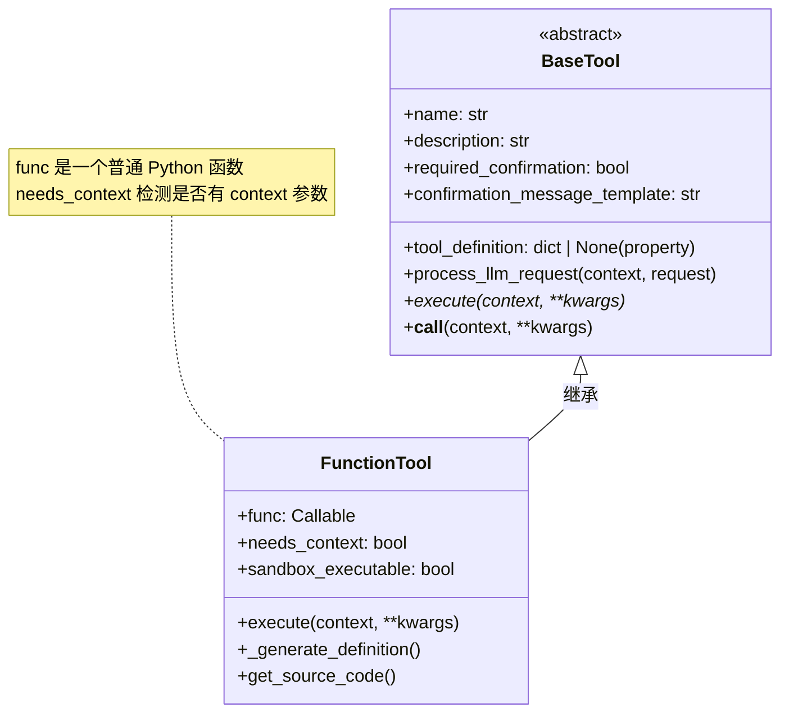

# 第 7 章 工具抽象

## 7.1 核心问题

Agent 要真正"动手"，就得能调用外部工具——搜索、计算、读写文件、执行代码……但这些工具原本只是普通的 Python 函数。LLM 无法直接"看到"一个 Python 函数，它需要一个结构化的**工具描述（JSON Schema）**才知道"有哪些工具、每个工具要什么参数"。

**本章回答的问题是：如何把普通 Python 函数抽象成 Agent 可识别、可描述、可调用的"工具"？**

## 7.2 教学目标

学完本章，你应当能够：

1. **说出** `BaseTool` 抽象基类的职责，以及它定义的核心接口（`execute`/`tool_definition`/确认相关字段）。
2. **理解** `FunctionTool` 如何"包装"一个函数——检测 `context` 参数、兼容同步/异步、自动生成 JSON Schema。
3. **理解** `@tool` 装饰器的两种用法，以及 `@overload` 如何让类型检查器区分它们。
4. **能独立实现** `function_to_input_schema`，把 Python 类型注解转换成 OpenAI 工具的 JSON Schema。

## 7.3 原理讲解

### 7.3.1 工具抽象要解决的三件事

把函数变成工具，本质是三件事：

1. **注册（描述）**：读取函数签名、类型注解、docstring，生成 LLM 能读懂的 JSON Schema，告诉模型"这个工具叫什么、干什么、要什么参数"。
2. **调用（执行）**：模型返回一个工具调用（`ToolCall`，第 4 章），Agent 要能据此调用对应的 Python 函数，处理同步/异步差异。
3. **约束（控制）**：某些危险工具需要人工确认（`required_confirmation`），某些工具需要在沙箱里跑（`sandbox_executable`）。

`scratchagent` 用两个文件分层解决：`_base.py` 定义**工具对象**（`BaseTool`/`FunctionTool`/`@tool`），`_helpers.py` 提供**辅助函数**（类型注解 → Schema、格式化定义、执行）。

### 7.3.2 配图：工具抽象的类关系

> 下图展示工具抽象的类层次，以及 `FunctionTool` 如何组合一个普通函数。



**解读**：`BaseTool` 定义了所有工具的统一接口（尤其是抽象的 `execute`），`FunctionTool` 是"包装普通函数"的具体实现。`@tool` 装饰器是 `FunctionTool` 的语法糖入口（未在图中画出，因为它返回的就是 `FunctionTool` 实例）。

## 7.4 源码精读

### 7.4.1 `BaseTool` —— 统一接口

```python
class BaseTool(ABC):
    """所有工具的抽象基类."""

    DEFAULT_CONFIRMATION_TEMPLATE = (
        "The Agent wants to execute '{name}' with arguments: {arguments}." "你同意吗?"
    )

    def __init__(
        self,
        name: str | None = None,
        description: str | None = None,
        tool_definition: dict[str, Any] | None = None,
        required_confirmation: bool = False,
        confirmation_message_template: str | None = None,
    ):
        self.name = name or self.__class__.__name__
        self.description = description or self.__doc__ or ""
        self._tool_definition = tool_definition
        self.required_confirmation = required_confirmation
        self.confirmation_message_template = (
            confirmation_message_template
            if confirmation_message_template
            else self.DEFAULT_CONFIRMATION_TEMPLATE
        )

    @property
    def tool_definition(self) -> dict[str, Any] | None:
        return self._tool_definition

    def get_confirmation_message(self, arguments: dict) -> str:
        return self.confirmation_message_template.format(
            name=self.name, arguments=arguments
        )

    async def process_llm_request(
        self,
        context: ExecutionContext,
        request: "LlmRequest",
    ) -> None:
        """供工具在发送大模型请求之前对其进行修改的钩子."""
        return None

    @abstractmethod
    async def execute(self, context: ExecutionContext, **kwargs) -> Any:
        pass

    async def __call__(self, context: ExecutionContext, **kwargs) -> Any:
        return await self.execute(context, **kwargs)
```

> **说明**：上面的 `request: "LlmRequest"` 用了**字符串前向引用**——`LlmRequest` 定义在 `llm/_client.py`，`_base.py` 顶部用 `if TYPE_CHECKING: from ..llm import LlmRequest` 延迟导入，既满足类型检查，又避免运行时的循环导入（`tools` 与 `llm` 互相依赖）。这是打破循环依赖的标准手法，详见第 3 章与附录 2。

设计要点：

1. **`ABC` + `@abstractmethod`**：`execute` 是抽象方法，强制所有子类实现。这是"工具必须能执行"这一契约的显式表达。

2. **默认值兜底**：`name` 缺省用类名，`description` 缺省用 docstring，`confirmation_message_template` 缺省用 `DEFAULT_CONFIRMATION_TEMPLATE`。让工具"开箱即用"，不必每个字段都显式传。

3. **`tool_definition` 是 property 只读**：对外暴露 `tool_definition`（供 `build_messages` 提取工具 schema，第 6 章），但底层存的是 `_tool_definition`，允许子类延迟生成（见 7.4.2）。

4. **`process_llm_request` 是扩展钩子**：默认空实现（`return None`），留给子类"在发 LLM 请求前修改请求"的扩展点。这是面向扩展的设计——不强制，但留了口子。

5. **`__call__` 委托给 `execute`**：让工具实例可以像函数一样被调用（`tool(context, arg=1)`），统一了"函数"与"工具"的调用语义。

### 7.4.2 `FunctionTool` —— 包装普通函数

```python
class FunctionTool(BaseTool):
    """将一个 Python 函数封装为基础工具"""

    def __init__(
        self,
        func: Callable[..., Any],
        name: str | None = None,
        description: str | None = None,
        tool_definition: dict[str, Any] | None = None,
        sandbox_executable: bool = False,
        required_confirmation: bool = False,
        confirmation_message_template: str = "",
    ):
        self.func = func
        self.needs_context = "context" in inspect.signature(func).parameters
        self.sandbox_executable = sandbox_executable

        if sandbox_executable and self.needs_context:
            raise ValueError(
                f"Tool '{func.__name__}' cannot be sandbox_executable "
                " because it requires 'context' parameters."
            )

        resolved_name = name or func.__name__
        resolved_desc = description or (func.__doc__ or "").strip()

        # Must set name/description before _generate_definition

        super().__init__(
            name=resolved_name,
            description=resolved_desc,
            tool_definition=tool_definition,
            required_confirmation=required_confirmation,
            confirmation_message_template=confirmation_message_template,
        )

        # Generate definition after super().__init__ so self.name is available
        if self._tool_definition is None:
            self._tool_definition = self._generate_definition()

    async def execute(self, context: ExecutionContext, **kwargs) -> Any:
        """执行被包装的函数"""
        if self.needs_context:
            result = self.func(context=context, **kwargs)
        else:
            result = self.func(**kwargs)

        # Handel both sync and async functions
        if inspect.iscoroutine(result):
            return await result
        return result
```

三个关键设计：

1. **`needs_context` 检测**：`"context" in inspect.signature(func).parameters` —— 用反射判断被包装函数是否声明了 `context` 参数。若声明了，执行时注入 `context=context`；否则不传。这让工具函数既能"感知执行上下文"，又不必都写这个参数。

2. **`sandbox_executable` 与 `context` 互斥**：若一个工具既要在沙箱跑、又需要 `context`，直接 `raise ValueError`。源码的报错信息是 `"cannot be sandbox_executable because it requires 'context' parameters"`——它只陈述了"两个特性不兼容"这一约束本身，并未解释底层原因（一个合理推断是：沙箱是隔离环境，工具在沙箱内执行时拿不到框架的 `ExecutionContext`）。这是**在构造期就用异常守住不变量**，而非等到运行时才出错。

3. **同步/异步兼容**：`execute` 调用 `self.func(**kwargs)` 后，用 `inspect.iscoroutine(result)` 判断——若是协程就 `await`，否则直接返回。这行注释 `# Handel both sync and async functions`（注意源码里的 `Handel` 是拼写错误，应为 `Handle`），是让"同一套工具接口"兼容同步和异步函数的巧妙处理。

   > **正例 vs 反例**：
   > - **反例**：要求所有工具函数都必须是 `async def`。这会把大量现成的同步工具库（如 `calculator`）挡在门外。
   > - **正例**：用 `inspect.iscoroutine(result)` 在运行时区分——同步函数返回普通值，异步函数返回协程；是协程就 `await`，不是就直接返回。一个工具既能包装同步函数，也能包装异步函数。

### 7.4.3 `@tool` 装饰器 —— 两种用法

```python
@overload
def tool(func: Callable[..., Any], /) -> FunctionTool: ...

@overload
def tool(
    *,
    name: str | None = None,
    description: str | None = None,
    sandbox_executable: bool = False,
    required_confirmation: bool = False,
    confirmation_message: str | None = None,
) -> Callable[[Callable[..., Any]], FunctionTool]: ...


def tool(
    func: Callable[..., Any] | None = None,
    *,
    name: str | None = None,
    ...
) -> FunctionTool | Callable[[Callable[..., Any]], FunctionTool]:
    def decorator(f: Callable[..., Any]) -> FunctionTool:
        return FunctionTool(func=f, name=name, ...)

    if func is not None:
        # Called without arguments: @tool
        return decorator(func)
    # Called with arguments: @tool(name=...)
    return decorator
```

两个要点：

1. **支持两种用法**：`@tool`（直接装饰，无参数）和 `@tool(name="...", description="...")`（带参数装饰）。实现技巧是判断 `func is not None`——若是 `@tool` 直接用在函数上，`func` 就是那个函数；若是 `@tool(...)`，`func` 是 `None`，返回 `decorator` 等待后续装饰。

2. **`@overload` 重载**：上面两个 `@overload` 声明让类型检查器能精确推断——`@tool` 直接用时返回 `FunctionTool`，`@tool(...)` 用时返回一个装饰器函数。这是让"灵活的 API"仍有"精确的类型"的关键（PEP 484 的 overload 机制）。

### 7.4.4 `function_to_input_schema` —— 类型注解到 JSON Schema

```python
def function_to_input_schema(func: Any) -> dict[str, Any]:
    """把一个Python 的函数签名转换成工具的 JSON Schema"""

    try:
        hints = get_type_hints(func)
    except Exception:
        hints = {
            name: param.annotation
            for name, param in inspect.signature(func).parameters.items()
            if param.annotation is not inspect.Parameter.empty
        }
    sig = inspect.signature(func)

    properties: dict[str, Any] = {}
    required: list[str] = []

    for name, param in sig.parameters.items():
        if name in ("self", "context"):
            continue

        prop: dict[str, Any] = {}
        hint = hints.get(name)

        if hint == str:
            prop["type"] = "string"
        elif hint == int:
            prop["type"] = "integer"
        elif hint == float:
            prop["type"] = "number"
        elif hint == bool:
            prop["type"] = "boolean"
        elif hint is list or get_origin(hint) is list:
            prop["type"] = "array"
            args = get_args(hint)
            if args:
                item_type = args[0]
                ...
        elif hint is not None and hasattr(hint, "model_json_schema"):
            prop = hint.model_json_schema()
        else:
            prop["type"] = "string"

        prop["description"] = f"Parameter:{name}"
        properties[name] = prop

        if param.default is inspect.Parameter.empty:
            required.append(name)

    schema = {"type": "object", "properties": properties}
    if required:
        schema["required"] = required
    return schema
```

核心逻辑是把 Python 类型映射到 JSON Schema 类型：

| Python 类型 | JSON Schema `type` |
|---|---|
| `str` | `"string"` |
| `int` | `"integer"` |
| `float` | `"number"` |
| `bool` | `"boolean"` |
| `list[...]` | `"array"`（进一步解析 `items`） |
| Pydantic 模型 | 直接用 `model_json_schema()` |
| 其他/未知 | 兜底 `"string"` |

三个要点：

1. **`get_type_hints` 优先，失败降级**：`get_type_hints` 能解析字符串前向引用等复杂注解，但如果失败（如某些动态场景），降级为手动读 `param.annotation`。这是"尽力而为"的健壮性处理。

2. **跳过 `self` 和 `context`**：`self` 是方法参数、`context` 是框架注入的上下文（见 7.4.2），都不属于"工具对 LLM 暴露的参数"，要排除。

3. **`required` 由默认值决定**：参数无默认值（`inspect.Parameter.empty`）→ 加入 `required`。这正确表达了"必填参数"的语义。

   > **已知局限**：`prop["description"]` 目前只是 `f"Parameter:{name}"`，源码注释也坦承"待改进从函数描述中获取"。这意味着 LLM 看到的参数描述很粗糙——这是诚实的、可改进的教学点。

## 7.5 动手实验

**目标**：在你的项目里实现工具抽象，把一个普通函数变成可被 Agent 调用的工具。

1. 新建 `tools/_helpers.py`，实现 `function_to_input_schema` 和 `format_tool_definition`（逻辑与本章一致）。
2. 新建 `tools/_base.py`，实现 `BaseTool`、`FunctionTool`、`@tool` 装饰器。
3. 写验证代码：

```python
from base_module import tool  # base_module 指你新建的 tools/_base.py
import inspect

@tool(name="calculator", description="执行加减乘除运算")
def calculator(operator: str, first_number: float, second_number: float) -> float:
    """执行简单的数学计算"""
    if operator == "add":
        return first_number + second_number
    elif operator == "subtract":
        return first_number - second_number
    elif operator == "multiply":
        return first_number * second_number
    elif operator == "divide":
        if second_number == 0:
            raise ValueError("Cannot divide by zero")
        return first_number / second_number
    else:
        raise ValueError(f"Unknown operator: {operator}")

# 1. 验证 tool_definition 是 OpenAI function calling 格式
print(calculator.name)                # calculator
print(calculator.tool_definition)     # 含 type/function/name/description/parameters

# 2. 验证 needs_context 检测
@tool
def no_context(x: int) -> int:
    return x * 2

@tool
def with_context(context, x: int) -> int:
    return x + len(context.events)

print(no_context.needs_context)       # False
print(with_context.needs_context)     # True
```

4. **思考题**：写一个 `async def` 的函数并用 `@tool` 包装，验证 `execute` 能否正确处理（应 `await` 它）。再写一个带 `context` 参数 + `sandbox_executable=True` 的工具，确认构造时抛 `ValueError`。

## 7.6 本章自检

- [ ] 能说出 `BaseTool` 的核心接口（抽象 `execute`、`tool_definition` property、确认字段）。
- [ ] 能解释 `needs_context` 如何用 `inspect.signature` 检测 `context` 参数。
- [ ] 能解释 `execute` 如何用 `inspect.iscoroutine` 兼容同步/异步函数。
- [ ] 能解释 `@tool` 两种用法的实现原理（`func is not None` 判断），以及 `@overload` 的作用。
- [ ] 能说出 `function_to_input_schema` 的类型映射规则（str/int/float/bool/list/Pydantic/兜底 string）。
- [ ] 能解释 `sandbox_executable` 与 `context` 参数互斥的原因（构造期抛异常守住不变量）。
- [ ] 独立实现的工具抽象，能用 `@tool` 包装同步和异步函数并正确执行。
