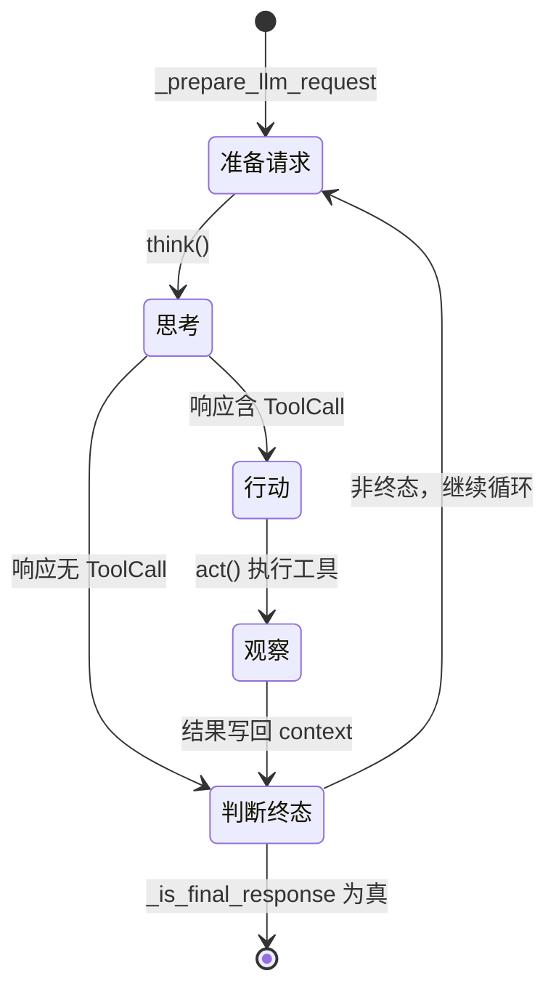
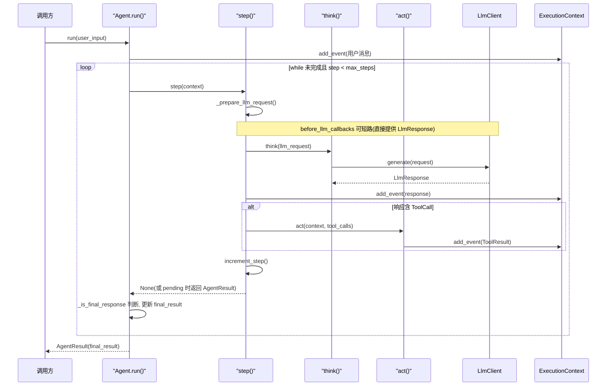

# 第 8 章 ReAct Agent（核心里程碑）

## 8.1 核心问题

前面 7 章已经备齐了所有零件：消息类型（第 4 章）、执行上下文（第 5 章）、消息转换（第 6 章）、工具抽象（第 7 章）。但它们还只是"零件"，缺一个"引擎"把它们串起来跑。

**本章回答的问题是：如何用这些零件，组装出一个能自主"思考—行动—观察"循环、直到完成任务的 ReAct Agent？**

> 这是全教程的**第一个里程碑**（第二个是第 20 章多智能体）。学完本章，你将第一次拥有一个完整可运行的 Agent。

## 8.2 学习目标

学完本章，你应当能够：

1. **说出** ReAct 循环的三个环节（Thought → Action → Observation），并指出它们在 `agent.py` 中的对应方法（`think()` / `act()` / 事件回写）。
2. **理解** `run()` 主循环的终止条件（`final_result` 或 `max_steps`），以及 `step()` 如何组织"一次思考 + 一次行动"。
3. **理解** `think()` / `act()` / `_prepare_llm_request` 三者的职责分工。
4. **能独立写出** 一个最小 ReAct 循环，并能解释每一步的数据流向。

## 8.3 原理讲解

### 8.3.1 ReAct 是什么

ReAct（Reasoning + Acting）是让 LLM 自主完成任务的核心范式：模型不是一次回答，而是**循环地**：

1. **Thought（思考）**：模型决定"下一步该做什么"——是回答，还是调用某个工具？
2. **Action（行动）**：如果需要工具，就调用它（`think()` 返回 `LlmResponse`，其中若含 `ToolCall`，`act()` 执行）。
3. **Observation（观察）**：工具结果（`ToolResult`）写回 `context.events`，作为下一次思考的输入。

循环持续到模型认为"信息够了"，给出最终答案。`scratchagent` 把这个循环固化在 `Agent.run()` 里。

### 8.3.2 配图：ReAct 循环的状态机

> 下图是 ReAct 循环的状态流转，标注了每个环节对应的 `agent.py` 方法。



**解读**：`think()` 产出的 `LlmResponse` 有两种情况——若含 `ToolCall`（模型要调工具），进入 `act()`；若只是文本，进入"判断终态"。注意**终止判断不在 `think()` 之后立即做，而是在 `run()` 主循环里对最新事件统一调 `_is_final_response`**（见 8.4.6）。此外，当设了 `output_type`（结构化输出，第 9 章）时，终止信号是"名为 `output_tool_name` 的 ToolResult 成功"，而非"无 ToolCall"——这两种终止模式在 8.4.6 详述。

### 8.3.3 配图：`run() → step() → think()/act()` 时序图（本章核心图）

> 下图是一轮完整 ReAct 迭代的调用时序，是理解本章最核心的一张图。



**解读**：`run()` 是外壳，内部是一个 `while` 循环反复调用 `step()`。`step()` 做一次"准备 → 思考 →（可能）行动"，把结果写回 `context.events`。**循环体内的关键动作是 `run()` 每轮都调 `_is_final_response` 检查最新事件**，一旦判定为终态就提取 `final_result` 并退出；否则继续下一轮。`before_llm_callbacks` 的短路（直接提供响应、跳过真实 LLM 调用）用 `Note` 标注。

## 8.4 源码精读

文件位置：src/scratchagent/agent.py

### 8.4.1 `run()` —— 主循环

```python
async def run(
    self,
    user_input: str | None = None,
    context: ExecutionContext | None = None,
    session_id: str | None = None,
    user_id: str | None = None,
    tool_confirmations: list[ToolConfirmation] | None = None,
    verbose: bool = False,
) -> AgentResult:
    """Execute the agent."""
    if self.model is None:
        raise ValueError("Agent requires a model to run.")
    ...
    terminal = False
    # Loop execution
    try:
        while not context.final_result and context.current_step < self.max_steps:
            result = await self.step(context, verbose=verbose)

            # Check for pending tool calls(human-in-the-loop)
            if result and result.status == "pending":
                ...
                return result

            if context.events:
                last_event = context.events[-1]
                if self._is_final_response(last_event):
                    context.final_result = self._extract_final_result(last_event)

            # Check for agent transfer
            if context.transfer_to:
                ...
        terminal = True
        ...
        return AgentResult(output=context.final_result, context=context, status="complete")
    finally:
        ...
```

核心是这个 `while` 循环，它的**终止条件**有两个，缺一不可：

1. `context.final_result` 非空——说明已经得到最终答案；
2. `context.current_step < self.max_steps`——防止无限循环（默认 `max_steps=10`）。

循环体内做四件事：

1. **调 `step()`** 执行一次"思考 + 行动"；
2. **检查 pending**：若 `step()` 返回 `status="pending"`（有工具需人工确认，HITL），立即暂停并返回，等用户确认后再续；
3. **判断是否终态**：检查最新事件 `_is_final_response`，若是则提取 `final_result`；
4. **检查转交**：若 `context.transfer_to` 被设置（多智能体，第 20 章），转交给目标 Agent。

> **关键设计——"循环体很薄，判断都在循环体内"**：`run()` 自己不关心"这次思考了什么、调用了什么工具"，它只负责"反复调 `step()`，直到出现终止信号"。具体的一步逻辑全在 `step()` 里。这种"外壳循环 + 单步函数"的分层，让代码职责清晰、易于测试。

### 8.4.2 `step()` —— 一次思考 + 一次行动

```python
async def step(
    self,
    context: ExecutionContext,
    verbose: bool = False,
) -> AgentResult | None:
    """Perform one think-act cycle"""
    # Prepare what to send to the LLM
    llm_request = await self._prepare_llm_request(context)

    # run before-llm-callbacks
    for callback in self.before_llm_callbacks:
        cb_result = callback(context, llm_request)
        if hasattr(cb_result, "__await__"):
            cb_result = await cb_result
        if cb_result is not None:
            if not isinstance(cb_result, LlmResponse):
                raise TypeError("before_llm_callbacks must return LlmResponse or None")
            llm_response = cb_result
            break
    else:
        llm_response = await self.think(llm_request)

    if verbose:
        self._log_response(llm_response)

    response_event = Event(
        execution_id=context.execution_id,
        author=self.name,
        content=llm_response.content,
    )
    context.add_event(response_event)

    tool_calls = [c for c in llm_response.content if isinstance(c, ToolCall)]
    if tool_calls:
        result = await self.act(context, tool_calls, verbose=verbose)
        if result and result.status == "pending":
            return result

    context.increment_step()
    return None
```

`step()` 是"一次 think-act 循环"的完整实现，四个阶段：

1. **准备**：`_prepare_llm_request` 把当前 `context` 扁平成 `LlmRequest`（带上历史、工具、指令）。
2. **思考**：先跑 `before_llm_callbacks`（回调可短路，直接提供 `LlmResponse` 跳过真实 LLM 调用），否则调 `think()`。
3. **记录**：把 `llm_response.content` 包装成 `Event` 写回 `context`（作者是 `self.name`）。
4. **行动**：从响应里筛出 `ToolCall`，若有则调 `act()` 执行；若 `act()` 返回 pending，立即向上传递。

最后 `increment_step()`，步数 +1。注意 `step()` 正常情况返回 `None`（循环由 `run()` 控制），只有遇到 pending 才返回 `AgentResult`。

### 8.4.3 `think()` —— 极简的"思考"

```python
async def think(self, llm_request: LlmRequest) -> LlmResponse:
    """Call the LLM to decide the next action."""
    model = self.model
    if model is None:
        raise ValueError("Agent requires a model to think.")
    return await model.generate(llm_request)
```

`think()` 只有一件事：把请求交给 `LlmClient.generate()`，拿回 `LlmResponse`。所谓"思考"，本质就是一次 LLM 调用——模型在请求里看到了历史、工具定义，于是决定"接下来输出文本还是工具调用"。

### 8.4.4 `act()` —— 执行工具

```python
async def act(
    self,
    context: ExecutionContext,
    tool_calls: list[ToolCall],
    verbose: bool = False,
) -> AgentResult | None:
    """Execute the tools requested by the LLM."""
    tools_dict = {tool.name: tool for tool in self.tools}
    results: list[ToolResult] = []
    pending: list[PendingToolCall] = []

    for tool_call in tool_calls:
        if tool_call.name not in tools_dict:
            results.append(ToolResult(..., status="error",
                content=[f"Tool '{tool_call.name}' not found"]))
            continue

        tool_obj = tools_dict[tool_call.name]

        # check if tool requires confirmation (human-in-the-loop)
        if tool_obj.required_confirmation:
            ...
            pending.append(PendingToolCall(...))
            continue

        # NEW: before tool callback
        skip = False
        for callback in self.before_tool_callbacks:
            ...
        if skip:
            continue

        # Execute the tool
        try:
            arguments = tool_call.arguments
            if isinstance(arguments, str):
                arguments = json.loads(arguments)
            output = await tool_obj(context, **arguments)
            tool_result = ToolResult(..., status="success", content=[output])
        except Exception as e:
            tool_result = ToolResult(..., status="error", content=[str(e)])

        # NEW: after tool callback
        for callback in self.after_tool_callbacks:
            ...

        results.append(tool_result)

    if pending:
        context.state["pending_tool_calls"] = [p.model_dump() for p in pending]
        ...
        return AgentResult(output=None, context=context, status="pending", ...)
    if results:
        tool_event = Event(execution_id=context.execution_id, author=self.name, content=results)
        context.add_event(tool_event)
    return None
```

`act()` 对每个 `ToolCall` 依次处理，是一条清晰的流水线：

1. **查表**：`tools_dict` 用工具名索引，找不到就返回一个 `status="error"` 的 `ToolResult`（不抛异常，让 LLM 看到"这个工具不存在"）。
2. **确认检查**：若工具 `required_confirmation`（第 7 章），挂起为 `PendingToolCall`，不执行。
3. **before 回调**：`before_tool_callbacks` 可拦截——若回调返回非 `None`，把返回值当作错误结果、跳过本次执行。
4. **执行**：`arguments` 若是字符串先 `json.loads`；`await tool_obj(context, **arguments)` 调用工具；异常则转成 `status="error"` 的结果。
5. **after 回调**：`after_tool_callbacks` 可改写结果（如结果压缩，第 12 章）。
6. **记录**：所有 `ToolResult` 打包成一个 `Event` 写回 `context`（这是"观察"环节——下一轮 `think` 会看到这些结果）。

> **正例 vs 反例（错误处理）**：
> - **反例**：工具执行出错就 `raise`，让异常打断整个循环。这样一次工具失败会导致整个 Agent 崩溃。
> - **正例**：用 `try/except` 把异常捕获成 `ToolResult(status="error", content=[str(e)])`，让 LLM 在下一次思考时"看到"错误信息并调整策略。这体现了 Agent 的容错哲学：**错误也是信息，反馈给模型而非中断执行**。

### 8.4.5 `_prepare_llm_request` —— 组装的请求

```python
async def _prepare_llm_request(self, context: ExecutionContext) -> LlmRequest:
    """Build an LlmRequest from the current context."""
    flat_contents: list[ContentItem] = []
    for event in context.events:
        flat_contents.extend(event.content)

    instructions: list[str] = []
    if self.instruction:
        instructions.append(self.instruction)
    sandbox_prompt = self._get_sandbox_tools_prompt()
    if sandbox_prompt:
        instructions.append(sandbox_prompt)

    if self.skills_path:
        ...  # skills prompt

    # Filter tools that should be exposed to the LLM
    llm_tools = [t for t in self.tools if t.tool_definition is not None]

    # determine tool choice strategy
    if self.output_tool_name:
        tool_choice = "required"
    elif llm_tools:
        tool_choice = "auto"
    else:
        tool_choice = None

    request = LlmRequest(instructions=instructions, contents=flat_contents, tools=llm_tools, tool_choice=tool_choice)

    # Let tools modify the request
    for tool_obj in self.tools:
        await tool_obj.process_llm_request(context, request)

    return request
```

这一步把分散的状态**组装**成一次 LLM 调用：

1. **扁平化历史**：把所有 `Event.content` 展平成 `flat_contents`（这是把"按事件组织"的历史，转成"按消息组织"的对话）。
2. **拼指令**：`instruction` → 沙箱工具 prompt → skills prompt，依次追加。
3. **过滤工具**：只暴露有 `tool_definition` 的工具给 LLM。
4. **tool_choice 策略**：有 `output_tool_name`（结构化输出，第 9 章）→ `required`；有工具 → `auto`；无工具 → `None`。
5. **工具钩子**：逐个调用 `process_llm_request`（第 7 章的扩展钩子），让工具在发请求前有机会修改请求（如 `MemoryTool` 注入记忆）。

### 8.4.6 `_is_final_response` —— 何时该停

```python
def _is_final_response(self, event: Event) -> bool:
    """Check if this event contains a final response"""
    if self.output_tool_name:
        for item in event.content:
            if (isinstance(item, ToolResult) and item.name == self.output_tool_name
                    and item.status == "success"):
                return True
        return False

    has_tool_calls = any(isinstance(c, ToolCall) for c in event.content)
    has_tool_results = any(isinstance(c, ToolResult) for c in event.content)
    return not has_tool_calls and not has_tool_results
```

终止判断分两种情况：

- **结构化输出模式**（设了 `output_type`，`_setup_tools` 会据此设 `output_tool_name = "final_answer"`，第 9 章展开）：当出现名字匹配 `output_tool_name` 且成功的 `ToolResult` 时终止；
- **普通模式**：当一轮响应里**既没有 ToolCall 也没有 ToolResult**——即模型只说了话、没调工具——就认为它是最终答案。

> **关键洞察**："模型只说文本、不调工具"就是终止信号。因为 ReAct 的语义是"只要还缺信息，模型就会继续调工具；当它觉得信息够了，就只输出文本"。这个判断精确捕捉了这一点。

### 8.4.7 已知局限（诚实声明）

这个 ReAct 实现是**教学型的最小内核**，有几处已知局限，值得你了解（它们是后续章节或改进方向）：

1. **`error_message` 未被消费**：`LlmResponse` 有 `error_message` 字段（第 2 章），但 `step()` 拿到响应后**没有检查它**——即使 LLM 调用失败（返回带 `error_message` 的响应），循环仍会继续往下走。生产级实现应在此处检查并处理。

2. **步数耗尽后状态仍是 `complete`**：若循环因 `current_step >= max_steps` 退出（而非 `final_result`），`run()` 仍返回 `status="complete"`，且 `output` 可能是 `None`。调用方无法区分"自然完成"与"步数耗尽未完成"。

3. **多个 ToolCall 串行执行**：当一轮 `think()` 返回多个 `ToolCall` 时，`act()` 是 `for` 循环逐个 `await`，串行而非并行。对相互独立的工具调用，并行执行能显著降低延迟。

4. **`arguments` 解析在 `act()` 内重复**：`json.loads` 的逻辑在 `act()` 和 `_process_confirmations` 里各写了一遍，属轻微 DRY 问题。

这些局限不是 bug，而是"最小实现"的合理取舍——它们在真实项目里都是可接受的起点。理解它们，能帮你在第 9 章及之后看清框架如何逐步补全。

## 8.5 动手实验

**目标**：用前 7 章的零件，组装出一个最小可运行的 ReAct Agent。

1. 新建 `agent.py`，实现 `Agent` 类的 `run`/`step`/`think`/`act` 四个方法（逻辑与本章一致，可先略去回调、记忆、沙箱、多智能体等高级特性，只保留核心 ReAct 循环）。
2. 用第 7 章的 `@tool` 定义两个工具（如 `calculator` 和一个简单的 `search`），然后：

```python
import asyncio
from scratchagent import Agent  # agent_module 指你新建的 agent.py
from scratchagent.llm import LlmClient, resolve_model_config, Provider
from scratchagent.tools import FunctionTool, calculator

async def main():
    client = LlmClient(default_config=resolve_model_config(
        provider=Provider.OPENAI_COMPAT, model="<你的模型名>"))  # 替换为实际可用的模型名
    agent = Agent(
        model=client,
        tools=[FunctionTool(calculator)],
        instruction="你是一个助手，需要计算时调用 calculator 工具。",
    )
    result = await agent.run("45738 乘以 238 等于多少？")
    print("输出:", result.output)
    print("状态:", result.status)
    print("步数:", result.context.current_step)

asyncio.run(main())
```

3. **观察循环**：在 `think()` 和 `act()` 里加 `print` 日志，观察一次完整的 ReAct 循环——模型先返回 `ToolCall`（调 calculator），`act()` 执行得到结果，下一轮模型看到结果后输出最终答案。
4. **验证终止**：确认当模型输出纯文本（无 ToolCall）时，`_is_final_response` 判定为真，循环结束，`final_result` 被正确提取。

## 8.6 本章自检

- [ ] 能画出 ReAct 循环状态机，并说出 Thought/Action/Observation 各对应 `agent.py` 的哪个方法。
- [ ] 能解释 `run()` 主循环的两个终止条件（`final_result` / `max_steps`），以及为什么需要 `max_steps` 防死循环。
- [ ] 能说清 `step()` 的四个阶段（准备 → 思考 → 记录 → 行动）。
- [ ] 能解释 `think()` 为何如此"薄"（就是一次 `model.generate`）。
- [ ] 能解释 `act()` 的错误处理哲学（异常转 `status="error"` 的 ToolResult，而非中断）。
- [ ] 能说清 `_is_final_response` 如何判断"该停了"（无 ToolCall 且无 ToolResult）。
- [ ] 独立写出的 Agent 能跑通一次完整的 ReAct 循环，正确输出最终答案。
