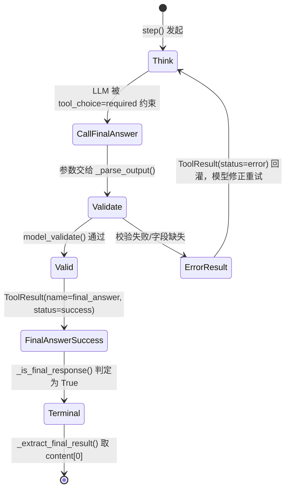

# 第 9 章 结构化输出：让 Agent 返回可校验的 Pydantic 对象

> 对应真实源码：`src/scratchagent/agent.py` §`output_type` / §`_setup_tools` / §`_prepare_llm_request` / §`_is_final_response` / §`_extract_final_result`，以及 `tools/_helpers.py` §`format_tool_definition`。
> 前置章节：第 8 章（ReAct 循环）、第 7 章（工具抽象）、第 4 章（消息类型）。

---

## 1. 核心问题

一个自由输出的 Agent，返回的是**一段自然语言文本**；而一个能嵌入生产流水线的 Agent，返回的应该是**一个结构确定、可被下游代码直接消费的对象**（例如一个 `WeatherReport`、一张 `OrderInfo`）。本章回答一个问题：**如何让 Agent 的最终输出不再是"随便一段话"，而是一个经过 Pydantic 校验、类型确定的实例？**

---

## 2. 教学目标

学完本章，你应当能：

1. **写出** `Agent(output_type=MyModel)` 的最小用法，并解释 `output_type` 如何从 `__init__` 一路流到最终结果；
2. **说清** `final_answer` 这个"隐式工具"是如何被 `_setup_tools` 动态生成的，以及它为什么能逼模型"必须按 schema 作答"；
3. **复述** `_is_final_response` / `_extract_final_result` 两处分支判断，说明结构化输出模式下"何时终止、取哪个值"与自由输出模式的差异；
4. **用代码** 复现 `model_json_schema()` → 弹 `title`/`$defs` → 包 `{"output": ...}` → `format_tool_definition` 这条 schema 加工链。

---

## 3. 原理讲解

### 3.1 结论先行：结构化输出 = "把 schema 变成一个工具"

自由输出与结构化输出的本质区别只有一句话：

| | 自由输出 | 结构化输出 |
|---|---|---|
| 模型产出 | 任意自然语言 `Message` | 一次对 `final_answer` 工具的调用 |
| 终止条件 | 没有 tool call / tool result | 出现 `final_answer` 且 `status="success"` |
| 返回值 | `Message.content`（字符串） | `ToolResult.content[0]`（Pydantic 实例） |
| 约束来源 | 无 | Pydantic 模型生成的 JSON Schema |

**关键洞察**：`scratchagent` **没有**使用 OpenAI 的结构化输出原生 API（`response_format: json_schema`），而是复用现有的**函数调用（Function Calling）机制**——把 `output_type` 的 JSON Schema 塞进一个叫 `final_answer` 的工具定义里，然后**强制**（`tool_choice="required"`）模型必须调用它。模型的"最终答案"因此被框定为一个符合 schema 的 JSON 参数。

### 3.2 正例 vs 反例：为什么不用原生 JSON 模式

**反例（常见朴素做法）**：提示词里写"请返回 JSON"，然后 `json.loads` 模型输出。

```python
# 反例：把结构约束交给 prompt，事后才解析
resp = await model.generate(...)          # 返回一段文本，可能夹带解释
data = json.loads(resp)                   # 可能抛异常：模型多打了个"好的，如下："前缀
```

问题：LLM 的输出是概率性的，prompt 约束是"软约束"，模型完全可能多输出一个前缀、漏一个字段、拼错 key。解析失败要在业务层反复兜底。

**正例（本章实现）**：让 schema 进入工具定义，模型**必须**以"工具调用参数"这一结构化通道回传，参数天然是合法 JSON，再交给 Pydantic 二次校验。

```python
# 正例：schema 变工具，参数走 function calling 通道，天然合法 JSON
class WeatherReport(BaseModel):
    city: str
    temperature_c: float
    summary: str

agent = Agent(model=client, output_type=WeatherReport)
result = await agent.run("北京今天天气如何？")
# result.output 是一个 WeatherReport 实例，而非字符串
```

两者差异的根因：**前者把结构当作"礼貌请求"，后者把结构当作"硬性协议"**。

### 3.3 一条加工链：从 Pydantic 模型到工具定义

`output_type` 到最终工具的完整加工发生在 `_setup_tools`（`agent.py` L517~546），分四步：

```
WeatherReport (BaseModel)
   │  step 1: model_json_schema()
   ▼
{"title":"WeatherReport","type":"object","properties":{...}}
   │  step 2: 弹出 title / $defs
   ▼
{"type":"object","properties":{...}}
   │  step 3: 包一层 {"output": <上面>}，并 required=["output"]
   ▼
{"type":"object","properties":{"output":{...}},"required":["output"]}
   │  step 4: format_tool_definition("final_answer", desc, 上面)
   ▼
{"type":"function","function":{"name":"final_answer", ...}}
```

> **为什么 step 3 要包一层 `output`？** OpenAI 的 function calling 参数本身必须是一个 JSON object（顶层不能是裸字符串/数组）。多包一层 `{"output": <schema>}` 既满足"参数是 object"，又把整个模型定义完整塞进一个字段，语义上"这是你要交的最终答案"。

---

## 4. 配图

### 图 1：`output_type` 到 `final_answer` 工具的生成流程

```mermaid
flowchart TD
    A["Agent.__init__<br/>output_type: type[BaseModel] | None"] -->|"非 None"| B["_setup_tools()<br/>L517"]
    B --> C["output_schema = output_type.model_json_schema()<br/>L518"]
    C --> D["弹出 'title' / '$defs'<br/>L519-520"]
    D --> E["内联构造参数<br/>{\"type\":\"object\", properties.output, required=['output']}<br/>L525-529"]
    E --> F["format_tool_definition('final_answer', desc, 上述参数)<br/>L522"]
    F --> G["FunctionTool(func=_parse_output, name='final_answer')<br/>L539"]
    G --> H["prepared_tools.append(final_answer_tool)<br/>L545"]
    H --> I["self.output_tool_name = 'final_answer'<br/>L546"]
    I --> J["LLM 侧: tool_choice='required'<br/>L444-445"]
```

**解读**：整条链的关键在两点——（1）`title`/`$defs` 必须被弹出，否则它们会污染工具参数 schema（`title` 会被某些模型误读为"顶层字段名"）；（2）`output_tool_name` 的赋值是后续 `_prepare_llm_request` 里设 `tool_choice="required"` 的唯一依据，二者构成"生成工具"与"强制调用"的呼应。

### 图 2：结构化输出的自我校验与终止循环（本章核心图）



**解读**：这张图揭示结构化输出的两大安全网——**Pydantic 校验**（`_parse_output` 内 `model_validate`，L534~537）和**终止判定**（`_is_final_response` 只看 `final_answer` 的 `ToolResult` 是否 `success`，L469~477）。一旦模型生成的 JSON 不合 schema，`act()` 会把错误作为 `ToolResult(status="error")` 回灌给模型，模型在下一次 `step()` 里修正重试，形成自我修复闭环。

---

## 5. 源码精读

### 5.1 入口：`__init__` 接收 `output_type`

```python
# agent.py L71
output_type: type[BaseModel] | None = None,
```

```python
# agent.py L91-92
self.output_type = output_type
self.output_tool_name: str | None = None
```

`output_tool_name` 初始为 `None`，它是一把"开关"——只要它是 `None`，后续所有终止/取值逻辑都走自由输出分支；一旦被赋值为 `"final_answer"`，就走结构化输出分支。**这一对字段的协作，是理解全章的钥匙**。

### 5.2 核心：`_setup_tools` 动态生成 `final_answer`（L517~546）

```python
if self.output_type is not None:
    output_schema = self.output_type.model_json_schema()   # L518
    output_schema.pop("title", None)                        # L519
    output_schema.pop("$defs", None)                        # L520

    tool_definition = format_tool_definition(               # L522
        "final_answer",
        "Return the final structured answer matching the required schema.",
        {
            "type": "object",
            "properties": {"output": output_schema},
            "required": ["output"],
        },
    )

    captured_type = self.output_type                        # L532

    def _parse_output(output) -> Any:                       # L534
        if isinstance(output, dict):
            return captured_type.model_validate(output)
        return output

    final_answer_tool = FunctionTool(                       # L539
        func=_parse_output,
        name="final_answer",
        description="Return the final structured answer matching the required schema.",
        tool_definition=tool_definition,
    )
    prepared_tools.append(final_answer_tool)                # L545
    self.output_tool_name = "final_answer"                  # L546
```

逐点讲解：

1. **`model_json_schema()`**（L518）是 Pydantic v2 的标准方法，返回符合 JSON Schema 规范的对象。项目锁定 `pydantic>=2.0.0`（见 `pyproject.toml` L20），所以这里是 v2 API。
2. **`pop("title", None)` / `pop("$defs", None)`**（L519-520）是**防御性清理**：`model_json_schema()` 默认会附带 `title`（模型名）；当模型含嵌套引用时还会生成 `$defs`（嵌套模型定义）。这两个 key 会干扰 function calling 的参数结构，故一并弹出。用 `pop(key, None)` 而非 `del`，是为了在 key 不存在时（如无嵌套的简单模型没有 `$defs`）也不抛异常。
3. **`captured_type = self.output_type`**（L532）是**闭包捕获**的细节：`_parse_output` 定义在 `_setup_tools` 内部，本可直接引用 `self.output_type`，但这里先捕获到局部变量 `captured_type`，让 `_parse_output` 成为一个**只依赖局部变量、不依赖 `self` 的纯函数**，语义更清晰、更易测试。
4. **`_parse_output`**（L534~537）：模型调用 `final_answer` 时，传入的 `output` 参数是一个 dict，`model_validate(output)` 把它转成真正的 `WeatherReport` 实例；若已是非 dict（异常路径），则原样返回。
5. **`tool_definition` 显式传入**：与第 7 章 `FunctionTool(calculator)` 的自动 schema 推导不同，这里**手动构造** `tool_definition`，因为 schema 已经在上一步加工好了，无需再从函数签名推导。

> **要点**：`final_answer` 工具的 `func` 不是去"执行什么业务"，而是**充当一个校验器**——它的输出就是最终答案本身。这是"工具即约束"的典型用法。

### 5.3 强制调用：`_prepare_llm_request` 的 `tool_choice`（L444~450）

```python
# agent.py L444-450
if self.output_tool_name:
    tool_choice = "required"
elif llm_tools:
    tool_choice = "auto"
else:
    tool_choice = None
```

当 `output_tool_name` 非空时，`tool_choice` 被设为 `"required"`——**告诉模型"这一轮必须调用一个工具"**。注意：`"required"` 只强制"必须调用某个工具"，并不直接点名 `final_answer`；模型是靠 `final_answer` 工具 description 里的"Return the final structured answer..."语义，自行判断何时该调用它来交付结果。这是把"自由生成"转成"强制结构化"的落点。

### 5.4 终止判定：`_is_final_response`（L467~481）

```python
def _is_final_response(self, event: Event) -> bool:
    if self.output_tool_name:                       # 结构化输出分支
        for item in event.content:
            if (
                isinstance(item, ToolResult)
                and item.name == self.output_tool_name
                and item.status == "success"
            ):
                return True
        return False

    has_tool_calls = any(isinstance(c, ToolCall) for c in event.content)       # L479
    has_tool_results = any(isinstance(c, ToolResult) for c in event.content)   # L480
    return not has_tool_calls and not has_tool_results                          # L481
```

**两个分支的对比**：

- **自由输出**：终止条件是"既没有 tool call、也没有 tool result"，即模型这轮只回了纯文本。
- **结构化输出**：终止条件是"出现了一个 `name==final_answer` 且 `status==success` 的 `ToolResult`"。注意它**必须 `status=="success"`**——如果 `_parse_output` 校验失败，`act()` 里会记录 `status="error"`，此时 `_is_final_response` 返回 `False`，循环继续，模型重试。

### 5.5 取值：`_extract_final_result`（L483~498）

```python
def _extract_final_result(self, event: Event) -> Any:
    if self.output_tool_name:                        # 结构化输出分支
        for item in event.content:
            if (
                isinstance(item, ToolResult)
                and item.name == self.output_tool_name
                and item.status == "success"
                and item.content
            ):
                return item.content[0]               # 返回校验后的 Pydantic 实例

    for item in event.content:                        # 自由输出分支
        if isinstance(item, Message) and item.role == "assistant":
            return item.content
    return None
```

`item.content[0]` 正是 `_parse_output` 里 `model_validate` 之后的**那个实例**——也就是说，最终 `AgentResult.output` 直接就是一个类型确定的 Pydantic 对象，下游可以 `isinstance(result.output, WeatherReport)` 直接消费。

> **闭环总结**：`output_type`（入口）→ `final_answer` 工具（生成）→ `tool_choice="required"`（强制）→ `_is_final_response`（终止）→ `_extract_final_result`（取值）。五个环节缺一不可，构成了"结构化输出"的完整生命周期。

---

## 6. 动手实验

目标：**给项目加一个结构化输出的最小用例**，验证 Pydantic 校验 + 自我修复两条链路。

### 实验 1：跑通最小结构化输出

在 `examples/` 下新建 `structured_output.py`（伪代码骨架，需填入你第 1~8 章已写好的 `LlmClient` 实例化）：

```python
from pydantic import BaseModel
from scratchagent import Agent

class WeatherReport(BaseModel):
    city: str
    temperature_c: float
    summary: str

async def main():
    # client = 你的 LlmClient 实例（见第 2 章）
    agent = Agent(model=client, instruction="你是天气助手", output_type=WeatherReport)
    result = await agent.run("北京今天天气如何？")
    print(type(result.output))      # 期望 <class 'WeatherReport'>
    print(result.output.city)       # 期望 "北京"
    assert isinstance(result.output, WeatherReport)

if __name__ == "__main__":
    import asyncio
    asyncio.run(main())
```

**验证点**：`result.output` 是 `WeatherReport` 实例而非字符串；`result.status == "complete"`。

### 实验 2：观察自我修复（模型先答错，再纠正）

把 `WeatherReport` 改成一个**故意很严**的约束，例如：

```python
class StrictReport(BaseModel):
    city: str
    temperature_c: float = Field(ge=-90, le=60)  # 摄氏温度物理上不可能超 60，诱导模型犯错
```

运行并开启 `verbose=True`，观察事件流：你会看到模型第一次调用 `final_answer` 时若 `temperature_c` 越界，`act()` 返回 `ToolResult(status="error")`，随后模型在下一轮修正参数重新调用，直到 `status="success"`。**这是图 2 状态图的直接印证**。

### 实验 3（进阶）：验证 schema 清理

```python
from pydantic import BaseModel

class Inner(BaseModel):
    x: int

class Outer(BaseModel):
    inner: Inner

schema = Outer.model_json_schema()
print("清理前 keys:", list(schema.keys()))   # 应含 title / $defs
schema.pop("title", None)
schema.pop("$defs", None)
print("清理后 keys:", list(schema.keys()))   # 只剩 type/properties/required 等
```

观察嵌套模型 `Inner` 会出现在 `$defs` 里——这正是源码 L520 要 `pop("$defs")` 的原因。

---

## 7. 本章自检

完成以下检查即视为掌握本章：

- [ ] 我能解释 `output_type` 参数与 `output_tool_name` 字段各自的作用，以及它们为何"成对"工作。
- [ ] 我能口述 `_setup_tools` 里 schema 的四步加工链（`model_json_schema` → 弹 `title`/`$defs` → 包 `output` → `format_tool_definition`）。
- [ ] 我能说清 `_parse_output` 闭包中 `captured_type` 捕获的目的，以及 `model_validate` 的触发时机。
- [ ] 我能对比 `_is_final_response` 在"自由输出"与"结构化输出"两个分支下的不同终止条件。
- [ ] 我能指出 `_extract_final_result` 返回的 `item.content[0]` 为何直接就是 Pydantic 实例。
- [ ] 我已跑通实验 1（`isinstance` 断言通过），并能在实验 2 中观察到自我修复循环。

---

## 延伸阅读

- Pydantic v2 `model_json_schema()` 与 `$defs` 机制：`https://docs.pydantic.dev/latest/concepts/json_schema/`
- OpenAI function calling 的 `tool_choice` 语义：`https://platform.openai.com/docs/guides/function-calling`
- 对比原生结构化输出 `response_format`：本章项目**有意未用**，思考二者取舍（原生 JSON 模式在部分兼容端点不可用，而 function-calling 通道更普适）。
