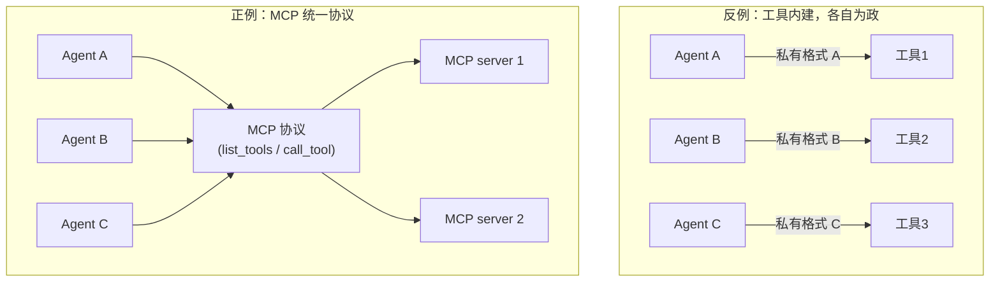
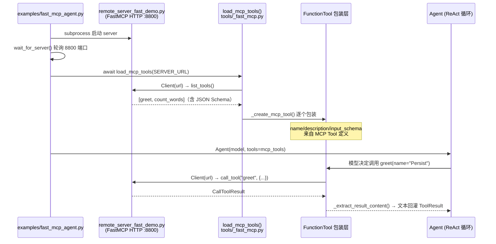
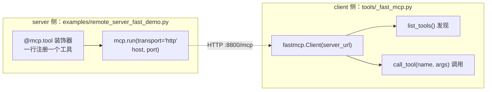

# 第 10 章 外部工具接入与 MCP：工具调用的 USB-C 接口

> **本章源码边界（重要）**：`scratchagent` **已实现** MCP 工具接入。真实源码位于 `src/scratchagent/tools/_fast_mcp.py`（87 行），核心入口是 `load_mcp_tools()`——从 FastMCP HTTP 服务器发现工具，并把它们包装为本项目的 `FunctionTool`。配套可运行示例：`examples/remote_server_fast_demo.py`（MCP server 端）与 `examples/fast_mcp_agent.py`（Agent 端到端调用）。本章所有源码引用均可在上述文件中逐行核对。

---

## 1. 核心问题

一个 Agent 的能力受限于**它内置的工具集**。现实世界的工具千千万——数据库、浏览器、本地文件、第三方 SaaS——逐个手工写成 `FunctionTool` 不可持续。本章回答：**是否存在一种"一次接入、处处可用"的开放协议，让 Agent 以统一方式调用任意外部工具？** 答案就是 MCP（Model Context Protocol），而 `scratchagent` 用 87 行源码给出了自己的最小实现。

---

## 2. 教学目标

学完本章，你应当能：

1. **说清** MCP 要解决的三个核心问题（工具标准化、传输解耦、生态复用），以及它与"函数调用"的关系；
2. **读懂** `tools/_fast_mcp.py` 的完整实现：`load_mcp_tools` 如何发现工具、`_create_mcp_tool` 如何把 MCP 工具包装成 `FunctionTool`、结果如何提取回灌；
3. **跑通**项目自带的端到端示例：启动一个 FastMCP HTTP server，让 Agent 通过 MCP 协议实际调用 `greet` 与 `count_words` 两个工具；
4. **评价**该实现的设计取舍：为什么选 HTTP 传输、为什么每次工具调用新建连接、以及这个最小实现没有覆盖什么（stdio、连接复用、鉴权）。

---

## 3. 原理讲解

### 3.1 结论先行：MCP 是"工具调用的 USB-C 接口"

如果把 Agent 比作一台主机，工具就像外设。传统的函数调用（第 7、8 章）是**直接焊在主板上的内建接口**——每个 `FunctionTool` 都是手工编写的 Python 代码。而 MCP 想做的是**统一的"USB-C"标准接口**：

- **工具提供方**（MCP server）：只需按 MCP 协议暴露工具，无需关心消费方是哪个 Agent；
- **工具消费方**（MCP client / host）：只需按 MCP 协议连接，即可发现并调用任意 server 的工具；
- **传输层**（stdio / SSE / HTTP）：与业务逻辑解耦，同一份工具逻辑可跑在本地进程或远程服务。

一句话总结：**MCP 把"我写一个工具给你用"升级为"我按协议暴露，任何 Agent 都能用"**。

### 3.2 三个核心问题（正反例）

**问题一：工具标准化**

- 反例：A 框架用 `{name, params}`，B 框架用 `{function, arguments}`，每接入一个工具都要写一层适配。
- MCP 解法：用统一的 `Tool` 定义 + JSON Schema 描述参数，`list_tools` 返回标准结构。

**问题二：传输解耦**

- 反例：工具逻辑和"通过 HTTP 还是 stdin 通信"耦合在一起，换一个部署方式就要重写。
- MCP 解法：协议与传输分离，同一 server 可切换 stdio（本地）或 HTTP/SSE（远程）传输，业务代码不变。

**问题三：生态复用**

- 反例：每个团队重复造"文件读取工具""数据库查询工具"。
- MCP 解法：官方与社区发布大量现成 MCP server（如 filesystem、fetch、database），`npx` 一行即可启动复用。

### 3.3 本项目实现的边界（诚实声明）

`scratchagent` 的 MCP 实现是**刻意的最小实现**，覆盖"HTTP 传输 + 工具发现 + 调用转发"这条主干。以下能力**不在**源码中，属于已知的边界：

| 能力 | 现状 | 说明 |
|---|---|---|
| HTTP（Streamable HTTP）传输 | ✅ 已实现 | 默认地址 `http://127.0.0.1:8800/mcp` |
| 工具发现 + `FunctionTool` 包装 | ✅ 已实现 | `load_mcp_tools()` 一行完成 |
| stdio 子进程传输 | ❌ 未实现 | 示例走 HTTP；stdio 传输可作为扩展练习 |
| 连接复用 / 连接池 | ❌ 未实现 | 每次工具调用新建一条 HTTP 连接（见 5.2 的取舍分析） |
| 鉴权 / 多 server 聚合 | ❌ 未实现 | 教学项目保持最小面 |

> **严谨提醒**：准确表述是"`scratchagent` 支持通过 `load_mcp_tools()` 接入 FastMCP HTTP 服务器暴露的工具"——不要扩大为"支持 MCP 全部传输方式与特性"。

---

## 4. 配图

### 图 1：MCP 要解决的核心问题（示意）



**解读**：左图是"一对一定制"——每接一个工具写一层适配，N 个 Agent × M 个工具 = N×M 层胶水；右图是"一对多复用"——所有 Agent 与所有 server 只需对接到同一个协议，复杂度降为 N+M。这就是 MCP 的核心价值：**把 O(N×M) 的集成成本降到 O(N+M)**。

### 图 2：`scratchagent` 的 MCP 接入链路（真实源码）



**解读**：接入分四步——（1）`list_tools` 发现 server 暴露的全部工具及其 JSON Schema；（2）`_create_mcp_tool` 把每个 MCP `Tool` 映射为本项目的 `FunctionTool`（源码已实现，见 5.2）；（3）Agent 正常走第 8 章的 ReAct 循环调用工具；（4）调用请求经 `call_tool` 转发到 server，结果提取为文本回灌。**关键结论**：MCP 并没有改变 `scratchagent` 的 ReAct 主循环，它只是"工具来源"的一种新可能。

### 图 3：FastMCP 的两种角色（本项目同时用到）



**解读**：`fastmcp` 库同时提供 server 与 client 两端。本项目 server 端用 `@mcp.tool` 装饰器注册工具（`remote_server_fast_demo.py` 仅 18 行），client 端用 `fastmcp.Client` 做发现与调用（`_fast_mcp.py`）。理解"同一个库的两侧"，是读懂这个示例组合的关键。

---

## 5. 源码精读（`tools/_fast_mcp.py`，87 行）

### 5.1 入口：`load_mcp_tools()`（L75~85）

```python
async def load_mcp_tools(
    server_url: str = DEFAULT_MCP_SERVER_URL,
) -> list[BaseTool]:
    """从 FastMCP HTTP 服务器加载工具作为函数工具.

    每次调用返回的工具都会新建一条 HTTP 连接.
    """
    async with Client(server_url) as client:
        mcp_tools = await client.list_tools()

    return [_create_mcp_tool(tool, server_url) for tool in _get_tools(mcp_tools)]
```

逐点解读：

1. **发现即退出**：`async with Client(...)` 只在 `list_tools()` 期间保持连接，发现完就断开。工具的"描述"（name/description/schema）是静态的，断开不影响后续调用。
2. **`_get_tools()` 的兼容处理**（L45~49）：FastMCP 的 `list_tools()` 可能返回列表，也可能返回 MCP 标准的 `ListToolsResult`（有 `.tools` 属性）——三行代码把两种形态抹平。
3. **默认地址**：`DEFAULT_MCP_SERVER_URL = "http://127.0.0.1:8800/mcp"`（L12），与示例 server 的监听地址一致。

### 5.2 包装：`_create_mcp_tool()`（L51~73）——本章最核心的 22 行

```python
def _create_mcp_tool(mcp_tool, server_url=DEFAULT_MCP_SERVER_URL) -> FunctionTool:
    async def call_mcp(**kwargs):
        async with Client(server_url) as client:
            result = await client.call_tool(mcp_tool.name, kwargs)
            return _extract_result_content(result)

    tool_definition = format_tool_definition(
        name=mcp_tool.name,
        description=mcp_tool.description or "",
        parameters=mcp_tool.input_schema
    )

    return FunctionTool(
        func=call_mcp,
        name=mcp_tool.name,
        description=mcp_tool.description or "",
        tool_definition=tool_definition,
    )
```

四个值得停下来想的设计点：

1. **闭包捕获 `server_url` 与 `mcp_tool`**：每个 MCP 工具生成一个专属的 `call_mcp` 闭包，调用时才知道"连哪个 server、调哪个工具"。注意这里没有循环变量晚绑定问题（每个 `_create_mcp_tool` 调用有自己的作用域）。
2. **纯 `**kwargs` 签名**：回顾第 7 章——`FunctionTool` 按参数名识别是否注入 `context`；`call_mcp(**kwargs)` 没有 `context` 参数，所以不会被误注入。MCP 工具天然"无状态"，正好匹配。
3. **schema 直接复用**：`mcp_tool.input_schema` 就是标准的 JSON Schema，直接喂给第 7 章的 `format_tool_definition()`。这就是 3.2"工具标准化"红利的现场演示——**MCP 的 schema 与本项目第 7 章自研的工具定义格式是无缝衔接的**。
4. **每次调用新建连接**（`call_mcp` 内部 `async with Client(...)`）：实现简单、无状态、不会泄漏连接；代价是每次调用有一次 TCP 握手开销。对教学场景（本地 server、低频调用）完全合理——这是一个**典型的"简单性优先"取舍**，你可以把它当作扩展练习改成连接复用。

### 5.3 结果提取：`_extract_result_content()`（L24~43）

MCP 的 `CallToolResult` 内容形态多样，本实现按**三级回退**提取稳定文本：

```
result.data（FastMCP 解析后的结构化数据，dict/list → json.dumps）
  ↘ result.content[]（标准内容块，拼接各块的 .text）
      ↘ result.structured_content（MCP 结构化内容 → json.dumps）
          ↘ 空字符串
```

为什么要兜底？因为不同 server 返回工具结果的形态不一致（有的给 `data`，有的只给 `content` 文本块）。这 20 行是"**防御性接口编程**"的好教材：对外部系统的输出**永远不要假设单一形态**。最后由 `_json_text()`（L14~22）统一转为字符串——回忆第 6 章：工具结果要以文本形式回灌为大模型可读的 `ToolResult` 消息。

### 5.4 一个细节：被注释掉的 `mcp_connection`（L88~98）

源码末尾有一段注释掉的 `@asynccontextmanager` 连接保持器。这是作者留下的"进化痕迹"——先写了常驻连接版本，后改为"发现短连接 + 调用短连接"的更简单方案。教学项目保留这段注释，恰好让你看到**同一个问题的两种工程取舍**。

---

## 6. 动手实验

目标：**跑通项目自带的端到端 MCP 示例，再动手扩展它**。以下实验均可直接运行（需先 `uv sync` 安装依赖，并配置 `.env` 中的模型凭据）。

### 实验 1：看 server——18 行的 FastMCP 服务

打开 `examples/remote_server_fast_demo.py`：

```python
from fastmcp import FastMCP

mcp = FastMCP("通过FastMCP 构建的远程MCP")

@mcp.tool
def greet(name: str) -> str:
    """一个简单的工具示例：问候 + user"""
    return f"你好，{name}!"

@mcp.tool
def count_words(text: str) -> int:
    """一个简单的工具：用于统计给出的文本有多少个词 word"""
    return len(text.split())

if __name__ == "__main__":
    mcp.run(transport="http", host="127.0.0.1", port=8800)
```

**验证点**：单独运行它（`python examples/remote_server_fast_demo.py`），server 在 `127.0.0.1:8800` 监听。注意 `@mcp.tool` 装饰器自动从函数签名与 docstring 生成了 JSON Schema——与第 7 章 `@tool` 装饰器的思路一模一样，只是换了个生态。

### 实验 2：端到端——Agent 通过 MCP 调用工具

运行 `python examples/fast_mcp_agent.py`，观察它的四步（对应图 2）：

1. `start_mcp_server()`：`subprocess` 启动实验 1 的 server；
2. `wait_for_server()`：轮询 8800 端口直到可连接（最多 10 秒）；
3. `load_mcp_tools(SERVER_URL)`：发现并包装工具，断言恰好是 `{greet, count_words}`；
4. `agent.run(...)`：让 Agent 同时调用两个工具并汇总原始结果。

**验证点**：Agent 输出中应包含 `greet` 的问候文本与 `count_words` 的词数统计。你刚刚完成了一次"自研 Agent × 标准协议 × 外部工具进程"的三方协作。

### 实验 3（扩展练习）：给最小实现加能力

任选其一，体会最小实现与生产实现的差距：

- **stdio 传输**：把 server 改为 `mcp.run(transport="stdio")`，改造 `load_mcp_tools` 用 stdio 客户端连接子进程；
- **连接复用**：把 5.2 的"每次调用新建连接"改为共享一个长连接（提示：参考被注释掉的 `mcp_connection`，注意 Agent 并发调用时的连接安全）；
- **第三方案例**：把实验 1 的 server 换成社区现成 MCP server（如 filesystem），验证 `load_mcp_tools` 的通用性。

---

## 7. 本章自检

- [ ] 我能用一句话说清 MCP 解决的三个问题（标准化、传输解耦、生态复用），并说明其"O(N×M)→O(N+M)"的集成成本本质。
- [ ] 我能准确陈述 MCP 在 `scratchagent` 中的真实能力边界：`load_mcp_tools()` 支持 FastMCP HTTP 服务器的工具发现与调用；stdio 传输、连接复用、鉴权未实现。
- [ ] 我能读懂 `_create_mcp_tool` 的四个设计点：闭包捕获、纯 `**kwargs` 签名、schema 直接复用 `format_tool_definition`、每次调用新建连接的取舍。
- [ ] 我能画出本项目 MCP 接入的完整链路（`list_tools` → 包装 → ReAct 调用 → `call_tool` → 结果提取回灌）。
- [ ] 我能说出 `_extract_result_content` 的三级回退顺序，并解释为什么必须对结果形态做防御性处理。
- [ ] 我在任何场合都不会把 `scratchagent` 的 MCP 能力夸大为"支持 MCP 全部传输方式与特性"。

---

## 延伸阅读

- MCP 官方规范与 SDK：`https://modelcontextprotocol.io/`
- FastMCP 文档：`https://gofastmcp.com/`
- 官方 MCP server 生态（filesystem/fetch/database 等）：`https://github.com/modelcontextprotocol/servers`
