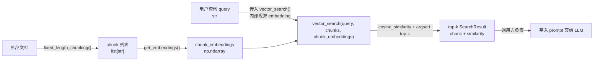
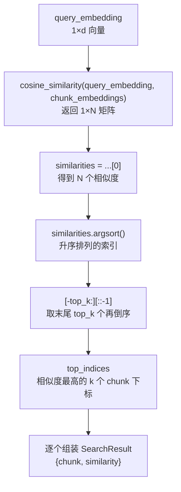

# 第 11 章 RAG 基础：用向量检索给 Agent 注入外部知识

> 对应真实源码：`src/scratchagent/rag.py`（`get_embeddings` / `fixed_length_chunking` / `vector_search` / `SearchResult`）。
> 前置章节：第 8 章（ReAct 循环）、第 4 章（消息类型）。

---

## 1. 核心问题

大模型的参数是**冻结**的，它不知道你私有文档里的内容。要让 Agent 回答"我公司内部制度第几条是什么"这类问题，必须把外部知识**在提问时动态塞进上下文**。RAG（Retrieval-Augmented Generation，检索增强生成）就是这套机制。本章回答：**如何用"切块 + 向量化 + 余弦检索"三步，从一堆文本里精准捞出与问题最相关的片段？**

---

## 2. 学习目标

学完本章，你应当能：

1. **写出** `rag.py` 的三个函数，并说清它们各自的职责边界（切块、向量化、检索）；
2. **解释** 为什么用 `cosine_similarity` 而不是直接比字符串，以及 `argsort()[-top_k:][::-1]` 这段倒序取 top-k 的技巧；
3. **定位** 本项目 RAG 的两个关键技术选型：嵌入用 OpenAI `text-embedding-3-small`（经 OpenRouter 中转）如果不行，用EMBEDDING_MODEL=perplexity/pplx-embed-v1-0.6b、相似度用 `sklearn.metrics.pairwise.cosine_similarity`（而非 faiss）；
4. **指出** `SearchResult` 这个 `TypedDict` 的引入动机，以及它对下游类型安全的意义。

---

## 3. 原理讲解

### 3.1 结论先行：RAG = "切块 → 向量化 → 相似度检索"三步

RAG 的核心思想一句话：**把"检索"和"生成"解耦**。检索阶段从外部语料中找到与问题相关的片段，生成阶段把这些片段作为上下文交给 LLM。本项目 `rag.py` 只实现了检索侧的三个纯函数：

```
文档 → fixed_length_chunking() → 若干 chunk
      → get_embeddings()       → 若干向量
查询 → get_embeddings()        → 查询向量
      → vector_search()        → top-k 相关 chunk
```

> **注意边界**：`rag.py` **不负责**"把检索结果塞进 prompt 交给 LLM"这一步——那是调用方（或后续章节）的事。`rag.py` 是**纯粹的知识检索工具**，职责单一。

### 3.2 正反例：为什么不能直接比字符串

**反例（朴素字符串匹配）**：用 `if query in text` 或关键词 `==` 判断相关性。

```python
# 反例：字符串字面匹配
if "报销流程" in document:      # 用户问"差旅费怎么报？"就匹配不到
    return document
```

问题：自然语言有同义改写、语序变化。"差旅费怎么报"和"报销流程"字面完全不同，但语义相同。字符串匹配对这类语义鸿沟完全失效。

**正例（向量相似度）**：把文本映射到高维向量空间，语义相近的文本向量距离近。

```python
# 正例：embedding 后算余弦相似度
query_embedding = get_embeddings("差旅费怎么报")        # 向量化
similarities = cosine_similarity(query_embedding, chunk_embeddings)[0]  # 语义距离
```

核心在于：embedding 模型把**语义**编码进了向量，余弦相似度衡量的是**向量方向**的一致性（值域 [-1, 1]，越接近 1 越相似），与具体用词无关。

### 3.3 两个关键选型：为什么是 sklearn 和 text-embedding-3-small / perplexity/pplx-embed-v1-0.6b

| 选型 | 本项目用 | 常见替代 | 取舍理由 |
|---|---|---|---|
| 相似度计算 | `sklearn.metrics.pairwise.cosine_similarity` | faiss / chroma 内置 | 数据量小、教学清晰，sklearn 纯 CPU 即可，无需引入向量库 |
| 嵌入模型 | OpenAI `text-embedding-3-small` | 本地 sentence-transformers | 走 OpenRouter 中转（`OPENROUTER_API_KEY`/`OPENROUTER_BASE_URL`），见源码 L35~36 注释 |

> **要点**：源码 L36 注释明确写了——"`text-embedding-3-small` 中转平台没有提供"，所以这里**专门用 OpenRouter** 的 Key 和 Base URL 建 client，而不是项目里 LLM 用的那个 client。这是"嵌入走一条通道、生成走另一条通道"的典型场景。

---

## 4. 配图

### 图 1：RAG 检索全链路（本章核心图）



**解读**：这条链路的关键分工是——`rag.py` 的终点停在 `R`（top-k 检索结果），"塞入 prompt 交给 LLM"（虚线框）**不在 `rag.py` 内**，由调用方完成。理解这个边界，才能理解为什么这三个函数都是**纯函数**（输入确定、输出确定、无副作用），可以独立测试。

### 图 2：余弦相似度与 top-k 检索示意



**解读**：`argsort()` 返回的是**升序**排列的下标，所以"最大的 top-k"在**末尾**。`[-top_k:]` 先取最后 k 个（此时仍升序），`[::-1]` 再倒序，得到**降序**的 top-k 下标。这行 `similarities.argsort()[-top_k:][::-1]`（源码 L89）是本章最值得默写的技巧。

---

## 5. 源码精读

文件位置： src/scratchagent/rag.py

### 5.1 数据结构：`SearchResult`（L13~17）

```python
class SearchResult(TypedDict):
    chunk: str
    similarity: float
```

`TypedDict`（PEP 589）为"结构固定的异构字典"提供类型检查——这里每个检索结果一定是"一个 `str` 文本块 + 一个 `float` 相似度"。为什么不用普通 `dict`？因为 `dict[str, str | float]` 无法区分哪个 key 是什么类型，而 `SearchResult` 能让 `results["chunk"]` 被 mypy 精确推断为 `str`、`results["similarity"]` 为 `float`。这正是第 3 章讲的"类型注解照妖镜"——精确的类型能暴露下游的误用。

### 5.2 向量化：`get_embeddings`（L20~46）

```python
def get_embeddings(
    texts: str | list[str], model: str = "text-embedding-3-small"
) -> np.ndarray:
    load_project_env()                          # L34：确保环境变量已加载
    client = OpenAI(                            # L37
        api_key=os.getenv("OPENROUTER_API_KEY"),
        base_url=os.getenv("OPENROUTER_BASE_URL"),
    )
    if isinstance(texts, str):                  # L41：单文本转列表
        texts = [texts]
    response = client.embeddings.create(model=model, input=texts)  # L44
    embeddings = np.array([item.embedding for item in response.data])  # L45
    return embeddings                           # L46：返回 np.ndarray
```

逐点讲解：

1. **`texts: str | list[str]`**（L21）：输入既接受单个字符串也接受列表，内部 L41~42 用 `isinstance` 把单字符串归一化为列表。这是"宽容输入、统一处理"的常见写法。
2. **返回 `np.ndarray`**（L45）：关键细节（这是我们对源码意图的解读）——`cosine_similarity`（sklearn）需要 **2D 的 ndarray**（每行一个向量），所以这里用 `np.array([...])` 堆叠成矩阵，而不是返回 `list[list[float]]`。
3. **每次调用都 `load_project_env()`**（L34）：这是本项目 `config.py` 的 `load_project_env`（带 `_ENV_LOADED` 单例标志），确保读环境变量前 `.env` 已加载，且不会重复加载。
4. **通道分离**：这里专门用 OpenRouter 建 client（L37~40），而非复用 LLM 用的 client——因为嵌入模型走的是另一条中转通道。

### 5.3 切块：`fixed_length_chunking`（L49~69）

```python
def fixed_length_chunking(
    text: str, chunk_size: int = 200, overlap: int = 50
) -> list[str]:
    chunks = []
    start = 0
    while start < len(text):                      # L65
        end = min(start + chunk_size, len(text))  # L66
        chunks.append(text[start:end])
        start += chunk_size - overlap             # L68：步长 = 块大小 - 重叠
    return chunks
```

核心是 L68 的**步长**：`chunk_size - overlap`。假设 `chunk_size=200, overlap=50`，第一块覆盖 [0,200)，下一块从 150 开始——即相邻两块**重叠 50 个字符**。重叠的意义是：避免一个完整语义单元（如一句话、一个词）恰好被切断在两个块的边界上。

> **边界提醒**：这是**固定字符长度**切块，不考虑句子边界。它简单、可复现，但对长文档可能把句子拦腰截断——这是"固定长度切块"的固有局限，理解它才能在第 15 章（上下文优化）里对比更高级的切分策略。

### 5.4 检索：`vector_search`（L72~100）

```python
def vector_search(
    query: str, chunks: list[str], chunk_embeddings: np.ndarray, top_k: int = 3
) -> list[SearchResult]:
    query_embedding = get_embeddings(query)                    # L87：查询也向量化
    similarities = cosine_similarity(query_embedding, chunk_embeddings)[0]  # L88
    top_indices = similarities.argsort()[-top_k:][::-1]        # L89：升序取末尾倒序
    results: list[SearchResult] = []
    for idx in top_indices:                                    # L92
        results.append({"chunk": chunks[idx], "similarity": similarities[idx]})
    return results
```

逐点讲解：

1. **`cosine_similarity(query_embedding, chunk_embeddings)`**（L88）：`query_embedding` 是 1×d，`chunk_embeddings` 是 N×d，结果是 1×N 的相似度矩阵，`[0]` 取出唯一一行，得到 N 个相似度。
2. **`argsort()[-top_k:][::-1]`**（L89）：`argsort()` 升序返回下标 → `[-top_k:]` 取最大 k 个（升序）→ `[::-1]` 倒序变降序。这是"取 top-k"的经典 numpy 写法。
3. **注意**：`chunk_embeddings` 是**调用方预先算好传入的**（参数里），而 `query_embedding` 是**函数内部现算的**（L87）。这个不对称是性能考量——语料库的向量只需算一次，查询向量每次都要算。
4. **返回 `list[SearchResult]`**：每个结果是 `{chunk, similarity}`，供调用方直接消费。

---

## 6. 动手实验

目标：**给项目补一个端到端的 RAG 最小用例**，验证"切块 → 向量化 → 检索"三步。

### 实验 1：跑通纯函数链（无需真实 API）

先验证**不依赖外部 API**的 `fixed_length_chunking`：

```python
from scratchagent.rag import fixed_length_chunking

text = "0123456789" * 20  # 200 字符
chunks = fixed_length_chunking(text, chunk_size=50, overlap=10)
print(len(chunks))              # 期望 5 块：(200-10)/(50-10) 向上
print(chunks[0][-10:])          # 期望与 chunks[1][:10] 相同，验证重叠
assert chunks[0][-10:] == chunks[1][:10]
```

**验证点**：理解"步长 = chunk_size - overlap"如何决定块数与重叠。

### 实验 2：模拟向量检索（用假向量绕过 API）

用 numpy 直接构造"语义相近"的假向量，验证 `vector_search` 的排序逻辑：

```python
import numpy as np
from scratchagent.rag import vector_search

# 绕过真实 embedding：手动构造 3 个 chunk 向量 + 1 个查询向量
# （真实场景用 get_embeddings 生成，这里用确定性假向量保证可复现）
chunks = ["苹果是一种水果", "汽车是一种交通工具", "香蕉也是一种水果"]
chunk_embeddings = np.array([[1.0, 0.0], [0.0, 1.0], [0.9, 0.1]])  # 3×2
# 注意：真实 vector_search 内部会调 get_embeddings(query)，本实验需 mock
```

> 由于 `vector_search` 内部硬编码调用了 `get_embeddings(query)`（L87），要完全离线测试需要 mock。这里给出一个 mock 方案：

```python
from unittest.mock import patch
from scratchagent.rag import vector_search

with patch("scratchagent.rag.get_embeddings", return_value=np.array([[1.0, 0.0]])):
    results = vector_search("query", chunks, chunk_embeddings, top_k=2)
    print(results[0]["chunk"])      # 期望 "苹果是一种水果"（相似度最高）
```

**验证点**：`top_k=2` 时返回 2 个结果，且按相似度降序；`results[0]["similarity"] >= results[1]["similarity"]`。

### 实验 3（进阶）：接入真实 Agent

注：实际参考案例 examples/rag_agent.py

把 `vector_search` 的结果拼进 Agent 的 instruction，观察"私有知识"如何进入上下文：

```python
# 省略部分上下文：client 为第 2 章的 LlmClient 实例，Agent 见第 8 章
from scratchagent import Agent
from scratchagent.rag import get_embeddings, vector_search

async def main():
    # 1. 离线构建知识库
    corpus = ["公司报销制度：差旅费按标准报销...", "公司年假制度：..."]
    chunk_embeddings = get_embeddings(corpus)   # 只需算一次

    # 2. 查询时检索
    results = vector_search("差旅费怎么报销？", corpus, chunk_embeddings, top_k=1)

    # 3. 把检索结果拼进 instruction
    context = f"参考资料：{results[0]['chunk']}"
    agent = Agent(model=client, instruction=context)
    await agent.run("差旅费怎么报销？")
```

**验证点**：这一步体现了图 1 里"调用方负责"的虚线框——RAG 的三个函数本身不碰 LLM，是你在实验 3 里把它们和 Agent 接起来。

---

## 7. 本章自检

- [ ] 我能说清 RAG 检索侧的三步：`fixed_length_chunking`（切块）、`get_embeddings`（向量化）、`vector_search`（检索）。
- [ ] 我能解释 `start += chunk_size - overlap` 这句为何是"步长 = 块大小 - 重叠"。
- [ ] 我能默写 `similarities.argsort()[-top_k:][::-1]` 并解释每一段的含义。
- [ ] 我能说明 `get_embeddings` 为何返回 `np.ndarray`（而非 list），以及 `cosine_similarity` 对输入形状的要求。
- [ ] 我能指出本项目用 `sklearn.cosine_similarity` 而非 faiss 的原因（数据量小、教学清晰）。
- [ ] 我能定位 `SearchResult` 这个 `TypedDict` 的动机（异构字典的类型精确化）。
- [ ] 我能划清 `rag.py` 的边界：它不负责"把结果交给 LLM"。

---

## 延伸阅读

- 余弦相似度的数学原理：`https://scikit-learn.org/stable/modules/generated/sklearn.metrics.pairwise.cosine_similarity.html`
- OpenAI 嵌入模型文档：`https://platform.openai.com/docs/guides/embeddings`
- RAG 综述（概念对比）：检索增强 vs 微调 vs 长上下文
