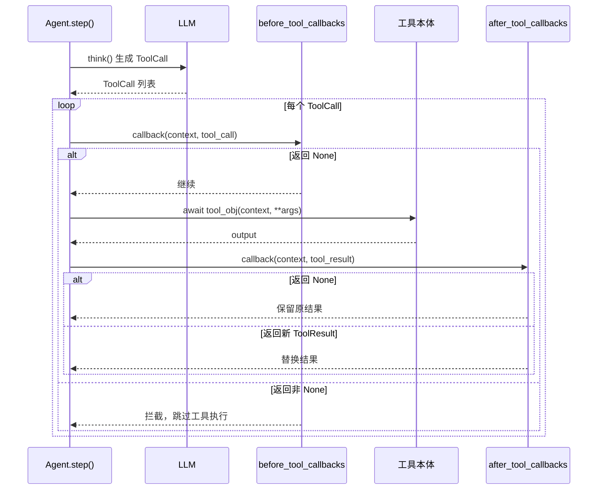
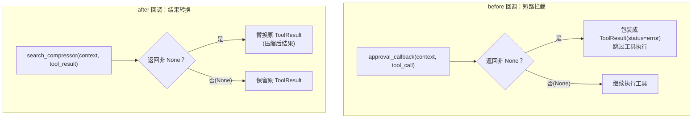
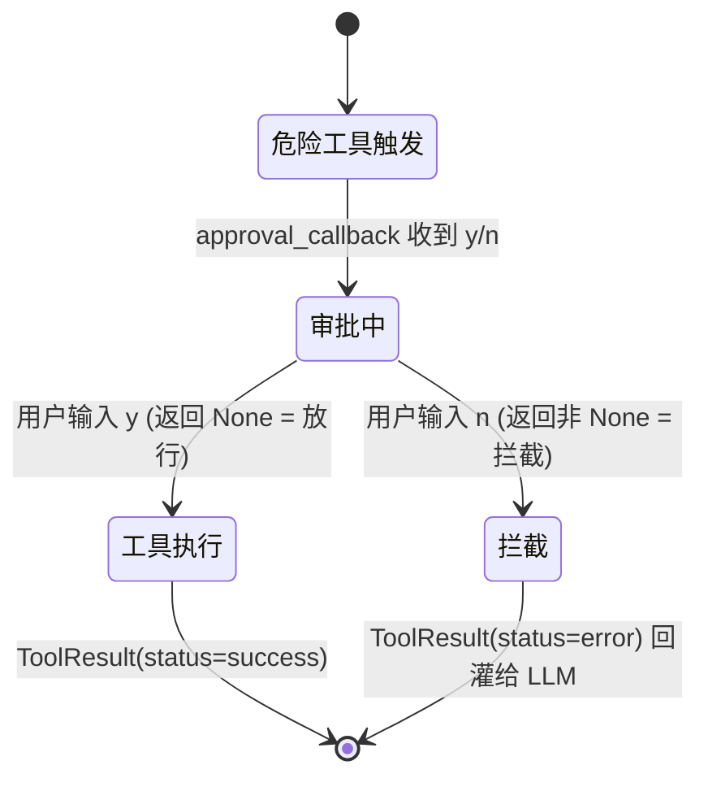

# 第 12 章 回调与人工审批：在工具执行前后插入拦截逻辑

> 对应真实源码：`src/scratchagent/tools/_callbacks.py`（`approval_callback` / `search_compressor` / `_extract_search_query`），以及 `agent.py` 中的回调调用点。
> 前置章节：第 8 章（ReAct 循环）、第 7 章（工具抽象）、第 11 章（RAG）。

---

## 1. 核心问题

Agent 一旦学会调用工具，就会带来两类新风险：**危险操作不可控**（删文件、发邮件、执行 SQL）和**返回结果不可控**（搜索结果太多、太长，撑爆上下文）。要在**不修改工具本身**的前提下给它们"套上护栏"，就需要一个钩子机制。本章回答：**如何用回调（callback）在工具执行前拦截、执行后压缩，甚至在必要时暂停流程等待人工审批？**

---

## 2. 学习目标

学完本章，你应当能：

1. **写出** `approval_callback` 和 `search_compressor` 两个回调，并说清它们各自挂在哪个阶段（before / after）；
2. **解释** before 回调与 after 回调的**返回值语义差异**：前者返回非 None 表示"短路拦截"，后者返回非 None 表示"替换结果"；
3. **定位** `agent.py` 中 before/after 回调的执行点，理解"返回 None 继续、返回内容则改写流程"这一契约；
4. **说清** `search_compressor` 如何复用第 11 章的 RAG 三个函数，把"超大搜索结果"压缩成"与查询最相关的 top-3"。

---

## 3. 原理讲解

### 3.1 结论先行：回调是"不动工具代码的横向切面"

回调的本质是**横切关注点（cross-cutting concern）**：危险工具审批、结果压缩这些能力，**不属于任何单一工具的业务逻辑**，而是"所有工具都可能需要"的通用护栏。把护栏写进每个工具内部，会造成大量重复；把护栏抽成回调，则能在 `agent.py` 的统一执行点里"一插即用"。

`scratchagent` 定义了**三类回调**，本章聚焦其中与工具相关的两类：

| 回调类别 | 挂载点 | 本章涉及 | 返回值语义 |
|---|---|---|---|
| `before_tool_callbacks` | 工具执行**前** | `approval_callback` | 非 None = 拦截，跳过工具执行 |
| `after_tool_callbacks` | 工具执行**后** | `search_compressor` | 非 None = 替换原 ToolResult |
| `before_llm_callbacks` | LLM 调用前 | （第 8 章已涉） | 返回 `LlmResponse` = 短路跳过 LLM；返回其他非 None 会 `raise TypeError` |

### 3.2 正反例：护栏写进工具 vs 抽成回调

**反例（护栏耦合进工具）**：

```python
class DeleteFileTool(BaseTool):
    async def __call__(self, context, **kwargs):
        # 审批逻辑硬编码进删除工具
        if input("确认删除？(y/n): ") != "y":
            return "用户拒绝"
        return os.remove(kwargs["path"])
```

问题：`send_email`、`execute_sql` 也要同样的审批逻辑，就要复制粘贴三次；而且审批逻辑污染了"删除文件"这个纯业务逻辑。

**正例（回调统一拦截）**：

```python
# agent.py act() 中，工具执行前统一跑 before 回调
for callback in self.before_tool_callbacks:
    callback_result = callback(context, tool_call)
    if callback_result is not None:   # 非 None = 拦截
        results.append(ToolResult(..., status="error", content=[callback_result]))
        skip = True
        break
```

核心差异：**工具的职责（做什么）与护栏的职责（何时拦截、如何压缩）彻底分离**。新增一个危险工具，只需把它的名字加进 `DANGEROUS_TOOLS` 列表，审批护栏自动生效。

### 3.3 回调契约：返回 None 的两种含义

回调的返回值是理解本章的钥匙，一句话：**返回 `None` 表示"我不介入，流程照旧"；返回非 `None` 表示"我要改写流程"**。但两类回调"改写"的方向不同：

- **before 回调**返回非 None → 该返回值被包装成 `ToolResult(status="error")`，**跳过**真正的工具执行（源码 `agent.py` L327~340）。
- **after 回调**返回非 None → 该返回值**替换**原 `ToolResult`（源码 `agent.py` L367~372）。

---

## 4. 配图

### 图 1：四类回调的执行时机



**解读**：这张时序图把 `agent.py` 里 `act()` 的执行顺序可视化——**before 回调 → 工具本体 → after 回调**，且两类回调各自有一个"返回 None vs 非 None"的分支。理解这张图，就等于理解了第 8 章 ReAct 循环里 `act()` 那一环的内部细节。

### 图 2：before 短路 vs after 转换（两种返回语义对比）



**解读**：同样是"返回非 None"，before 回调的语义是**否决**（把一次危险调用变成 error 结果），after 回调的语义是**改写**（把一次成功调用替换成更优结果）。方向相反，却共用同一个 `if callback_result is not None` 判断——这是回调设计的巧妙之处，也是容易混淆之处。

### 图 3：人工审批的中断-恢复



**解读**：`approval_callback` 的审批是**同步阻塞**的（`input()`），这与第 13 章将要讲的 `required_confirmation`（挂起、持久化、跨 run 恢复）形成对照——本章的审批是"当场问、当场答"，下一章的确认机制是"问完挂起、下次再答"。两者是 HITL（human-in-the-loop）的两种形态。

---

## 5. 源码精读

文件位置：src/scratchagent/tools/_callbacks.py

### 5.1 危险工具名单（L10）

```python
DANGEROUS_TOOLS = ["delete_file", "send_email", "execute_sql"]
```

一个**模块级常量列表**。新增危险工具，只需在这里加一个名字。这是"配置即护栏"的最小实现——`approval_callback` 只认这个名单，不关心具体工具如何实现。

### 5.2 审批回调：`approval_callback`（L13~28）

```python
def approval_callback(context: ExecutionContext, tool_call: ToolCall):
    if tool_call.name not in DANGEROUS_TOOLS:     # L15：非危险工具直接放行
        return None
    print("\n⚠️ Dangerous tool execution requested")
    print(f"Tool: {tool_call.name}")
    print(f"Arguments: {tool_call.arguments}")

    response = input("Do you approve the execution of this tool? (y/n): ").strip().lower()
    if response == "y":                            # L24：同意 → 返回 None 放行
        print("✅ Approved. Executing...\n")
        return None
    print("❌ Rejected. Tool execution will not proceed.\n")
    return f"User denied execution of the tool '{tool_call.name}'."  # L28：拒绝
```

逐点讲解：

1. **签名**：`(context, tool_call)` —— 这正是 `agent.py` L329~330 调用 before 回调时传入的两个参数。回调能拿到当前上下文和本次工具调用。
2. **早返回 None**（L15~16）：非危险工具直接放行，**零开销**。这是性能关键——绝大多数工具调用不会触发审批。
3. **返回值语义**：同意返回 `None`（放行），拒绝返回一段字符串（被 `agent.py` 包装成 `status="error"` 的 ToolResult，回灌给 LLM 让它知道"用户拒绝了"）。

> **要点**：注意这里的审批是**同步 `input()`**，会阻塞整个 `async` 事件循环。这是教学版的简化实现，生产环境应改用异步确认（见第 13 章的 `required_confirmation` 机制）。

### 5.3 查询提取：`_extract_search_query`（L31~46）

```python
def _extract_search_query(context: ExecutionContext, tool_call_id: str) -> str:
    for event in context.events:                   # L33：遍历历史事件
        for item in event.content:
            if not isinstance(item, ToolCall) or item.tool_call_id != tool_call_id:
                continue                           # L35：跳过非本次调用
            arguments = item.arguments
            if isinstance(arguments, str):
                try:
                    arguments = json.loads(arguments)   # L40：字符串参数先解析
                except json.JSONDecodeError:
                    return ""
            if isinstance(arguments, Mapping):
                query = arguments.get("query", "")      # L44：取 query 字段
                return query if isinstance(query, str) else ""
    return ""
```

这个下划线私有函数是 `search_compressor` 的**辅助**：它从 `context.events` 里**反查**出"本次 `tool_call_id` 对应的那次工具调用，它的 `query` 参数是什么"。为什么需要反查？因为 after 回调拿到的 `tool_result` 里**只有结果、没有原始查询**——查询藏在更早的 `ToolCall` 事件里。这个"从历史事件反查输入"的模式，是回调与上下文协作的典型用法。

### 5.4 结果压缩：`search_compressor`（L49~102）

```python
def search_compressor(context: ExecutionContext, tool_result: ToolResult):
    if tool_result.name not in {"search_web", "search_documents"}:   # L51
        return None
    if tool_result.status != "success" or not tool_result.content:   # L53
        return None

    original_content = tool_result.content[0]        # L56
    query = _extract_search_query(context, tool_result.tool_call_id)  # L57
    if not query:
        return None

    if tool_result.name == "search_documents":       # L61：文档检索分支
        if not isinstance(original_content, list) or not all(
            isinstance(document, str) for document in original_content
        ):
            return None
        chunks: list[str] = original_content
    else:                                            # L67：网页检索分支
        if isinstance(original_content, list):
            web_items = [item for item in original_content if isinstance(item, Mapping)]
            web_text = "\n\n".join(
                "\n".join(str(value) for key in ("title", "content", "url")
                          if (value := item.get(key)))
                for item in web_items
            )
        elif isinstance(original_content, str):
            web_text = original_content
        else:
            return None
        if len(web_text) < 2000:                     # L82：短结果不压缩
            return None
        chunks = fixed_length_chunking(web_text, chunk_size=500, overlap=50)  # L84

    if not chunks:
        return None
    embeddings = get_embeddings(chunks)              # L88
    results = vector_search(query, chunks, embeddings, top_k=3)  # L89
    compressed: list[str] = [result["chunk"] for result in results]  # L90
    result_content: list[str | list[str] | list[dict]]
    if tool_result.name == "search_documents":
        result_content = [*compressed]               # L93：文档返回 list[str]
    else:
        result_content = ["\n\n".join(compressed)]   # L95：网页合并为一个 list 内的单段字符串

    return ToolResult(
        tool_call_id=tool_result.tool_call_id,
        name=tool_result.name,
        status="success",
        content=result_content,
    )
```

逐点讲解：

1. **多道早返回**（L51~59）：不相关工具、非成功结果、空结果、查不到 query，一律 `return None` 放行——保证压缩逻辑只作用于"确实需要压缩"的场景。
2. **两种结果形态的适配**（L61~84）：`search_documents` 返回 `list[str]`（已是块），`search_web` 返回可能是 `list[dict]`（含 title/content/url）或 `str`。代码用海象运算符 `:=`（L74）和 `isinstance` 逐层归一化。注意最终返回的 `result_content` 始终是 `list`——网页分支是"含一个长字符串的 list"（`["\n\n".join(...)]`），文档分支是"多个字符串的 list"（`[*compressed]`），而非裸字符串。
3. **复用第 11 章**（L84~89）：`fixed_length_chunking` → `get_embeddings` → `vector_search`，三个函数原封不动地接进来，把"超大网页文本"压成"与查询最相关的 top-3 块"。**这是跨章复用最漂亮的一处**——第 11 章学到的 RAG 能力，在这里立即派上用场。
4. **返回新 ToolResult**（L97~102）：关键——返回的 `tool_result.tool_call_id` 和 `name` **保持不变**，只有 `content` 被替换成压缩结果。因为 after 回调返回非 None 会**替换**原 ToolResult，这里必须保证 `tool_call_id` 一致，否则第 4 章讲的"ToolCall↔ToolResult 按 id 配对"就会断裂。

---

## 6. 动手实验

目标：**给项目挂上两个回调，验证"拦截"与"压缩"两条链路**。

参考应用示例： example/human_in_loop_agent.py

### 实验 1：验证审批拦截

```python
from scratchagent import Agent
from scratchagent.tools import approval_callback

# 假设 agent 配了一个名为 send_email 的工具
agent = Agent(
    model=client,
    tools=[...],                         # 含 send_email
    before_tool_callbacks=[approval_callback],
)
# 运行后，当 LLM 尝试调用 send_email 时，会触发 input() 询问
# 输入 n → 工具不执行，ToolResult(status="error", content=["User denied..."])
# 输入 y → 工具正常执行
```

**验证点**：`send_email` 触发审批（打印 ⚠️），而普通工具（如 `calculator`）**不触发**审批（因为不在 `DANGEROUS_TOOLS` 里）。

### 实验 2：验证结果压缩

```python
from scratchagent.tools._callbacks import search_compressor

# 构造一个超长搜索结果，模拟 search_web 返回 list[dict]
agent = Agent(
    model=client,
    tools=[...],                          # 含 search_web
    after_tool_callbacks=[search_compressor],
)
# 运行后，search_web 返回的超长结果会被压缩为与 query 最相关的 top-3 块
```

**验证点**：开启 `verbose=True`，观察 `Tool Result` 打印出的内容是否从"超长"变为"3 段精简文本"。

### 实验 3：自定义一个 before 回调（拦敏感词）

```python
def keyword_blocker(context, tool_call):
    """拦截包含敏感词的查询，演示自定义 before 回调"""
    if "删除" in str(tool_call.arguments):
        return "包含敏感词，已拦截"
    return None

agent = Agent(model=client, tools=[...], before_tool_callbacks=[keyword_blocker])
```

**验证点**：理解回调契约——返回非 None 即拦截，返回 None 即放行。这是你自己写第三个回调时的"模板"。

---

## 7. 本章自检

- [ ] 我能说清三类回调（before_tool / after_tool / before_llm）各自的挂载点和返回语义。
- [ ] 我能解释"返回 None = 不介入，返回非 None = 改写流程"，并区分 before（短路）与 after（替换）的方向差异。
- [ ] 我能定位 `agent.py` 里 before/after 回调的执行点，并说清回调签名 `(context, tool_call/tool_result)` 的两个参数来源。
- [ ] 我能说明 `_extract_search_query` 为何要"反查历史事件"，以及它解决了 after 回调拿不到原始查询的什么问题。
- [ ] 我能指出 `search_compressor` 复用第 11 章 RAG 三个函数的具体位置（L84~89）。
- [ ] 我能说明 `search_compressor` 返回的新 ToolResult 为何必须保持 `tool_call_id` 不变。
- [ ] 我能区分本章的"同步 input() 审批"与第 13 章"挂起式确认"两种 HITL 形态。

---

## 延伸阅读

- 回调/钩子（hook）设计模式：对比 Django 的 signal、Flask 的 before_request
- 海象运算符 `:=`（PEP 572）在过滤逻辑中的应用
- Human-in-the-loop（HITL）的两种形态：同步确认 vs 异步挂起
