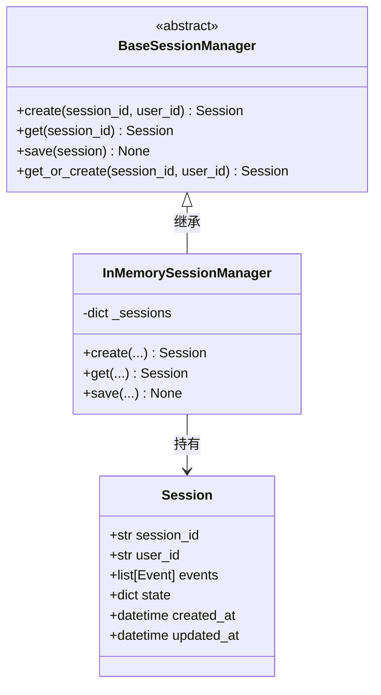
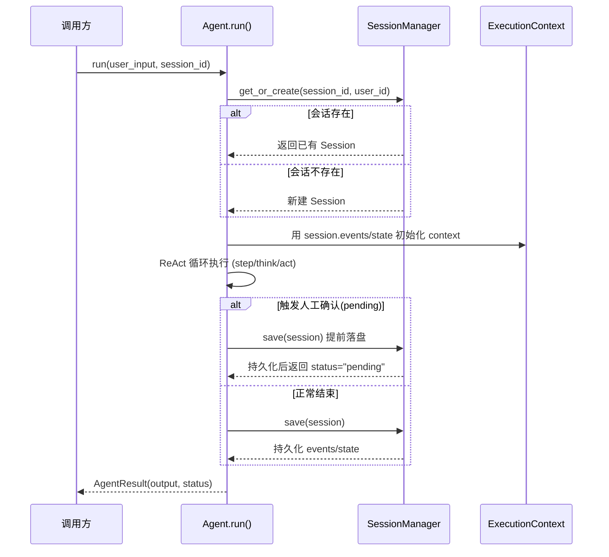

# 第 13 章 会话持久化：让 Agent 记住"上次聊到哪"

> 对应真实源码：`src/scratchagent/memory/_session.py`（`Session` / `BaseSessionManager` / `InMemorySessionManager`），以及 `agent.py` 中会话的读写调用点。
> 前置章节：第 8 章（ReAct 循环）、第 5 章（执行上下文）。

---

## 1. 核心问题

第 8 章的 `Agent.run()` 每次执行都从**空上下文**开始——问它"我刚才让你查什么了？"它一无所知，因为上一次 run 的事件流已经随进程结束而消失。要让 Agent 支持"多轮、跨 run 的连续对话"，就必须把**会话状态持久化**。本章回答：**如何用 `session_id` 把一次 run 的事件与状态存下来，并在下一次 run 时原样恢复？**

---

## 2. 教学目标

学完本章，你应当能：

1. **写出** `Session` 数据模型，说清它六个字段各自的用途（尤其是 `events` 与 `state` 的区别）；
2. **说清** `BaseSessionManager` 抽象类的三个抽象方法（`create`/`get`/`save`）与一个模板方法（`get_or_create`）；
3. **定位** `agent.py` 中会话的**恢复**（run 开头）与**保存**（run 结尾）两个时机，解释"为何要在 pending 分支也提前保存"；
4. **判断** `InMemorySessionManager` 的适用边界（仅开发/测试，进程退出即丢）。

---

## 3. 原理讲解

### 3.1 结论先行：会话 = 一份"可恢复的上下文快照"

会话持久化的核心思想：**把 `ExecutionContext` 里最宝贵的两部分——`events`（历史事件流）和 `state`（键值状态）——在 run 结束时打包存起来，下一次 run 开始时原样读回**。这样，Agent 的"记忆"就不再局限于单次 run 的生命周期。

`session_id` 是这套机制的主键：同一个 `session_id` 指向同一段对话历史，不同 `session_id` 之间互不干扰。这正是"多用户、多对话"隔离的基础。

### 3.2 正反例：进程内变量 vs 持久化会话

**反例（把历史存进程内全局变量）**：

```python
# 反例：全局变量保存历史，进程一重启就丢
history = []
async def run(user_input):
    history.append(user_input)
    # ... 用 history 拼上下文
```

问题：`history` 是进程内状态，服务重启、代码热更新、多实例部署都会导致历史丢失或串线。

**正例（会话管理器持久化）**：

```python
session = await session_manager.get_or_create(session_id, user_id)  # 恢复
# ... run 执行，产生新的 events/state ...
await session_manager.save(session)  # 保存
```

核心差异：历史不再"裸奔"在进程里，而是**经过一个 `BaseSessionManager` 接口**的托管。这个接口把"存哪、怎么存"与"用不用"解耦——当前是内存实现，将来换成 Redis/数据库，`Agent` 的代码一行不用改。

### 3.3 关键设计：抽象基类 + 模板方法

`BaseSessionManager` 用了两个经典设计：

1. **抽象基类（ABC）**：`create`/`get`/`save` 声明为 `@abstractmethod`，强制任何存储后端都实现这三个能力。
2. **模板方法（Template Method）**：`get_or_create` 是**具体方法**，内部调用抽象的 `get` 和 `create`——"先查、查不到再建"这个**流程**是固定的，但"怎么查、怎么建"留给子类。这就是"把可变部分下沉、把不变流程上提"。

---

## 4. 配图

### 图 1：会话三层结构的类图



**解读**：这张类图揭示了三点——（1）`Session` 是纯数据模型（Pydantic `BaseModel`），只存状态不含行为；（2）`BaseSessionManager` 定义接口契约，三个 `@abstractmethod` + 一个模板方法 `get_or_create`；（3）`InMemorySessionManager` 是唯一的现成实现，内部用 `dict[str, Session]` 存所有会话。

### 图 2：会话的恢复-执行-保存时序（本章核心图）

下面这张时序图勾勒本章骨架——**恢复在 run 开头、保存在 run 结尾**，中间是第 8 章已熟悉的 ReAct 循环：



**解读**：这条时序图的关键在**恢复**这一步——`context.events = list(session.events)`、`context.state = dict(session.state)`，把上次的状态完整接续过来；以及**提前保存**这条支路——run 中途挂起时也要先落盘，否则"待确认"状态会丢失。

---

## 5. 源码精读

### 5.1 数据模型：`Session`（L12~20）

```python
class Session(BaseModel):
    session_id: str
    user_id: str | None = None
    events: list[Event] = Field(default_factory=list)
    state: dict[str, Any] = Field(default_factory=dict)
    created_at: datetime = Field(default_factory=datetime.now)
    updated_at: datetime = Field(default_factory=datetime.now)
```

逐点讲解：

1. **`events` vs `state` 的分工**：`events` 存**历史事件流**（用户消息、工具调用、工具结果……，即第 4 章的 `Event` 序列），是 LLM 下次对话要"看见"的上下文；`state` 存**任意键值状态**（如第 12 章提到的 `pending_tool_calls`），是 Agent 内部流转需要的、不直接喂给 LLM 的数据。
2. **`Field(default_factory=list)`**（L17）：这是 Pydantic 的**可变默认值陷阱**防护——不能用 `events: list[Event] = []`（所有实例会共享同一个空列表），必须用 `default_factory` 让每个实例都拿到**独立的新列表**。`state` 的 `dict` 同理。
3. **`created_at`/`updated_at`**（L19~20）：`default_factory=datetime.now`，每次创建实例时生成。区别在于 `updated_at` 会在 `save()` 时被刷新（见 5.4）。

### 5.2 抽象基类：`BaseSessionManager`（L23~54）

```python
class BaseSessionManager(ABC):
    @abstractmethod
    async def create(self, session_id, user_id=None) -> Session: ...
    @abstractmethod
    async def get(self, session_id: str) -> Session | None: ...
    @abstractmethod
    async def save(self, session: Session) -> None: ...

    async def get_or_create(self, session_id, user_id=None) -> Session:
        session = await self.get(session_id)
        if session is None:
            session = await self.create(session_id, user_id)
        return session
```

三个抽象方法定义了**最小契约**，`get_or_create` 是模板方法。注意一个细节：`get` 返回 `Session | None`（查不到返回 None），而 `create` 在 `InMemorySessionManager` 里会**对已存在的 id 抛 `ValueError`**（见 5.3 L69~70）——所以 `get_or_create` 的"先查再建"顺序是**必须**的，否则重复调用会撞上 `create` 的重复检查。

### 5.3 内存实现：`InMemorySessionManager`（L57~83）

```python
class InMemorySessionManager(BaseSessionManager):
    def __init__(self):
        self._sessions: dict[str, Session] = {}     # L61：进程内字典

    async def create(self, session_id, user_id=None) -> Session:
        if session_id in self._sessions:            # L69：重复检查
            raise ValueError(f"Session {session_id} already exists")
        session = Session(session_id=session_id, user_id=user_id)
        self._sessions[session_id] = session
        return session

    async def get(self, session_id: str) -> Session | None:
        return self._sessions.get(session_id)       # L78：dict.get 天然返回 None

    async def save(self, session: Session) -> None:
        session.updated_at = datetime.now()         # L82：刷新更新时间
        self._sessions[session.session_id] = session
```

逐点讲解：

1. **存储介质**（L61）：一个普通 `dict`。这正是它叫"InMemory"的原因——**进程退出，数据全丢**，只适合开发和测试。
2. **`get` 用 `dict.get`**（L78）：Python 字典的 `get` 在 key 不存在时返回 `None`，天然契合抽象类 `get -> Session | None` 的签名，无需额外 `if ... in ...`。
3. **`save` 刷新 `updated_at`**（L82）：每次保存都更新"最后修改时间"，这是数据层的一个好习惯，配合 `created_at` 形成"创建时间 vs 更新时间"的完整生命周期记录。

### 5.4 与 `Agent` 的协作（`agent.py` 中的调用点）

会话机制在 `agent.py` 里有三个关键调用点：

**恢复（run 开头）**：

```python
# agent.py run() 中
if session_id and self.session_manager:
    session = await self.session_manager.get_or_create(session_id, user_id)
# ...
if context is None:
    context = ExecutionContext(session=session, ...)
    if session:
        context.events = list(session.events)      # 恢复事件流
        context.state = dict(session.state)        # 恢复状态
```

**保存（正常结束）**：

```python
# agent.py run() 末尾
if session and self.session_manager:
    session.events = list(context.events)
    session.state = dict(context.state)
    await self.session_manager.save(session)
```

**提前保存（pending 分支，有两处）**：当工具触发人工确认、run 需要**中途挂起**时，也会在返回前保存一次（见第 12 章图 3 的对照）——因为此时状态必须落盘，才能让下一次 run 从"待确认"处恢复。这两处分别在 `tool_confirmations` 分支（`agent.py` L157~160）和 `step` 循环内 `status=="pending"` 分支（L187~192）。

> **要点**：三处调用点共同体现了同一个模式——**`session.events/state` 与 `context.events/state` 之间用 `list(...)`/`dict(...)` 做拷贝**，而非直接赋值。这是为了避免"会话对象和上下文对象引用同一份可变数据，互相污染"。

---

## 6. 动手实验

目标：**给项目加一个"跨 run 记忆"的最小用例**，验证会话恢复。

### 实验 1：验证会话跨 run 恢复

```python
import asyncio
from scratchagent import Agent
from scratchagent.memory import InMemorySessionManager

# client 为前几章构造的 LlmClient 实例（见第 2 章）
async def main():
    sm = InMemorySessionManager()
    agent = Agent(model=client, session_manager=sm)

    # 第一次 run：告诉 Agent 一个事实
    await agent.run("我的名字叫老夏", session_id="chat-1")

    # 第二次 run：同一个 session_id，Agent 应该"记得"
    result = await agent.run("我叫什么名字？", session_id="chat-1")
    print(result.output)  # 期望能答出"老夏"

    # 第三次 run：换个 session_id，Agent 应该"失忆"
    result2 = await agent.run("我叫什么名字？", session_id="chat-2")
    print(result2.output)  # 期望答不出（新会话，无历史）

asyncio.run(main())
```

**验证点**：`chat-1` 的两次 run 共享历史，`chat-2` 是全新会话。这是"多对话隔离"的最直观演示。

### 实验 2：观察 `get_or_create` 的幂等性

```python
sm = InMemorySessionManager()
s1 = await sm.get_or_create("a", "u1")   # 新建
s2 = await sm.get_or_create("a", "u1")   # 命中已有，不新建
print(s1 is s2)                          # 期望 True（同一个对象）

# 直接 create 一个已存在的 id 会抛异常
try:
    await sm.create("a", "u1")
except ValueError as e:
    print(e)  # 期望 "Session a already exists"
```

**验证点**：`get_or_create` 幂等，`create` 对重复 id 严格抛错——理解这两个方法的边界。

### 实验 3：自定义一个持久化后端

```python
from scratchagent.memory import BaseSessionManager, Session
import json

class JsonFileSessionManager(BaseSessionManager):
    """把会话存成 JSON 文件，演示如何扩展后端"""
    def __init__(self, path):
        self.path = path
    async def create(self, session_id, user_id=None):
        s = Session(session_id=session_id, user_id=user_id)
        await self.save(s)
        return s
    async def get(self, session_id):
        # 从 JSON 文件读回（省略反序列化细节）
        ...
    async def save(self, session):
        # 把 session 序列化写入 JSON 文件（省略）
        ...

# 使用方式与 InMemorySessionManager 完全一致
agent = Agent(model=client, session_manager=JsonFileSessionManager("sessions.json"))
```

**验证点**：这是 3.3 节"抽象基类 + 模板方法"价值的落地——你只实现 `create`/`get`/`save` 三个方法，`get_or_create` 和 `Agent` 的调用逻辑**零改动**。

---

## 7. 本章自检

- [ ] 我能说清 `Session` 六个字段，并区分 `events`（喂给 LLM 的历史）与 `state`（内部状态）的用途。
- [ ] 我能解释 `Field(default_factory=list)` 为何不能写成 `= []`（Pydantic 可变默认值陷阱）。
- [ ] 我能说清 `BaseSessionManager` 的"三个抽象方法 + 一个模板方法"结构，以及 `get_or_create` 为何必须先查再建。
- [ ] 我能定位 `agent.py` 中会话的恢复、保存、pending 提前保存三个调用点，并说明为何用 `list()/dict()` 拷贝。
- [ ] 我能指出 `InMemorySessionManager` 的适用边界（进程退出即丢，仅开发/测试）。
- [ ] 我能自己写一个 `BaseSessionManager` 的子类，且不改动 `Agent` 的任何调用代码。

---

## 延伸阅读

- Python `abc` 抽象基类：`https://docs.python.org/3/library/abc.html`
- Pydantic 模型字段与 `default_factory`：`https://docs.pydantic.dev/latest/concepts/models/`
- 模板方法设计模式（Template Method）与策略模式的对比
