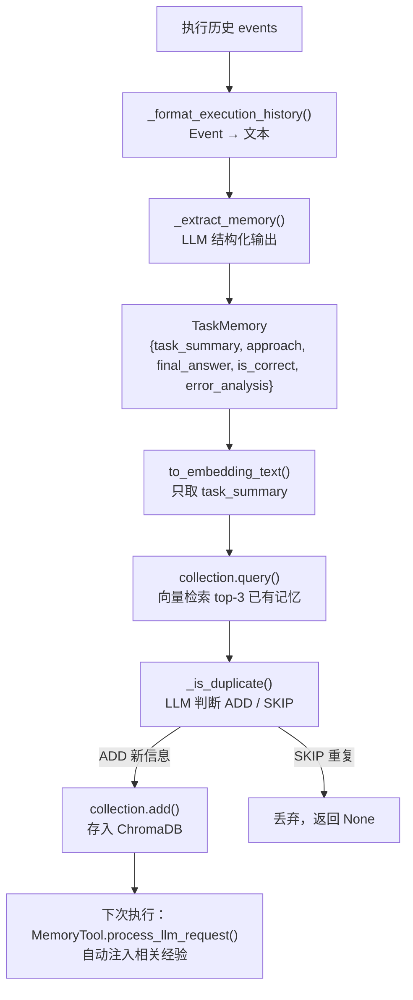
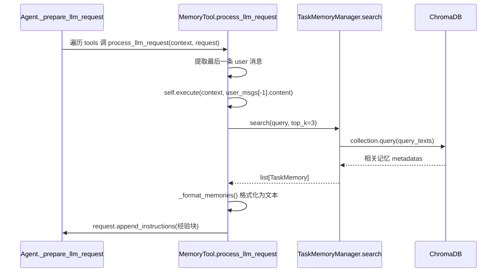

# 第 14 章 长期记忆：让 Agent 跨任务复用经验

> 对应真实源码：`src/scratchagent/memory/_long_term.py`（`TaskMemory` / `TaskMemoryManager` / `DuplicateCheckResult`），以及 `src/scratchagent/tools/_memory_tool.py`（`MemoryTool`）。
> 前置章节：第 13 章（会话持久化）、第 11 章（RAG）、第 9 章（结构化输出）。

---

## 1. 核心问题

第 13 章的会话记忆是**短期的**——它只记住"这一次对话"。但一个真正会学习的 Agent，应该能记住"上次解过类似的题、用的什么方法、最后对不对"，从而在下一次遇到类似问题时**少走弯路**。这就是长期记忆（long-term memory）。本章回答：**如何把一次执行的历史"提炼"成结构化经验，存入向量库，并在下次执行时自动注入相关经验？**

---

## 2. 学习目标

学完本章，你应当能：

1. **说清** 长期记忆的完整链路：执行历史 → LLM 抽取 → 向量检索去重 → 存入 ChromaDB → 下次自动注入；
2. **写出** `TaskMemory` 数据模型，说清它的 `to_embedding_text()` 为何只取 `task_summary`；
3. **解释** 去重机制：为什么用 LLM 判断 `ADD`/`SKIP`，而不是简单字符串比对；
4. **定位** `MemoryTool` 的"隐式注入"机制——它如何通过 `process_llm_request` 在 LLM 调用前悄悄塞入经验，而不需要模型主动调用工具。

---

## 3. 原理讲解

### 3.1 结论先行：长期记忆 = "抽取 → 去重 → 存向量 → 注入"四步闭环

长期记忆的本质是把**一次性的执行历史**，提炼成**可复用的经验条目**。完整链路是：

```
执行历史(events) → _format_execution_history() → 文本 → _extract_memory(LLM) → TaskMemory 结构化经验
                 → _is_duplicate(LLM+向量检索) → 决定 ADD 或 SKIP
                 → collection.add() 存入 ChromaDB
下次执行时 → MemoryTool.process_llm_request() → 自动注入相关经验到 prompt
```

关键洞察：**抽取和去重都由 LLM 完成**（结构化输出，正是第 9 章讲的能力），**存储和检索由 ChromaDB 完成**（向量相似度，正是第 11 章讲的能力）。本章是前面两章能力的"合流"。

### 3.2 正反例：为什么不能存原始历史

**反例（把原始 events 直接当记忆存）**：

```python
# 反例：存原始执行历史
memory_db.append(json.dumps(context.events))   # 一次执行可能几百个 Event
```

问题：执行历史冗长、含大量噪音（中间步骤、工具调用的原始返回），既占存储，又难以按语义检索。"上次解过类似的题吗"这种查询，无法在原始事件流上高效回答。

**正例（提炼成结构化经验）**：

```python
memory = await self._extract_memory(execution_history)  # LLM 提炼成 TaskMemory
# TaskMemory: {task_summary, approach, final_answer, is_correct, error_analysis}
```

核心差异：**原始历史 → 结构化经验**是一次"信息压缩"。LLM 把几百个 Event 提炼成 5 个字段，既保留了"这道题问什么、怎么解的、对不对、错在哪"，又便于向量化和语义检索。

### 3.3 去重为什么也要 LLM

去重的朴素做法是字符串比对（`if new == old`），但"同一问题、不同解法"应该算新经验，"同一问题、相同解法、相同结果"才算重复。这个判断**语义层面**的，字符串比对做不到。所以 `_is_duplicate` 也交给 LLM，用 `DUPLICATE_CHECK_PROMPT` 明确告知判断标准：

> - 相同问题 + 不同解法 或 不同结果 → `ADD`（新信息）
> - 相同问题 + 相同解法 + 相同结果 → `SKIP`（重复）

这是"用 LLM 做语义判断"的又一例证，与第 9 章的结构化输出（`response_format`）协同。

---

## 4. 配图

### 图 1：长期记忆全链路（本章核心图）



**解读**：这条链路有四个关键决策点——（1）`_format_execution_history` 把结构化 Event 变成文本；（2）`_extract_memory` 用 LLM 提炼成 `TaskMemory`；（3）`_is_duplicate` 用 LLM 判断是否重复；（4）`MemoryTool` 在下次执行时自动注入。其中两处"用 LLM 做判断"是本章区别于普通数据库持久化的核心特征。

### 图 2：`MemoryTool` 的隐式注入时序



**解读**：注意 `MemoryTool` 的注入**不是**靠模型调用工具，而是靠 `_prepare_llm_request` 里"遍历所有工具调 `process_llm_request`"这一钩子（第 8 章已埋下）。它拿"最后一条用户消息"作为查询，检索到经验后**直接追加进 request 的 instructions**——模型还没开始想，就已经"看"到了相关经验。这就是"隐式注入"与"显式调用"的区别。

---

## 5. 源码精读

文件位置：src/scratchagent/memory/_long_term.py  和 ../tools/_memory_tool.py

### 5.1 数据结构：`TaskMemory` 与 `DuplicateCheckResult`（L21~42）

```python
class TaskMemory(BaseModel):
    task_summary: str = Field(description="What the problem asked")
    approach: str = Field(description="Methods and tools used to solve it")
    final_answer: str = Field(description="The agent's submitted answer")
    is_correct: bool = Field(description="Whether the answer was correct")
    error_analysis: str | None = Field(default=None, description="Why the attempt failed, if it did")

    def to_embedding_text(self) -> str:
        return f"Task: {self.task_summary}"

class DuplicateCheckResult(BaseModel):
    decision: str = Field(description="ADD (new information) or SKIP (duplicate)")
    reason: str = Field(description="Explanation for the decision")
```

逐点讲解：

1. **`TaskMemory` 的五个字段**：`task_summary`（问什么）、`approach`（怎么解）、`final_answer`（答案）、`is_correct`（对不对）、`error_analysis`（错在哪，可空）。这五个字段就是一条"解题经验"的完整画像。
2. **`to_embedding_text()`**（L33~35）只返回 `task_summary`：这是**检索键**的设计——用户下次的查询是"这道题怎么解"，最相关的是**问题描述**（task_summary），而非答案本身。所以向量化时只嵌入问题，答案存在 metadata 里，检索到后再取。
3. **`DuplicateCheckResult`**（L38~42）：去重判断的**输出契约**，`decision` 只能是 `ADD`/`SKIP`。这是第 9 章结构化输出的直接应用——用 `response_format=DuplicateCheckResult` 让 LLM 返回枚举值而非自由文本。

### 5.2 初始化：`TaskMemoryManager.__init__`（L80~98）

```python
def __init__(self, llm_client: LlmClient, collection_name: str = "task_memories"):
    self.llm_client = llm_client
    # chromadb.PersistentClient(path="./.memory_db")   # L88：注释掉的持久化方案
    self.client = chromadb.Client()                     # L89：内存模式
    embedding_fn = OpenAIEmbeddingFunction(model_name="text-embedding-3-small")  # L90
    self.collection = self.client.get_or_create_collection(
        name=collection_name,
        embedding_function=cast(Any, embedding_fn),
    )
```

逐点讲解：

1. **`chromadb.Client()`**（L89）：这是 ChromaDB 的**内存模式**——数据存在进程内，进程退出即丢。源码 L88 注释掉的 `PersistentClient(path="./.memory_db")` 是持久化方案，作者刻意选内存模式做教学演示。
2. **`OpenAIEmbeddingFunction`**（L90）：ChromaDB 内置的 embedding 函数，与第 11 章 `rag.py` 用同一个 `text-embedding-3-small`注：截至202609月份 OpenRouter 不再提供该模型，故修改了模型：perplexity/pplx-embed-v1-0.6b 模型。注意这里**没有传 api_key/api_base**（L91~92 注释掉了），这是因为它依赖环境变量自动配置。
3. **`cast(Any, embedding_fn)`**（L97）：`embedding_function` 参数的静态类型与 `OpenAIEmbeddingFunction` 的实际类型不完全匹配，用 `cast` 显式声明"这里我确定是对的"。注意 `cast` **只在静态类型检查时生效，运行时不做任何转换**——它是给 mypy 看的"类型断言"，不影响实际执行。

### 5.3 抽取：`_extract_memory`（L100~115）

```python
async def _extract_memory(self, execution_history: str) -> TaskMemory | None:
    prompt = TASK_MEMORY_EXTRACTION_PROMPT.format(execution_history=execution_history)
    try:
        result = await self.llm_client.ask(prompt=prompt, response_format=TaskMemory)
        if not isinstance(result, TaskMemory):
            raise TypeError("Expected TaskMemory from memory extraction")
        return result
    except Exception as e:
        print(f"Memory extraction failed: {e}")
        return None
```

关键点：

1. **`llm_client.ask(..., response_format=TaskMemory)`**（L106）：这是第 9 章结构化输出的**另一种用法**——`ask` 直接要求 LLM 按 `TaskMemory` 的 schema 返回，`result` 就是一个 `TaskMemory` 实例。注意这里用的是 `ask` 而非 `generate`（`ask` 是更上层的封装，遇错会抛异常）。
2. **`isinstance` 防御**（L110）：即使声明了 `response_format`，仍做类型断言，防止 LLM 返回异常类型。这是防御式编程。
3. **`except Exception` 兜底**（L113~115）：抽取失败不致命——返回 `None`，让 `save()` 静默跳过，而不是让整个 run 崩溃。

### 5.4 历史格式化：`_format_execution_history`（L117~129）

```python
def _format_execution_history(self, events: list[Event]) -> str:
    lines = []
    for event in events:
        for item in event.content:
            if isinstance(item, Message):
                lines.append(f"[{item.role}]: {item.content}")
            elif isinstance(item, ToolCall):
                lines.append(f"[Tool Call]: {item.name}({item.arguments})")
            elif isinstance(item, ToolResult):
                content_preview = str(item.content[0])[:500] if item.content else ""
                lines.append(f"[Tool Result]: {item.name} -> {content_preview}")
    return "\n".join(lines)
```

这是把第 4 章的 `Event` 流还原成"可读文本"的过程，供 LLM 抽取。注意 L127 的 `[:500]` 截断——工具结果可能很长，只取前 500 字符做预览，避免抽取 prompt 过长。

### 5.5 去重：`_is_duplicate`（L131~167）

```python
async def _is_duplicate(self, new_memory, existing_results) -> bool:
    metadatas = existing_results["metadatas"]
    if not metadatas or not metadatas[0]:
        return False                     # 无已有记忆 → 必非重复

    existing_texts = []                  # 组装已有记忆的摘要
    for meta in metadatas[0]:
        existing_texts.append(
            f"task_summary: {meta.get('task_summary')}, "
            f"- approach: {meta.get('approach')}, "
            f"is_correct: {meta.get('is_correct')}"
        )

    prompt = DUPLICATE_CHECK_PROMPT.format(existing_memories="\n".join(existing_texts), new_memory=...)
    try:
        result = await self.llm_client.ask(prompt=prompt, response_format=DuplicateCheckResult)
        if not isinstance(result, DuplicateCheckResult):
            raise TypeError(...)
        return result.decision == "SKIP"   # 返回 True 表示重复
    except Exception:
        return False                       # 判断失败默认"非重复"，宁存不丢
```

关键点：L166~167 的 `except Exception: return False` 是**容错策略**——去重判断失败时，默认当作"非重复"（`False`），宁可多存一条也不丢经验。这与 `_extract_memory` 的 `except Exception: return None` 形成对比：抽取失败是"宁丢不存"，去重失败是"宁存不丢"。

### 5.6 存储：`save`（L169~201）

```python
async def save(self, context: ExecutionContext) -> str | None:
    execution_history = self._format_execution_history(context.events)   # 1
    memory = await self._extract_memory(execution_history)               # 2
    if memory is None:
        return None
    existing = self.collection.query(query_texts=[memory.to_embedding_text()], n_results=3)  # 3
    if await self._is_duplicate(memory, existing):
        return None
    memory_id = str(uuid.uuid4())                                        # 4
    metadata = memory.model_dump()
    metadata = {k: ("" if v is None else v) for k, v in metadata.items()} # L195：None 转空串
    self.collection.add(ids=[memory_id], documents=[memory.to_embedding_text()], metadatas=[metadata])
    return memory_id
```

关键点：

1. **L195 的 None 处理**：`TaskMemory.error_analysis` 可能为 `None`，但 ChromaDB 的 metadata **不能存 None 值**，所以这里用字典推导式把所有 `None` 转成空字符串 `""`。这是与外部存储库交互时的典型兼容性处理。
2. **检索键与存储键一致**（L185、L198 都用 `to_embedding_text()`）：去重查询时用 `task_summary` 向量，存储时也用同一个向量，保证"查"和"存"在同一个语义空间。

### 5.7 检索：`search`（L203~214）

```python
async def search(self, query: str, top_k: int = 5) -> list[TaskMemory]:
    results = self.collection.query(query_texts=[query], n_results=top_k)
    metadatas = results["metadatas"]
    if not metadatas or not metadatas[0]:
        return []
    return [TaskMemory.model_validate(meta) for meta in metadatas[0]]
```

检索时按 `query` 向量查 top-k，把返回的 metadata **反向 `model_validate` 回 `TaskMemory` 实例**（L214）。这与 `save` 里的 `model_dump()` 构成"序列化 ↔ 反序列化"的闭环。

### 5.8 注入工具：`MemoryTool`（`tools/_memory_tool.py`）

```python
class MemoryTool(BaseTool):
    def __init__(self):
        super().__init__(
            name="recall_memory",
            description="Search for past problem-solving records...",
            tool_definition=None,   # L26：仅自动注入，不作为可调用工具暴露
        )

    async def execute(self, context, query: str = "", **kwargs) -> str:
        if context.memory_manager is None:
            return ""
        memories = await context.memory_manager.search(query, top_k=3)
        if not memories:
            return ""
        return self._format_memories(memories)

    async def process_llm_request(self, context, request) -> None:
        if context.memory_manager is None:
            return
        user_msgs = [c for c in request.contents if isinstance(c, Message) and c.role == "user"]
        if not user_msgs:
            return
        result = await self.execute(context, user_msgs[-1].content)   # 用最后一条用户消息
        if not result:
            return
        request.append_instructions("The following are records from similar problems...\n<PAST_EXPERIENCES>\n" + result + "\n</PAST_EXPERIENCES>\n...")
```

逐点讲解：

1. **`tool_definition=None`**（L26）：这是 `MemoryTool` 最精妙的设计——它**不是一个让模型主动调用的工具**，而是"幕后工作者"。`tool_definition=None` 意味着它不会出现在给 LLM 的工具列表里（回顾第 8 章 `_prepare_llm_request` 里 `[t for t in self.tools if t.tool_definition is not None]` 的过滤）。
2. **`process_llm_request` 是真正的入口**（L58）：这是 `BaseTool` 上的一个钩子，`agent.py` 的 `_prepare_llm_request` 会**遍历所有工具**调用它（第 8 章已讲）。`MemoryTool` 在这里"搭便车"——在 LLM 调用前，把相关经验塞进 request。
3. **用最后一条用户消息做查询**（L72）：`user_msgs[-1].content` 就是用户当前的问题，用它检索"历史上有没有解过类似的问题"。
4. **`append_instructions`**（L76）：把格式化后的经验追加到 request 的 instructions 里，用 `<PAST_EXPERIENCES>` 标签包裹，明确告诉模型"以下是历史经验"。

---

## 6. 动手实验

参考示例： examples/memory_agent.py

目标：**给项目加一个"跨任务记忆"的最小用例**，验证经验抽取与自动注入。

### 实验 1：跑通存储链路

```python
from scratchagent.memory import TaskMemoryManager
from scratchagent import Agent

# client 为 LlmClient 实例
memory_manager = TaskMemoryManager(llm_client=client)
agent = Agent(model=client, memory_manager=memory_manager)

# 第一次执行：解一道题
await agent.run("计算 15 * 7 等于多少？")

# 观察：执行结束后，run() 内部会调 memory_manager.save(context)
# 经验被提炼成 TaskMemory 存入 ChromaDB
```

**验证点**：执行一次后，`memory_manager.collection.count()` 应该从 0 变成 1（或更多）。

### 实验 2：验证自动注入

```python
# 第二次执行：问一个"类似"的问题
result = await agent.run("计算 12 * 8 等于多少？", verbose=True)

# 观察 verbose 输出：LLM 请求的 instructions 里应该包含 <PAST_EXPERIENCES> 块
# 里面有第一次执行提炼出的经验（task_summary="计算 15*7" 等）
```

**验证点**：`MemoryTool.process_llm_request` 在 LLM 调用前自动注入了第一次的经验。开启 verbose 能看到注入的内容。

### 实验 3：验证去重

```python
# 第三次执行：完全重复第一次的问题
await agent.run("计算 15 * 7 等于多少？")

# 观察：因为"相同问题+相同解法+相同结果"，_is_duplicate 返回 SKIP
# 经验不会被重复存储，collection.count() 不增加
```

**验证点**：相同问题不会重复积累记忆，`collection.count()` 保持不变。

---

## 7. 本章自检

- [ ] 我能画出长期记忆的完整链路：抽取 → 去重 → 存向量 → 注入。
- [ ] 我能说清 `TaskMemory` 五个字段，以及 `to_embedding_text()` 为何只取 `task_summary`。
- [ ] 我能解释去重为何用 LLM（语义判断）而非字符串比对，并说出 `ADD`/`SKIP` 的判断标准。
- [ ] 我能指出 `chromadb.Client()` 是内存模式（L89），以及 L88 注释掉的 `PersistentClient` 是持久化方案。
- [ ] 我能说明 `save` 里 L195 为何要把 `None` 转空串（ChromaDB metadata 限制）。
- [ ] 我能说清 `MemoryTool` 的 `tool_definition=None` 的含义（隐式注入，不作为可调用工具）。
- [ ] 我能定位 `process_llm_request` 的调用时机（`_prepare_llm_request` 遍历工具时），并说清它如何"搭便车"注入经验。

---

## 延伸阅读

- ChromaDB 文档：`https://docs.trychroma.com/`
- ChromaDB 内存模式 vs 持久化模式的取舍
- "隐式工具"与"显式工具"的设计差异（对比 `MemoryTool` 与第 7 章的 `FunctionTool`）
