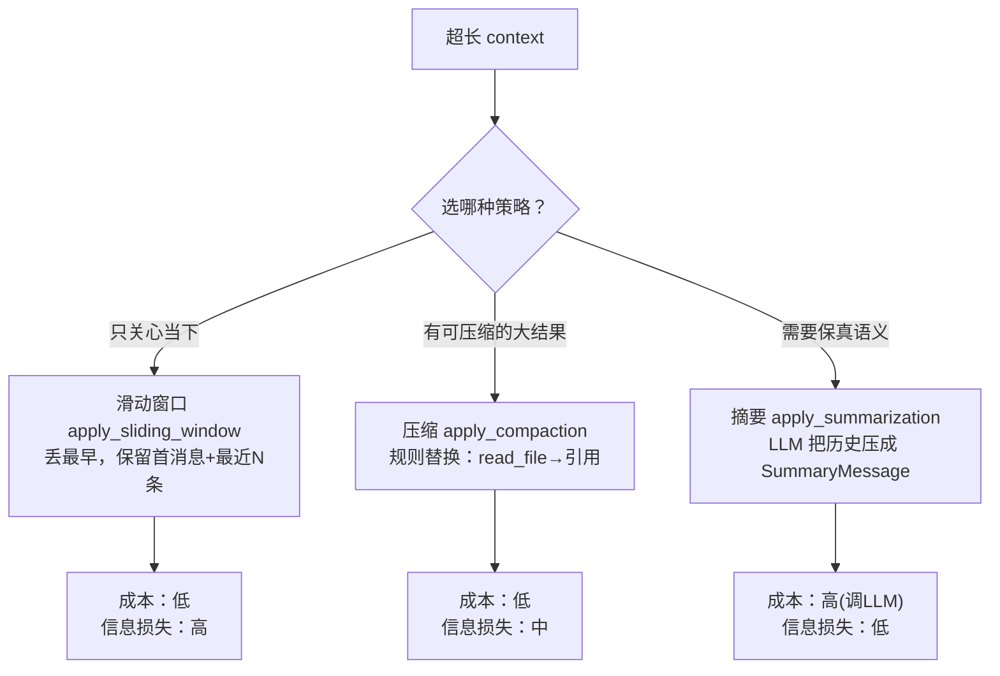
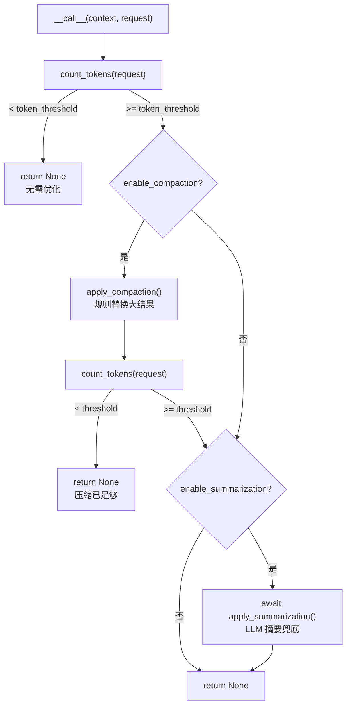
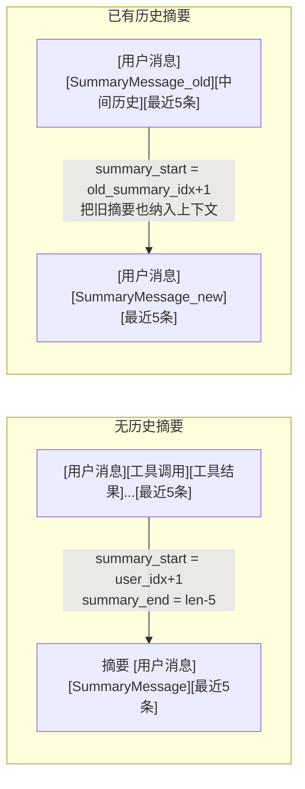

# 第 15 章 上下文优化：当对话变长，如何不撑爆窗口

> 对应真实源码：`src/scratchagent/memory/_context_optimizer.py`（`ContextOptimizer` / `count_tokens` / `apply_sliding_window` / `apply_compaction` / `apply_summarization`）。
> 前置章节：第 8 章（ReAct 循环）、第 6 章（消息转换）、第 14 章（长期记忆）。

---

## 1. 核心问题

Agent 跑得越久，`context.events` 里的内容就越长——几十轮对话、上百次工具调用，很快会逼近甚至超出 LLM 的上下文窗口（token 上限）。超限会导致报错或隐性截断。本章回答：**如何在 LLM 调用前检测 token 用量，并对过长的上下文自动执行"滑动窗口、压缩、摘要"三种降级策略？**

---

## 2. 学习目标

学完本章，你应当能：

1. **写出** `count_tokens`，说清它如何用 `tiktoken` 估算 token 数（含消息开销、工具调用、工具定义）；
2. **说清** 三种优化策略的定位差异：滑动窗口（丢最早）、压缩（把大结果换成引用）、摘要（用 LLM 把旧历史压成一段话）；
3. **解释** `ContextOptimizer.__call__` 的**分层降级**逻辑：先压缩、不够再摘要，以及为什么这样排序；
4. **定位** `SummaryMessage` 在摘要机制中的"检查点"作用，理解 `summary_start`/`summary_end` 的边界计算。

---

## 3. 原理讲解

### 3.1 结论先行：上下文优化 = "阈值触发 + 分级降级"

上下文优化的核心是**一个挂载在 `before_llm_callbacks` 上的优化器**：每次 LLM 调用前，先数 token；超过阈值才动手，且**从"最廉价"到"最昂贵"逐级尝试**：

```
count_tokens(request) < threshold ?  → 不动，直接放行
否 → apply_compaction(压缩)          → 再数，够了就停
否 → apply_summarization(摘要)       → 最后兜底
```

这个"分级"设计的精髓在于**成本递增**：

| 策略 | 成本 | 信息损失 | 触发顺序 |
|---|---|---|---|
| 滑动窗口 | 最低（纯截断） | 高（丢最早消息） | （独立工具，未接入 `__call__`） |
| 压缩 | 低（规则替换） | 中（大结果变引用） | 第一步 |
| 摘要 | 高（调 LLM） | 低（语义保留） | 第二步兜底 |

先用**几乎零成本**的压缩（把 `read_file` 的整段文件内容换成一句"需要时重读"），不够再用**昂贵但保真**的摘要。这就是"分级降级"的工程智慧。

### 3.2 正反例：为什么不一次性全摘要

**反例（无脑全摘要）**：

```python
# 反例：token 一超就全文摘要
if count_tokens(request) > threshold:
    await apply_summarization(...)   # 每次都调 LLM，昂贵且慢
```

问题：很多超限场景其实**不需要 LLM 出马**——比如 `read_file` 返回了 5000 行代码，把它换成"File content from xxx. Re-read if needed."一句引用就能省下海量 token，且**不损失语义**（模型真要读可以重读）。直接摘要反而慢且引入 LLM 幻觉风险。

**正例（分级降级）**：

```python
if self.enable_compaction:
    apply_compaction(context, request)           # 先廉价压缩
    if count_tokens(request) < self.token_threshold:
        return None                              # 够了就停
if self.enable_summarization:
    await apply_summarization(...)               # 不够再昂贵摘要
```

核心差异：**能用规则解决的不调 LLM，能用压缩解决的不摘要**。这是"最省成本的先上"的贪心思想。

### 3.3 三种策略的本质对比

- **滑动窗口（sliding window）**：保留"第一条用户消息 + 最近 N 条"，中间全丢。**最快，但丢历史**——适合"只关心当下"的对话。
- **压缩（compaction）**：用**规则**（`TOOLCALL_COMPACTION_RULES` / `TOOLRESULT_COMPACTION_RULES` 两个字典）把特定工具的调用参数和返回结果替换成短引用。**不调 LLM，语义可控**。
- **摘要（summarization）**：用 LLM 把一段历史压成一句 `SummaryMessage`。**保真最好，但最贵**，且会引入 LLM 的归纳偏差。

---

## 4. 配图

### 图 1：三种优化策略对比



**解读**：三种策略在"成本"和"信息损失"两个维度上形成清晰的权衡——滑动窗口最省但最伤，摘要最贵但最保真，压缩居中。实际工程中往往组合使用（`__call__` 里就是"压缩→摘要"的分级组合）。

### 图 2：`ContextOptimizer.__call__` 分层降级流程（本章核心图）



**解读**：这张流程图精确对应 `__call__` 的**三处 `return None`**（L313 未超限、L318 压缩足够、L325 最终出口）和两处 `count_tokens`。关键设计是**"压缩后再数一次"**——如果压缩已经让 token 降到阈值以下，就**不再触发昂贵的摘要**。注意"摘要后"与"未启用摘要"共享同一个 `return None` 出口（源码 L325），这是函数末尾的统一返回。

### 图 3：摘要的"检查点"边界演进



**解读**：摘要不是"每次都从零摘要全部历史"，而是**增量式**——每次把"上一次摘要之后新增的中间历史"压成一段新的摘要，且把旧摘要作为上下文一并喂给 LLM（源码 L240~245）。这样摘要节点不断前移，但每次都只处理"新增部分"，成本恒定。

---

## 5. 源码精读

文件位置：src/scratchagent/memory/_context_optimizer.py

### 5.1 工厂函数：`create_optimizer_callback`（L17~35）

```python
def create_optimizer_callback(apply_optimization, threshold: int = 50000):
    async def callback(context, request) -> LlmResponse | None:
        token_count = count_tokens(request)           # L24
        if token_count < threshold:
            return None                               # L26~27：未超限，放行
        result = apply_optimization(context, request) # L30：执行优化
        if inspect.isawaitable(result):               # L31：兼容同步/异步
            await result
        return None
    return callback
```

这是一个**工厂函数**——接收一个 `apply_optimization` 策略函数，返回一个符合 `before_llm_callbacks` 签名（`(context, request) -> LlmResponse | None`）的闭包。注意 L31 的 `inspect.isawaitable`：它让工厂能同时接受**同步**和**异步**的优化函数，调用方无需关心差异。

### 5.2 token 统计：`count_tokens`（L38~71）

```python
def count_tokens(request: LlmRequest) -> int:
    import tiktoken                                    # L40：延迟导入
    try:
        encoding = tiktoken.encoding_for_model("gpt-5")  # L44
    except KeyError:
        encoding = tiktoken.get_encoding("o200k_base")   # L46
    messages = build_messages(request)                 # L48：复用第 6 章
    total_tokens = 0
    for message in messages:
        total_tokens += 4                              # L52：每条消息固定开销
        if message.get("content"):
            total_tokens += len(encoding.encode(str(message["content"])))
        if message.get("tool_calls"):                  # L57：统计工具调用
            for tool_call in message["tool_calls"]:
                func = tool_call.get("function", {})
                if func.get("name"):
                    total_tokens += len(encoding.encode(func["name"]))
                if func.get("arguments"):
                    total_tokens += len(encoding.encode(func["arguments"]))
    if request.tools:                                  # L65：统计工具定义
        for tool in request.tools:
            tool_def = tool.tool_definition
            if tool_def:
                total_tokens += len(encoding.encode(json.dumps(tool_def)))
    return total_tokens
```

逐点讲解：

1. **`import tiktoken` 延迟导入**（L40）：`tiktoken` 是可选依赖，延迟到函数体内导入，避免"不用上下文优化也必须装 tiktoken"。
2. **`build_messages(request)` 复用**（L48）：这里直接调用了第 6 章讲的 `build_messages`，把 `LlmRequest` 转成 OpenAI 消息格式，再逐条数 token。**跨章复用**的又一例证。
3. **每条消息 `+4`**（L52）：这是 OpenAI 消息格式的**固定开销**（每条消息有协议头），真实 token 计数需要加上。
4. **统计三类内容**：消息正文（L54~55）、工具调用参数（L57~63）、工具定义（L65~69）。这三类都是会占用上下文窗口的东西，缺一不可。

### 5.3 滑动窗口：`apply_sliding_window`（L74~100）

```python
def apply_sliding_window(context, request, window_size: int = 20) -> None:
    contents = request.contents
    user_message_idx: int | None = None
    for i, item in enumerate(contents):               # L84：找第一条用户消息
        if isinstance(item, Message) and item.role == "user":
            user_message_idx = i
            break
    if user_message_idx is None:
        return
    preserved = contents[: user_message_idx + 1]      # L93：保留首消息及之前
    remaining = contents[user_message_idx + 1:]       # L96：剩余部分
    if len(remaining) > window_size:
        remaining = remaining[-window_size:]          # L98：只留最近 N 条
    request.contents = preserved + remaining
```

核心逻辑：**永远保留第一条用户消息**（它是任务的"根"，丢了 Agent 就忘了自己在干嘛），其余只留最近 `window_size` 条。注意这个函数**未接入 `ContextOptimizer.__call__`**（它是个独立的工具函数），这是源码的一个现状，需点明。

### 5.4 压缩规则与实现：`apply_compaction`（L104~174）

```python
TOOLCALL_COMPACTION_RULES = {
    "create_file": "[Content saved to file]",
}
TOOLRESULT_COMPACTION_RULES = {
    "read_file": "File content from {file_path}. Re-read if needed.",
    "search_web": "Search results processed. Query: {query}. Re-search if needed.",
    "tavily_search": "Search results processed. Query: {query}. Re-search if needed.",
}
```

这两个**模块级字典**就是压缩的"规则表"——key 是工具名，value 是替换模板。`apply_compaction` 遍历 `request.contents`：

- 遇到 `ToolCall` 且名字在 `TOOLCALL_COMPACTION_RULES` 里，把它的 `content` 参数替换成 `"[Content saved to file]"`（L138~141）；
- 遇到 `ToolResult` 且名字在 `TOOLRESULT_COMPACTION_RULES` 里，用 `template.format(file_path=..., query=...)` 生成一句引用（L156~160）。

关键细节：**压缩必须保持 `tool_call_id` 不变**（L144、L163）——因为第 4 章讲的 `ToolCall↔ToolResult` 按 id 配对，丢了 id 就断了关联。

### 5.5 摘要：`apply_summarization`（L192~255）

```python
async def apply_summarization(context, request, llm_client, keep_recent: int = 5) -> None:
    contents = request.contents
    user_idx = next((i for i, item in enumerate(contents)
                     if isinstance(item, Message) and item.role == "user"), None)  # L210~217
    if user_idx is None:
        return
    summary_idx = next((i for i in range(len(contents) - 1, -1, -1)
                        if isinstance(contents[i], SummaryMessage)), None)  # L221~228
    summary_start = (summary_idx + 1) if summary_idx is not None else user_idx + 1  # L229
    summary_end = len(contents) - keep_recent                                        # L230
    if summary_end <= summary_start:
        return
    to_summarize = contents[summary_start:summary_end]                              # L235
    if not to_summarize:
        return
    history_parts: list[str] = []
    if summary_idx is not None:                       # L241：纳入旧摘要
        previous_summary = contents[summary_idx]
        if isinstance(previous_summary, SummaryMessage):
            history_parts.append(f"[Previous summary]\n{previous_summary.content}")
    history_parts.append(format_history_for_summary(to_summarize))
    summary = await generate_summary(llm_client, "\n\n".join(history_parts))  # L247
    if not summary:
        return
    summary_item = SummaryMessage(content=summary)
    summary_prefix_end = summary_idx if summary_idx is not None else summary_start
    preserved_prefix = contents[:summary_prefix_end]   # L253
    preserved_end = contents[summary_end:]             # L254
    request.contents = preserved_prefix + [summary_item] + preserved_end
```

这段是本章最复杂的逻辑，核心是**四个边界索引**：

1. **`user_idx`**：第一条用户消息的位置——它之前的内容（系统指令等）必须保留。
2. **`summary_idx`**：最后一个 `SummaryMessage`（历史摘要检查点）的位置，从后往前找（L224 的 `range(len-1, -1, -1)`）。
3. **`summary_start`**：从哪开始摘要 = 旧摘要之后（有旧摘要）或第一条用户消息之后（无旧摘要）。
4. **`summary_end`**：摘要到哪结束 = 末尾往前留 `keep_recent` 条（最近的消息不摘要，保持新鲜）。

最终用 `preserved_prefix + [summary_item] + preserved_end` 重组成新序列——**中间那段历史被压缩成一条 `SummaryMessage`**。

### 5.6 摘要生成：`generate_summary`（L272~286）

```python
async def generate_summary(llm_client: LlmClient, history: str) -> str:
    request = LlmRequest(
        instructions=[SUMMARIZATION_PROMPT.format(history=history)],
        contents=[Message(role="user", content="Please summarize.")],
    )
    response = await llm_client.generate(request)
    for item in response.content:
        if isinstance(item, Message):
            return item.content
    return ""
```

注意这里**新起了一个独立的 `LlmRequest`**（不是主对话的 request），用 `SUMMARIZATION_PROMPT` 要求 LLM 提取"关键发现、用过的工具、当前状态"三要素。这是"用 LLM 做元操作"的典型——主 Agent 的 LLM 在解题，这里又用 LLM 来"总结解题过程"。

### 5.7 入口：`ContextOptimizer.__call__`（L306~325）

```python
async def __call__(self, context, request) -> LlmResponse | None:
    if count_tokens(request) < self.token_threshold:
        return None                               # 未超限
    if self.enable_compaction:
        apply_compaction(context, request)        # 第一步：压缩
        if count_tokens(request) < self.token_threshold:
            return None                           # 压缩够了
    if self.enable_summarization:
        await apply_summarization(context, request, self.llm_client, self.keep_recent_steps)
    return None
```

这就是图 2 的源码对应。`ContextOptimizer` 实现了 `__call__`，所以它的实例**本身就能当回调用**（`before_llm_callbacks=[optimizer]`）。注意它返回的始终是 `None`（不短路 LLM 调用，只做"改造 request"的副作用）——这与第 12 章 before 回调"返回非 None 即拦截"的语义一致，这里优化器"只改不改判"。

---

## 6. 动手实验

目标：**给项目挂上上下文优化器**，验证三种策略。

### 实验 1：验证 token 统计

```python
from scratchagent.memory import count_tokens
from scratchagent.llm import LlmRequest
from scratchagent.types import Message

# 构造一个请求
request = LlmRequest(
    instructions=["你是助手"],
    contents=[Message(role="user", content="你好" * 100)],  # 200 字符（"你好"为 2 字符）
)
print(count_tokens(request))  # 期望一个合理的 token 数（中文约 1 字 ≈ 1~2 token）,测试结果 111
```

**验证点**：理解 `count_tokens` 的估算逻辑，确认它返回一个正数且随内容增长而增长。

### 实验 2：验证压缩

```python
from scratchagent.memory import apply_compaction
from scratchagent.llm import LlmRequest
from scratchagent.types import ToolResult

# 构造一个超长的 read_file 结果
request = LlmRequest(
    contents=[ToolResult(tool_call_id="1", name="read_file", status="success",
                         content=["<5000 行代码>..."])],
)
# 注意：apply_compaction 不使用 context 参数（此处传 None 仅作占位），
# 实际接入时由 before_llm_callback 自动传入真实 ExecutionContext
apply_compaction(None, request)
# 期望：content 变成 ["File content from unknown. Re-read if needed."]
print(request.contents[0].content)
```

**验证点**：`read_file` 的超长结果被压缩成一句引用，token 大幅下降，且 `tool_call_id` 保持 "1" 不变。

### 实验 3：验证分层降级

```python
from scratchagent.memory import ContextOptimizer

optimizer = ContextOptimizer(llm_client=client, token_threshold=100)  # 设低阈值便于触发
agent = Agent(model=client, before_llm_callbacks=[optimizer])

# 跑一个会产生大量工具调用的任务
await agent.run("...一个需要多次读文件、搜索的任务...")
# 观察：超阈值时先压缩，压缩不够再摘要
```

**验证点**：`ContextOptimizer` 作为 before_llm_callback 自动生效，超阈值时触发分级降级。

---

## 7. 本章自检

- [ ] 我能说出 `count_tokens` 统计的三类内容（消息正文、工具调用、工具定义），以及为何每条消息 `+4`。
- [ ] 我能对比三种策略（滑动窗口/压缩/摘要）在"成本"和"信息损失"上的差异。
- [ ] 我能解释 `ContextOptimizer.__call__` 的分层降级顺序，以及"压缩后再数一次 token"的意义。
- [ ] 我能说清 `apply_compaction` 为何要保持 `tool_call_id` 不变。
- [ ] 我能画出摘要的四个边界索引（`user_idx`/`summary_idx`/`summary_start`/`summary_end`），并说清各自含义。
- [ ] 我能指出 `apply_sliding_window` 未接入 `__call__`（是独立工具函数），以及 `create_optimizer_callback` 工厂的用途。
- [ ] 我能说明 `SummaryMessage` 的"检查点"作用（增量摘要，不重复摘要全部历史）。

---

## 延伸阅读

- tiktoken 文档：`https://github.com/openai/tiktoken`
- 滑动窗口 vs 摘要的经典取舍（对比 LangChain 的 ConversationSummaryBufferMemory）
- LLM 上下文窗口与 token 计数原理
