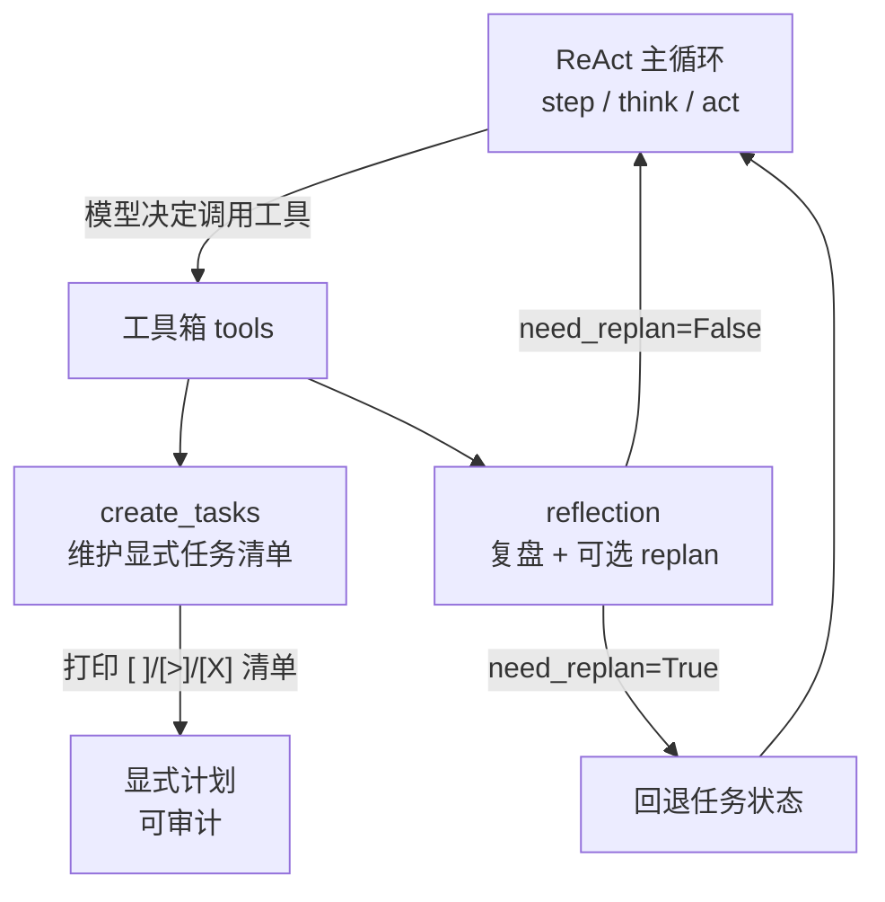
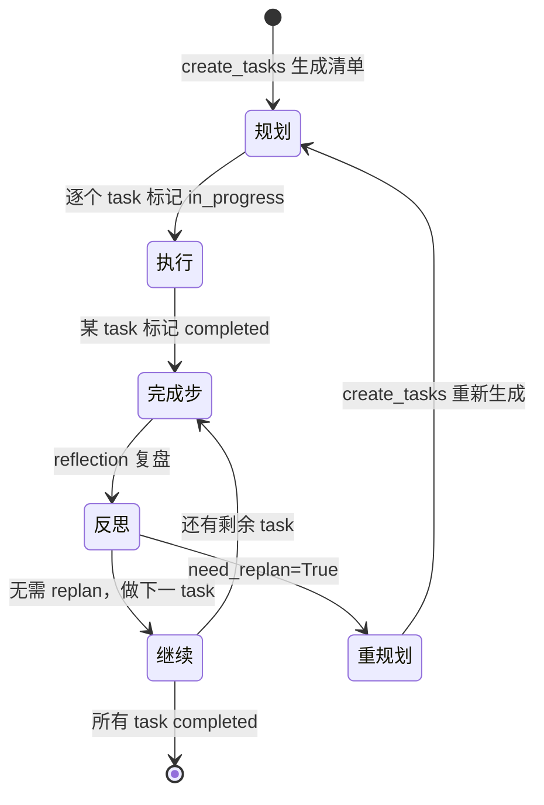

# 第 16 章 规划与反思

> 本章源码精读模块：`orchestration/_planning_reflection.py`（78 行）
> 配套代码：`tools._base` 的 `@tool` 装饰器、`Task` 模型、`Literal` 状态枚举

---

## 一、核心问题

第 8 章的 ReAct 主循环已经能让 Agent「思考—行动—观察」地跑起来，但它有一个隐含的短板：**Agent 的每一步都是「短视」的**——它只根据当前上下文决定「下一步做什么」，没有一个显式的、可被审查的「长计划」。

当你让 Agent 处理「对比三家云厂商的定价并给出选型建议」这类多步骤任务时，它可能：
- 跳来跳去，反复搜索，浪费 token；
- 做完一半就急着给结论；
- 遇到工具失败后不知道「是继续硬试，还是换条路」。

本章引入两个**显式工具**，把「规划」和「反思」从模型的隐式行为，变成可调用、可观察、可审计的一等公民：

- **`create_tasks`**：让模型维护一份**显式任务清单**（todo list）；
- **`reflection`**：让模型**暂停下来复盘**，必要时触发**重新规划**（replan）。

---

## 二、学习目标

学完本章，你能：

1. 说清「规划与反思」和 ReAct 主循环的**关系**——它们是 ReAct 之上的一层，不是替代；
2. 写出 `Task` 模型，理解 `Literal` 状态枚举如何约束状态取值；
3. 用 `@tool` 装饰器把普通函数注册成 Agent 可调用的工具；
4. 理解 `create_tasks` 和 `reflection` 的**签名设计哲学**——为什么它们把「何时用/何时不用」写进 docstring；
5. 亲手跑一个「显式规划 + 反思」的 mini 实验。

---

## 三、原理讲解

### 3.1 规划与反思是「元层」，不是「替换层」

ReAct 解决的是「**单步决策**」：给当前上下文，决定调哪个工具。规划与反思解决的是「**全局导航**」：

```text
无规划（纯 ReAct）：
  思考 → 行动 → 观察 → 思考 → 行动 → ...   （每步孤立，无全局视角）

有规划（ReAct + create_tasks + reflection）：
  先规划 → [task1 → task2 → task3]        （显式计划，可审查）
         ↓ 每完成一步
       reflection 复盘 → 决定「继续 / 重规划」
```

**关键认知**：`create_tasks` 和 `reflection` **本质上就是两个工具**。它们和 `search_web`、`calculator` 没有任何特权区别——模型可以「决定」调用它们，也可以不调用。规划的威力来自**模型被引导去调用**它们，而非框架强制。

### 3.2 为什么用「工具」而非「框架内置流程」

这是本项目的一个关键设计取舍。对比两种方案：

| 方案 | 做法 | 优点 | 缺点 |
|---|---|---|---|
| **工具式**（本项目） | 规划/反思就是普通 `FunctionTool` | 模型自主决定何时规划、何时反思；可审计、可观察 | 模型可能「忘记」规划 |
| **流程式**（如 LangGraph） | 规划是图上的固定节点 | 保证每次都规划 | 僵硬，简单任务也强制走规划 |

本项目选择**工具式**，与它「教学型、可替换部件」的定位一致——你可以通过 docstring 里的「WHEN TO USE / WHEN NOT TO USE」来引导模型，而不是用硬编码流程锁死它。

### 3.3 `Literal` 状态机：让非法状态在类型层就过不去

`Task.status` 的类型是 `Literal["pending", "in_progress", "completed"]`，而非自由 `str`。这意味着：

- 写 `Task(content="x", status="随便")` 在 **Pydantic 校验阶段**就会抛 `ValidationError`；
- IDE 会给出三个候选值的自动补全；
- 这就是第 9 章「结构化输出」能力在「内部数据结构」上的应用——**用类型系统锁死合法状态**。

三个状态的流转是一条单向链（配合 `reflection` 的 `need_replan` 可以回退）：

```text
pending ──> in_progress ──> completed
   ↑                          │
   └──────── need_replan ─────┘（重规划，回退到 pending）
```

---

## 四、配图

### 图 1：`create_tasks`/`reflection` 与 ReAct 主循环的关系



**解读**：规划与反思不是独立于 ReAct 的新引擎，而是**挂在 ReAct 工具箱里的两个普通工具**。模型在 `think` 阶段决定「现在该调用 `create_tasks` 还是 `reflection`」，框架照常执行并观察结果。这一层的价值在于把「全局导航」显式化，但主循环的运转方式完全不变。

### 图 2：plan-review-revise 循环状态图



**解读**：正常路径是「规划→执行→反思→继续」的推进；当 `reflection(need_replan=True)` 被调用时，状态机回退到「重规划」，模型重新调 `create_tasks` 生成新清单。这条回退边是「反思」区别于「纯前进式规划」的核心——它允许模型**承认计划错了并纠正**。

---

## 五、源码精读

文件位置：orchestration/_planning_reflection.py

### 5.1 `Task` 模型与 `__str__`（L10~21）

```python
class Task(BaseModel):
    content: str
    status: Literal["pending", "in_progress", "completed"]

    def __str__(self):
        if self.status == "pending":
            return f"[ ] {self.content}"
        elif self.status == "in_progress":
            return f"[>] **{self.content}**"
        elif self.status == "completed":
            return f"[X] ~~{self.content}~~"
        return self.content
```

三个要点：

1. **`Literal`（L3 导入）**：`status` 只能是三个字符串之一，非法值在构造时就被 Pydantic 拦截。
2. **`__str__` 是「渲染层」**：把状态映射成 Markdown 勾选框语法——`[ ]`（待办）、`[>]`（进行中，加粗）、`[X]`（完成，加删除线）。这个设计让任务清单**打印出来就能直接当 Markdown 看**。
3. **`return self.content` 兜底**（L21）：逻辑上 `status` 已被 `Literal` 锁死，这行永远不会走到，但它让类型检查器和读者都安心——这是一个防御性兜底。

### 5.2 `create_tasks` 工具（L24~47）

```python
@tool
def create_tasks(tasks: list[Task]) -> str:
    """Create or update a task plan.

    WHEN TO USE:
    - Complex queries requiring multiple steps of research
    ...
    """
    normalized_tasks = [
        task if isinstance(task, Task) else Task.model_validate(task) for task in tasks
    ]
    plan = "\n".join(str(task) for task in normalized_tasks)
    print(f"\n[Planning] Task list:\n{plan}\n", flush=True)
    return plan
```

三个要点：

1. **`@tool` 装饰器**（L24）：把普通函数包装成 `FunctionTool`。注意这里**没有**显式传 `name`/`description`，说明工具名和描述由 `FunctionTool.__init__` 自动推导——`resolved_name = name or func.__name__`、`resolved_desc = description or (func.__doc__ or "").strip()`（`tools/_base.py` L101~102）。而 L164 的单参 `@overload` 只是让 `@tool` 这种无参调用能通过类型检查，本身不含推导逻辑。另需注意：docstring **并非必填**——缺省时 `description` 会落为空串 `""`。
2. **`normalized_tasks` 归一化**（L42~44）：模型调用工具时，参数可能以「dict」形式传入（而非已构造好的 `Task` 实例）。这行用 `isinstance` 判断，dict 则走 `Task.model_validate` 转成 `Task`。这是「工具参数可能不是强类型」的防御处理。
3. **`print(..., flush=True)`**（L46）：把计划清单打印到 stdout 供人观察，同时 `return plan` 把同样的字符串回传给 Agent（作为 `ToolResult`）。**「给人看」和「给模型看」用的是同一份数据**——这是可审计性的落点。

### 5.3 `reflection` 工具（L50~78）

```python
@tool
def reflection(analysis: str, need_replan: bool = False) -> str:
    """Pause and analyze progress before continuing.

    WHEN TO USE:
    1. PROGRESS REVIEW - After completing a meaningful step
    2. ERROR ANALYSIS - When a tool fails or returns unexpected results
    3. RESULT SYNTHESIS - When combining information from multiple sources
    4. SELF CHECK - Before providing final answer
    ...
    """
    if need_replan:
        return f"Reflection recorded (REPLAN NEEDED): {analysis}"
    return f"Reflection recorded: {analysis}"
```

两个要点：

1. **`need_replan: bool = False`**（L51）：唯一的开关参数。默认 `False`（只是记录复盘），显式传 `True` 才触发重规划。这个默认值设计很关键——**反思默认「不打断」，只有模型主动判断需要时才 replan**，避免过度打断。
2. **docstring 的「WHEN NOT TO USE」**（L67~70）是**成本控制**：明确告诉模型「不要每次工具调用后都反思」「简单操作不要反思」。这是在用**提示词工程**替代「硬编码节流」——把「何时反思」的智慧交给模型，但用 docstring 约束它的滥用。

### 5.4 导出链路

`orchestration/__init__.py` L6：

```python
from ._planning_reflection import create_tasks, reflection
```

所以顶层 `from scratchagent import create_tasks, reflection` 直接可用（见 `__init__.py` 的 `__all__`）。

---

## 六、动手实验

参考示例：examples/planning_reflection_agent.py

### 实验 1：观察 `Task` 的渲染与校验

```python
from scratchagent.orchestration._planning_reflection import Task

# 三个状态各自的渲染
print(Task(content="调研云厂商", status="pending"))        # [ ] 调研云厂商
print(Task(content="对比定价", status="in_progress"))      # [>] **对比定价**
print(Task(content="输出选型", status="completed"))        # [X] ~~输出选型~~

# 非法状态会被 Pydantic 拦截
try:
    Task(content="x", status="随便")  # 不是三个合法值之一
except Exception as e:
    print("校验失败：", type(e).__name__)  # ValidationError
```

### 实验 2：直接调用 `create_tasks`

```python
from scratchagent import create_tasks

tasks = [
    {"content": "调研云厂商", "status": "pending"},
    {"content": "对比定价", "status": "in_progress"},
    {"content": "输出选型", "status": "pending"},
]
plan = create_tasks(tasks)   # 注意：传的是 dict 列表，触发 model_validate 归一化
print(plan)
```

**观察点**：传入的是**字典列表**而非 `Task` 列表，验证 `create_tasks` 内部的 `Task.model_validate` 归一化逻辑（L43）确实生效。

### 实验 3：把两个工具挂到 Agent 上，观察规划行为

```python
import asyncio
from scratchagent import Agent, create_tasks, reflection

async def main():
    agent = Agent(
        system_prompt="你是严谨的研究助手，复杂任务先规划再执行。",
        tools=[create_tasks, reflection],
    )
    result = await agent.run("对比三家云厂商的定价，给出选型建议")
    print(result.output)

asyncio.run(main())
```

**观察点**：给一个**多步骤**任务，观察 Agent 是否会先调 `create_tasks` 列出计划、过程中是否调 `reflection` 复盘。对比给一个**简单任务**（如「1+1 等于几」），观察它是否**跳过**规划——这就是 docstring 里「WHEN NOT TO USE」在起作用。

---

## 七、本章自检

- [ ] 我能说清规划与反思和 ReAct 的关系：它们是 ReAct 工具箱里的两个普通工具，不是独立引擎。
- [ ] 我能写出 `Task` 模型，并说清 `Literal` 如何锁死合法状态。
- [ ] 我理解 `__str__` 是「渲染层」，把状态映射成 `[ ]`/`[>]`/`[X]` 三种 Markdown 勾选框。
- [ ] 我能说清 `@tool` 装饰器如何从函数名 + docstring 自动推导工具名和描述。
- [ ] 我理解 `reflection` 的 `need_replan` 默认 `False` 的设计意图（反思默认不打断）。
- [ ] 我理解为什么用「工具式」而非「流程式」实现规划（可审计、可替换、模型自主）。
