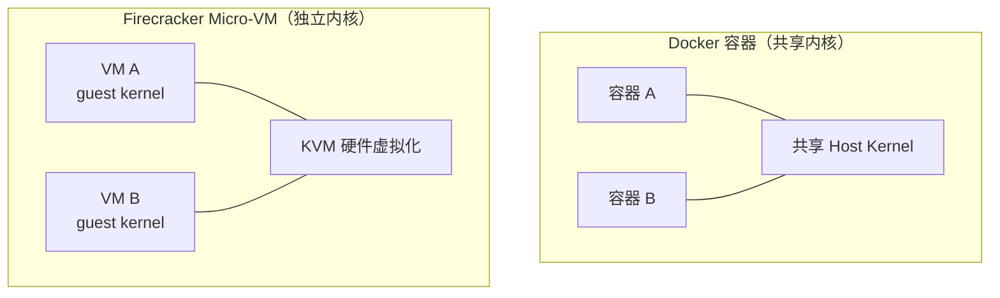
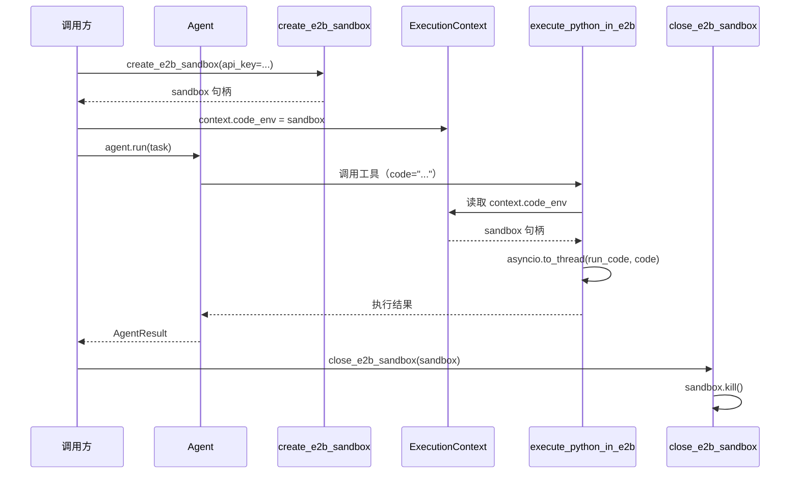

# 第 17 章 E2B 沙箱

> 本章源码精读模块：`sandbox/_e2b_sandbox.py`（70 行）+ `tools/_code_execution.py`（70 行）
> 配套符号：`context.py` 的 `code_env`/`code_env_owned` 字段、`tools._base` 的 `get_source_code`

---

## 一、核心问题

第 7 章的 `FunctionTool` 让 Agent 能调用 `search_web`、`calculator` 这类**本地函数**。但真实场景里，Agent 经常需要**执行任意代码**——让模型自己写一段 Python，跑出来看结果（数据分析、计算、文件处理）。

直接在本机 `eval` 模型生成的代码是**灾难性**的：模型可能写出 `import os; os.remove(...)`、无限循环、或访问敏感文件。你需要一个**隔离的、可随时销毁的执行环境**，让「模型写的代码」和「你自己的系统」物理隔开。

本章引入 **E2B（Code Interpreter Sandbox）**，把「执行任意代码」变成一件**有边界、可回收**的事：

- **为什么隔离**：模型代码不可信，必须有独立的进程/文件系统/网络边界；
- **怎么隔离**：E2B 用 Firecracker Micro-VM，而非 Docker 容器；
- **怎么接进来**：沙箱作为 `context.code_env` 注入上下文，代码执行工具依赖它。

---

## 二、学习目标

学完本章，你能：

1. 理解 Docker 容器与 Firecracker Micro-VM 在**隔离强度**上的区别；
2. 写出 `create_e2b_sandbox`，理解「延迟导入 + 环境变量解析 + 失败归一化」三重设计；
3. 理解「沙箱作为上下文依赖注入」的架构——工具不自己创建沙箱，而是从 `context.code_env` 取；
4. 说清三个代码执行工具（`execute_python_in_e2b` / `base_e2b_tool` / `upload_file_to_e2b`）各自的职责边界；
5. 亲手跑一个「创建沙箱 → 执行 → 销毁」的生命周期实验。

---

## 三、原理讲解

### 3.1 隔离的两种级别：Docker vs Firecracker

「隔离」不是一个非黑即白的概念，它有强弱之分：

| 维度 | Docker 容器 | Firecracker Micro-VM |
|---|---|---|
| 隔离单位 | 共享宿主机内核 | 独立轻量虚拟机（KVM） |
| 内核 | 共享 host kernel | 每个 VM 独立 guest kernel |
| 启动速度 | 快（秒级） | 也快（<125ms 冷启动，官方宣称，专为 serverless 优化） |
| 攻击面 | 内核漏洞可逃逸到 host | 硬件虚拟化，逃逸难度高一个量级 |
| 典型场景 | 部署应用 | 运行**不可信代码**（如模型生成的代码） |

**关键结论**：运行模型生成的代码，隔离强度要求高于「跑自家应用」。Docker 共享内核意味着一个内核漏洞就能让恶意代码逃逸到宿主机；Firecracker 用硬件虚拟化把每个沙箱变成一个独立虚拟机，逃逸成本大幅上升。E2B 选 Firecracker，正是为了这个「跑不可信代码」的场景。

### 3.2 沙箱的生命周期：创建 → 执行 → 销毁

一个 E2B 沙箱是**有生命周期的一次性资源**，不是常驻服务：

```text
create_e2b_sandbox()     # 创建：拉起一个 Micro-VM，注入到 context.code_env
        ↓
Agent 执行工具            # execute_python_in_e2b / base_e2b_tool / upload_file_to_e2b
        ↓
close_e2b_sandbox()      # 销毁：sandbox.kill()，回收资源
```

**关键点**：沙箱的创建和销毁**由编排方（Agent 的调用者）负责**，而执行由工具负责。这背后的原则是**「资源的所有权与使用分离」**——创建者负责 `kill`，使用者只管用。

### 3.3 「沙箱是上下文依赖，不是工具自己造」

看三个代码执行工具的签名，它们的第一参数都是 `context: ExecutionContext`，第一行都检查 `context.code_env is None`：

```python
async def execute_python_in_e2b(context: ExecutionContext, code: str) -> str:
    if context.code_env is None:
        raise RuntimeError("No code execution environment available.")
    ...
```

这是一个**依赖注入**设计：工具**不负责创建沙箱**，而是从 `context.code_env` 读取「运行时注入的沙箱句柄」。好处是：

1. **可测试**：你可以注入一个 mock 的 `code_env` 来单测工具，无需真实 E2B；
2. **可复用**：同一个沙箱可以被多个工具共享（执行代码、跑命令、传文件）；
3. **职责清晰**：工具只关心「用」，不关心「从哪来、怎么销毁」。

---

## 四、配图

### 图 1：Docker vs Firecracker 隔离对比



**解读**：Docker 的所有容器共享同一个宿主机内核，隔离靠 namespace/cgroup 实现；Firecracker 每个沙箱是一个带独立 guest kernel 的微虚拟机，隔离靠 KVM 硬件虚拟化。后者逃逸难度更高，更适合运行模型生成的不可信代码——这正是 E2B 选择 Firecracker 的原因。

### 图 2：Agent → Sandbox → execute → kill 生命周期时序（本章核心图）



**解读**：这条时序图串起沙箱完整生命周期——**创建在 Agent 运行之前、销毁在 Agent 运行之后**，中间工具执行时从 `context.code_env` 读句柄。注意「创建者负责销毁」：调用方先 `create`，最后 `kill`，Agent 和工具都不碰生命周期管理。

### 图 3：自定义模板构建流程


**解读**：默认沙箱只有基础 Python；若代码需要 `numpy`/`pandas` 等重依赖，就要**预先构建自定义模板**（把依赖装进 Dockerfile），得到一个 `template id`，再通过 `E2B_TEMPLATE_ID` 环境变量（或 `template` 参数）让 `create_e2b_sandbox` 用它拉起沙箱。这避免「每次执行都现装依赖」的低效。

---

## 五、源码精读

文件位置： src/scratchagent/sandbox/_e2b_sandbox.py

### 5.1 `create_e2b_sandbox`（`_e2b_sandbox.py` L17~52）

```python
def create_e2b_sandbox(
    *,
    api_key: str | None = None,
    template: str | None = None,
    timeout: int = DEFAULT_TIMEOUT_SECONDS,
    allow_internet_access: bool = False,
) -> Any:
    load_project_env()
    resolved_key = api_key or os.getenv("E2B_API_KEY")
    template = template or os.getenv("E2B_TEMPLATE_ID") or os.getenv("E2B_TEMPLATE")
    if not resolved_key:
        raise E2BSandboxConfigurationError(
            "E2B_API_KEY is not configured; set it in the environment or .env."
        )
    if timeout <= 0:
        raise ValueError("E2B 沙箱超时时间必须为正秒数.")

    try:
        from e2b_code_interpreter import Sandbox
        create_options: dict[str, Any] = {
            "api_key": resolved_key,
            "timeout": timeout,
            "allow_internet_access": allow_internet_access,
        }
        if template:
            create_options["template"] = template
        return Sandbox.create(**create_options)
    except Exception as exc:
        raise E2BSandboxConfigurationError("Failed to create the E2B sandbox.") from exc
```

五个要点：

1. **关键字限定 `*`**（L18）：强制所有参数必须用关键字传入，避免 `create_e2b_sandbox("key", "tpl")` 这类易错的位置传参。
2. **参数优先级**（L31~32）：显式参数 > 环境变量。`api_key or os.getenv(...)` 是「参数覆盖 env」的标准写法。
3. **失败快检**（L33~38）：`api_key` 缺失、`timeout <= 0` 都在创建前**显式抛出**，给出清晰错误信息，而非让 SDK 抛难懂的底层异常。
4. **延迟导入**（L41）：`from e2b_code_interpreter import Sandbox` 放在函数体内，而非模块顶部。好处是**没有 E2B 依赖时也能 import 这个模块**（比如只是用 `register_sandbox_tools` 的场景）。
5. **异常归一化**（L51~52）：把 SDK 抛出的任何异常统一包装成 `E2BSandboxConfigurationError`，并保留原始异常链（`from exc`）。调用方只需处理一种异常类型。

### 5.2 `register_sandbox_tools`（L55~64）

```python
def register_sandbox_tools(sandbox: Any, tools: Iterable[Any]) -> None:
    sources = [tool.get_source_code() for tool in tools]
    if not sources:
        return
    execution = sandbox.run_code("\n\n".join(sources))
    error = getattr(execution, "error", None)
    if error:
        raise RuntimeError(f"Failed to register sandbox tools: {error}")
```

这个函数解决了「**沙箱里没有你的工具代码**」的问题：沙箱是全新环境，你要把本项目的可复用工具（如 `calculator`）的**源码**传进去执行，才能在沙箱里调用它们。它把每个工具的 `get_source_code()`（`tools/_base.py` L139）拼接起来，用 `run_code` 在沙箱里定义这些函数。

### 5.3 `close_e2b_sandbox`（L67~70）

```python
def close_e2b_sandbox(sandbox: Any) -> None:
    if sandbox is not None:
        sandbox.kill()
```

极简，但有一个防御细节：`if sandbox is not None` 允许调用方在「沙箱可能没创建成功」的情况下安全地调用清理（幂等清理）。

### 5.4 代码执行工具（`_code_execution.py`）

**`_execution_output`（L12~21）**：把 E2B SDK 的执行结果序列化为可读字符串。先检查 `execution.error`（有错直接 raise），再 `execution.to_json()` 转 JSON。

**`execute_python_in_e2b`（L24~36）**：

```python
@tool(name="execute_python_in_e2b", description="Execute Python code in an isolated E2B sandbox. ...（省略后半句）")
async def execute_python_in_e2b(context: ExecutionContext, code: str) -> str:
    if context.code_env is None:
        raise RuntimeError("No code execution environment available.")
    execution = await asyncio.to_thread(context.code_env.run_code, code)
    return _execution_output(execution)
```

关键：`asyncio.to_thread` 把**同步阻塞的** `run_code` 丢到线程池执行，避免阻塞事件循环。这是「同步 SDK + 异步 Agent 循环」的桥接技巧。

**`base_e2b_tool`（L39~51）**：执行 shell 命令，把 `stdout`/`stderr` 拼接成输出；`stderr` 会加 `STDERR:` 前缀。

**`upload_file_to_e2b`（L54~70）**：把本地文件以二进制读入，写到沙箱的 `/home/user/` 目录（默认路径，可用 `sandbox_path` 覆盖）。

三个工具的**共同契约**：第一行都是 `if context.code_env is None: raise RuntimeError(...)`——它们都是**异步依赖注入的消费者**。

---

## 六、动手实验

参考示例： examples/e2b_agent.py

### 实验 1：创建与销毁沙箱（无需真实 E2B 也能理解生命周期）

```python
# 伪代码：演示生命周期，真实运行需要 E2B_API_KEY
from scratchagent.sandbox import create_e2b_sandbox, close_e2b_sandbox
from scratchagent.sandbox._e2b_sandbox import E2BSandboxConfigurationError

# 未配置 key 时会抛出 E2BSandboxConfigurationError
try:
    sandbox = create_e2b_sandbox()
except E2BSandboxConfigurationError as e:
    print("配置缺失（符合预期）：", e)
```

**观察点**：不配置 `E2B_API_KEY` 时，`create_e2b_sandbox` 在 L33~36 抛出**清晰的中文语境错误**，而不是 SDK 的底层异常——这是「失败快检」设计的效果。（真实场景里若创建成功，务必在最后调用 `close_e2b_sandbox(sandbox)` 释放资源，呼应「创建者负责销毁」的生命周期原则。）

### 实验 2：验证 timeout 校验

```python
from scratchagent.sandbox import create_e2b_sandbox

try:
    create_e2b_sandbox(api_key="fake", timeout=0)  # 非法 timeout
except ValueError as e:
    print("超时校验生效：", e)  # "E2B sandbox timeout must be positive seconds."
```

**观察点**：`timeout <= 0` 在 L37~38 抛 `ValueError`，且**先于**真正创建沙箱（先检查 key，再检查 timeout，最后才 `Sandbox.create`）。

### 实验 3：理解工具对 `code_env` 的依赖

```python
import asyncio
from scratchagent.context import ExecutionContext
from scratchagent.tools import execute_python_in_e2b

async def main():
    ctx = ExecutionContext()  # code_env 默认 None
    try:
        await execute_python_in_e2b(ctx, "print(1+1)")
    except RuntimeError as e:
        print("依赖注入缺失（符合预期）：", e)  # "No code execution environment available."

asyncio.run(main())
```

**观察点**：`code_env` 为 `None` 时，工具在 L33~34 抛出 `RuntimeError`，而不是尝试创建沙箱。这验证了「工具是依赖的消费者，不是创建者」的架构。

---

## 七、本章自检

- [ ] 我能说清 Docker（共享内核）与 Firecracker（独立微虚拟机）在隔离强度上的区别，以及为什么跑不可信代码要选后者。
- [ ] 我能写出 `create_e2b_sandbox`，并说清「延迟导入」「参数覆盖 env」「失败快检」「异常归一化」四重设计。
- [ ] 我理解沙箱生命周期：创建者负责 `create` 和 `kill`，工具只负责「用」。
- [ ] 我理解「沙箱作为 `context.code_env` 依赖注入」的好处（可测试、可复用、职责清晰）。
- [ ] 我能说清 `asyncio.to_thread` 为什么在这里被使用（同步 SDK 不阻塞异步事件循环）。
- [ ] 我能区分三个代码执行工具的职责：执行 Python、执行 shell、上传文件。
