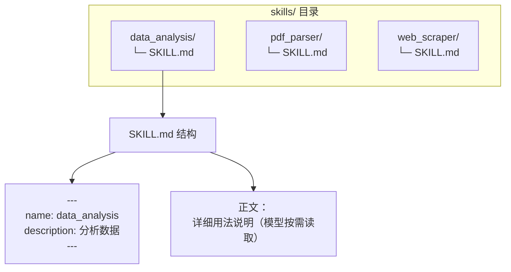
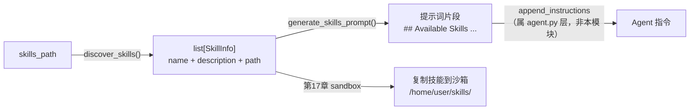

# 第 18 章 Skills 技能系统

> 本章源码精读模块：`skills.py`（101 行）
> 配套概念：渐进式披露（progressive disclosure）、YAML frontmatter、dataclass

---

## 一、核心问题

第 7 章把「工具」做成了可调用的函数，第 14 章让 Agent 有了「长期记忆」。但还有一个真实工程问题没解决：**Agent 的能力会越来越多，如何管理这些能力，又不让每一次调用都被「能力清单」淹没？**

设想你的 Agent 既有「数据分析」「网页抓取」「PDF 解析」「图像处理」等几十种能力。如果把它们**全部塞进 system prompt**，每次调用都要付上这几十段描述的 token 成本，而且模型会被海量无关信息干扰——这被称为「上下文污染」。

本章引入 **Skills（技能）** 机制，用一个朴素的约定解决这个问题：

- **每个技能是一个目录**，目录里放一个 `SKILL.md` 描述这个技能；
- **发现**：扫描技能目录，解析每个 `SKILL.md` 的 frontmatter 得到「名字 + 描述」；
- **披露**：生成一段简短的能力清单提示词，只在需要时注入。

核心思想是**渐进式披露**：默认只告诉模型「有哪些技能」（名字 + 一句话描述），只有当模型决定用某个技能时，才去读那个技能的 `SKILL.md` 全文。

---

## 二、学习目标

学完本章，你能：

1. 理解「渐进式披露」与「一次性加载」的区别，以及为什么前者更省 token、抗干扰；
2. 写出 `parse_frontmatter`，理解正则如何提取 Markdown 的 YAML 头部；
3. 写出 `load_skill` / `discover_skills`，理解「目录约定」如何驱动发现；
4. 理解 `generate_skills_prompt` 生成的提示词结构，以及它和 E2B 沙箱（第 17 章）的衔接；
5. 亲手跑一个「建技能目录 → 发现 → 生成提示词」的实验。

---

## 三、原理讲解

### 3.1 渐进式披露 vs 一次性加载

「能力如何暴露给模型」有两种极端做法：

| 方案 | 做法 | token 成本 | 抗干扰 |
|---|---|---|---|
| **一次性加载** | 把所有能力描述全塞进 prompt | 每次固定付出全部成本 | 差，无关能力干扰模型 |
| **渐进式披露** | 先给「名字 + 一句话」，按需再读全文 | 按需付出，用多少付多少 | 好，模型聚焦当前任务 |

**关键结论**：`skills.py` 实现的正是后者。`discover_skills` 得到的是**极简元信息**（`name` + `description`），`generate_skills_prompt` 把这份清单注入 prompt；只有当模型决定用某技能时，它才会去读 `SKILL.md` 的正文（正文里才有「怎么用」的完整说明）。

### 3.2 目录约定 = 无框架的元数据

Skills 机制**没有引入任何数据库或配置文件格式**，它靠的是**目录约定**：

```text
skills/
├── data_analysis/
│   └── SKILL.md          # frontmatter: name + description，正文: 用法说明
├── pdf_parser/
│   └── SKILL.md
└── web_scraper/
    └── SKILL.md
```

- 每个**子目录** = 一个技能；
- 每个目录里的 **`SKILL.md`** = 技能的描述文件；
- `SKILL.md` 开头的 **YAML frontmatter** = 机器可读的元信息（`name`/`description`）；
- `SKILL.md` 的**正文** = 给人/模型看的详细用法。

这个约定足够简单，任何文本编辑器、任何版本管理工具都能直接处理，不需要额外的「技能注册中心」。

### 3.3 为什么用 dataclass 而非 Pydantic

`SkillInfo` 用的是标准库 `dataclasses.dataclass`（`import` 在 L4，`@dataclass` 装饰器在 L8），而非项目里其他模型（如第 14 章的 `TaskMemory`）用的 `pydantic.BaseModel`。这是有意的取舍：

- `SkillInfo` 只是**纯数据容器**（三个字段，无校验逻辑），`dataclass` 足够；
- 它不需要「结构化输出」（第 9 章）那种 schema 生成能力，也不需要 Pydantic 的序列化；
- 用标准库更轻，减少不必要的依赖。

**判断标准**：需要校验/序列化/schema 时用 Pydantic；只是装数据时用 dataclass。

---

## 四、配图

### 图 1：SKILL.md 目录约定与 frontmatter 结构



**解读**：每个技能是一个目录，`SKILL.md` 分两部分——**frontmatter**（`---` 包裹的 YAML，机器读）和**正文**（人/模型读的详细用法）。`parse_frontmatter` 只提取前者，得到 `name` + `description`；后者留给模型按需读取，这正是渐进式披露的关键。

### 图 2：discover_skills → 注入 prompt / 复制沙箱 流程



**解读**：`discover_skills` 扫出技能元信息后，有两条用途——① `generate_skills_prompt` 把它变成提示词，注入 Agent 指令，让模型「知道有哪些技能」；② 配合第 17 章沙箱，把技能目录复制进沙箱的 `/home/user/skills/`，让模型「能在代码里用这些技能」。一条发现，两处消费。

### 图 3：渐进式披露 vs 一次性加载对比


**解读**：渐进式披露把「知道有什么」和「知道怎么用」分成两段——前者便宜（只需元信息），后者昂贵（读全文），所以**按需加载**。一次性加载则把昂贵的全文一次性付出，无论用不用。在技能数量多、单技能描述长时，两者 token 成本差异显著。

---

## 五、源码精读

文件位置： src/scratchagent/skills.py

### 5.1 `SkillInfo`（L8~14）

```python
@dataclass
class SkillInfo:
    name: str
    description: str
    path: Path
```

三个字段，纯数据容器。`path` 存的是**技能目录**的 `Path`（不是 `SKILL.md` 的路径），因为后续「复制到沙箱」要的是整个目录。

### 5.2 `parse_frontmatter`（L17~28）

```python
def parse_frontmatter(content: str) -> dict:
    pattern = r"^---\s*\n(.*?)\n---"
    match = re.match(pattern, content, re.DOTALL)
    if not match:
        return {}
    result = {}
    for line in match.group(1).split("\n"):
        if ":" in line:
            key, value = line.split(":", 1)
            result[key.strip()] = value.strip().strip("\"'")
    return result
```

三个要点：

1. **正则 `^---\s*\n(.*?)\n---`**（L19）：匹配文件开头的 `---` 到下一个 `---` 之间的内容。`re.DOTALL` 让 `.` 能跨行匹配；`(.*?)` 非贪婪，确保匹配到**第一个**结束的 `---`。
2. **逐行解析 `key: value`**（L24~27）：不引入完整 YAML 解析器，只用 `split(":", 1)` 拆键值。`split(":", 1)` 的第二个参数 `1` 表示只拆**第一个**冒号——因为 value 里可能还含冒号（如 `description: 使用 a:b 格式`）。
3. **`strip("\"'")`**（L27）：去掉 value 两端的引号，兼容 `name: "data_analysis"` 和 `name: data_analysis` 两种写法。

> **局限（值得知道）**：这是**极简的 frontmatter 解析器**，不支持 YAML 的嵌套结构、数组、多行字符串。对「name + description」这种扁平场景够用，但如果技能元数据变复杂（如 tags 列表），就需要换真正的 YAML 库（如 `pyyaml`）。

### 5.3 `load_skill`（L31~48）

```python
def load_skill(skill_dir: Path) -> SkillInfo | None:
    skill_md = skill_dir / "SKILL.md"
    if not skill_md.exists():
        return None
    content = skill_md.read_text(encoding="utf-8")
    frontmatter = parse_frontmatter(content)
    name = frontmatter.get("name")
    description = frontmatter.get("description")
    if not name or not description:
        return None
    return SkillInfo(name=name, description=description, path=skill_dir)
```

要点：**「缺什么就返回 None」**——没有 `SKILL.md`、缺 `name`、缺 `description`，都返回 `None`。返回 `None` 而非抛异常，是为了让 `discover_skills` 能**静默跳过**「不合格」的技能目录，而不是因为一个坏目录让整个发现流程崩溃。

### 5.4 `discover_skills`（L51~66）

```python
def discover_skills(skills_path: str | Path) -> list[SkillInfo]:
    skills_dir = Path(skills_path)
    if not skills_dir.exists():
        return []
    skills = []
    for item in sorted(skills_dir.iterdir()):
        if item.is_dir() and not item.name.startswith("."):
            skill = load_skill(item)
            if skill:
                skills.append(skill)
    return skills
```

三个要点：

1. **`sorted(...)`**（L61）：遍历顺序确定化。文件系统的目录顺序不稳定，排序后结果可复现（对测试和调试很重要）。
2. **`not item.name.startswith(".")`**（L62）：跳过 `.git`、`.DS_Store` 等隐藏目录/文件。
3. **容错链**：目录不存在返回 `[]`，非目录跳过，`load_skill` 返回 `None` 跳过——**发现流程永不因单个异常中断**。

### 5.5 `generate_skills_prompt`（L69~101）

```python
def generate_skills_prompt(skills: list[SkillInfo], sandbox_path: str = "/home/user/skills") -> str:
    if not skills:
        return ""
    lines = ["## Available Skills", "The following skills are available in the sandbox environment:", ""]
    for skill in skills:
        lines.append(f"### {skill.name}")
        lines.append(f"- Description: {skill.description}")
        lines.append(f"- Path: {sandbox_path}/{skill.name}/")
        lines.append(f"- Read the SKILL.md for usage instructions: {sandbox_path}/{skill.name}/SKILL.md")
        lines.append("")
    lines.append("You can import and use these skills in your Python code. Read the SKILL.md file first to understand how to use each skill.")
    return "\n".join(lines)
```

三个要点：

1. **`sandbox_path: str = "/home/user/skills"`**（L71）：默认路径指向**沙箱内**的技能目录，这和第 17 章 E2B 沙箱的默认路径 `/home/user/` 呼应——技能会被复制到沙箱里，模型在沙箱代码里 import 它们。
2. **生成的提示词是「清单」而非「全文」**（L87~94）：每个技能只给 `name`、`description`、`path`、`SKILL.md` 的位置，**不含正文**——这正是渐进式披露的落点。模型被引导「先读 SKILL.md 再用」。
3. **空技能返回 `""`**（L78~79）：没有技能时不注入任何内容，避免在 prompt 里留下孤立的标题。

---

## 六、动手实验

参考示例： examples/skill_agent.py

### 实验 1：解析 frontmatter

```python
from scratchagent import parse_frontmatter

content = """---
name: data_analysis
description: 分析 CSV 数据并生成图表
---
# 正文：这里是详细用法
"""
print(parse_frontmatter(content))
# 期望：{'name': 'data_analysis', 'description': '分析 CSV 数据并生成图表'}
```

**观察点**：`parse_frontmatter` 只提取 `---` 包裹的部分，正文（`# 正文...`）被忽略。尝试把 `description` 的值写成 `"带引号"`，观察 `strip("\"'")` 如何去掉引号。

### 实验 2：建技能目录并发现

```python
from pathlib import Path
from scratchagent import discover_skills, generate_skills_prompt

# 建一个临时技能目录
skills_dir = Path("./_demo_skills")
(skills_dir / "data_analysis").mkdir(parents=True, exist_ok=True)
(skills_dir / "data_analysis" / "SKILL.md").write_text(
    "---\nname: data_analysis\ndescription: 分析 CSV 数据\n---\n正文用法...", encoding="utf-8"
)

skills = discover_skills(skills_dir)
print(len(skills))          # 期望 1
print(skills[0].name)       # data_analysis
print(generate_skills_prompt(skills))  # 观察生成的提示词结构
```

**观察点**：`discover_skills` 扫出一个技能，`generate_skills_prompt` 生成包含 `## Available Skills` 和 `### data_analysis` 的提示词，但**不含** SKILL.md 的正文「正文用法...」——验证渐进式披露。

### 实验 3：验证「不合格目录被跳过」

```python
from pathlib import Path
from scratchagent import discover_skills

# 接实验 2 运行：_demo_skills 里已有一个合格的 data_analysis 技能
skills_dir = Path("./_demo_skills")
# 一个没有 SKILL.md 的目录
(skills_dir / "empty_skill").mkdir(exist_ok=True)
# 一个 SKILL.md 缺 description 的目录
(skills_dir / "broken_skill").mkdir(exist_ok=True)
(skills_dir / "broken_skill" / "SKILL.md").write_text("---\nname: broken\n---\n", encoding="utf-8")

skills = discover_skills(skills_dir)
print([s.name for s in skills])  # 期望只含 data_analysis，不含 empty_skill 和 broken_skill
```

**观察点**：`empty_skill`（无 SKILL.md）和 `broken_skill`（缺 description）都被 `load_skill` 静默跳过，发现流程不中断。

---

## 七、本章自检

- [ ] 我能说清「渐进式披露」与「一次性加载」的区别，以及前者为什么省 token、抗干扰。
- [ ] 我能写出 `parse_frontmatter`，理解正则 `^---\s*\n(.*?)\n---` 和 `re.DOTALL` 的作用。
- [ ] 我理解 `load_skill` 为什么「缺 name/description 就返回 None」而非抛异常（静默跳过不合格目录）。
- [ ] 我理解 `discover_skills` 里 `sorted()` 和「跳过 `.` 开头目录」的两个细节。
- [ ] 我能说清 `generate_skills_prompt` 生成的清单「不含正文」，这正是渐进式披露的落点。
- [ ] 我理解 `sandbox_path` 默认 `/home/user/skills` 与第 17 章 E2B 沙箱的衔接关系。
