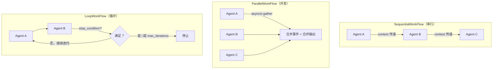
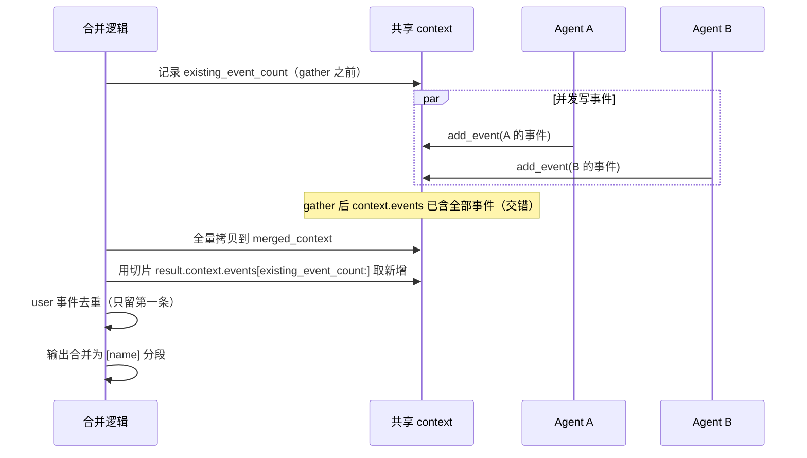

# 第 19 章 多智能体编排

> 本章源码精读模块：`orchestration/_sequential.py`（59 行）、`_parallel.py`（73 行）、`_loop.py`（74 行）
> 配套符号：`Agent.run()` 的签名、`ExecutionContext`、`asyncio.gather`

---

## 一、核心问题

第 8 章的 `Agent` 是一个「单个智能体」——一个模型、一套工具、一个执行循环。但真实任务往往**需要多个角色协作**：一个「研究员」查资料，一个「写手」组织成文，一个「审核员」检查错误。

你会怎么组织多个 Agent？答案是**把工作流本身也做成一个 Agent**。

本章引入三个**工作流类**，它们都**继承自 `Agent`**：

- **`SequentialWorkFlow`**：多个 Agent **串行**执行，上下文逐个传递；
- **`ParallelWorkFlow`**：多个 Agent **并发**执行，结果合并；
- **`LoopWorkFlow`**：多个 Agent **循环**执行，直到满足停止条件。

**关键认知**：工作流是 `Agent` 的子类，意味着**工作流可以被当作 Agent 使用**——它可以再被塞进另一个工作流里，形成嵌套编排。这是「编排」能力的递归基础。

---

## 二、学习目标

学完本章，你能：

1. 理解「工作流继承 `Agent`」这个设计的含义与好处（可嵌套、可替换）；
2. 写出 `SequentialWorkFlow.run`，理解「上下文串接」的机制；
3. 写出 `ParallelWorkFlow.run`，理解「并发执行 + 事件合并 + 输出合并」三步；
4. 理解 `ParallelWorkFlow` 共享 `context` 的**竞态风险**（为什么它要切片去重 user 事件）；
5. 写出 `LoopWorkFlow`，理解 `StopCondition` 回调和 `max_iterations` 兜底；
6. 亲手跑一个「三工作流对照」的实验。

---

## 三、原理讲解

### 3.1 工作流是 Agent 的子类

三种工作流的第一行都是：

```python
class SequentialWorkFlow(Agent):
    ...
    def __init__(self, agents: list[Agent], name: str = "sequential_workflow"):
        super().__init__(model=None, name=name)   # 关键：model=None
        self.agents = agents
```

**关键设计**：工作流**自己不调用模型**（`model=None`），它只是**调度**别人。它继承 `Agent` 的唯一目的，是复用 `run()` 的统一接口签名，让「工作流」和「单智能体」在调用方眼里**无差别**。

这意味着：

```python
# 调用方不关心 work 是单 Agent 还是工作流
result = await work.run(user_input="...")
```

这是**组合优于继承**思想的体现——工作流复用 Agent 的「外壳」（run 签名），但内部逻辑完全自己实现。

### 3.2 三种工作流的本质区别

| 维度 | Sequential | Parallel | Loop |
|---|---|---|---|
| 执行顺序 | 串行（一个接一个） | 并发（同时跑） | 循环（重复跑） |
| 上下文传递 | 上一个的输出 → 下一个 | 共享同一个 context | 迭代间传递 |
| 结果形态 | 最后一个 agent 的结果 | 合并输出（`[name]` 分段） | 停止时的结果 |
| 停止机制 | 全部跑完 | 全部跑完 | `stop_condition` 或 `max_iterations` |

**选型判断**：
- 有**先后依赖**（先查资料再写文）→ `Sequential`；
- **互不依赖**（同时查 A、B、C 三个来源）→ `Parallel`；
- **需要反复迭代**（写作-审核-修改直到合格）→ `Loop`。

### 3.3 共享 context 的竞态风险（Parallel 的难点）

`ParallelWorkFlow` 让多个 agent **共享同一个 `context`** 并发跑。这是性能换来的代价——**多个 agent 同时往 `context.events` 里写事件**，会带来两个问题：

1. **事件交错**：A、B 两个 agent 的事件在 `context.events` 里交错排列，顺序不可控；
2. **user 事件重复**：每个 agent 都把 `user_input` 当成自己的输入，可能各自写一条 `user` 事件。

`ParallelWorkFlow` 的解法（详见 §5.2）：记录**并发前的事件数量** `existing_event_count`，合并时用 `result.context.events[existing_event_count:]` **切掉并发前就存在的部分**（因为所有 agent 共享同一个 `context`，并发期间它们的新事件都 append 进了同一个 `context.events`），只保留各自新增的事件，且对 `user` 事件**去重**（只保留第一条）。

---

## 四、配图

### 图 1：Sequential / Parallel / Loop 三种工作流对照（本章核心图）



**解读**：三种工作流共享同一个 `Agent` 外壳，区别只在调度逻辑——串行是「链式传递」，并发是「gather 后合并」，循环是「带停止条件的重复」。理解这张图，就理解了整个编排模块的骨架。

### 图 2：ParallelWorkFlow 共享 context 的竞态风险



**解读**：并发意味着多个 agent 同时向共享 `context` 写事件，产生交错与重复。合并逻辑用「记录并发前数量 + 切片 + user 去重」来纠偏。这张图揭示了一个重要工程事实——**并发不是免费的，需要额外的合并逻辑来保证结果确定性**。

---

## 五、源码精读

### 5.1 `SequentialWorkFlow`（`_sequential.py` L9~59）

```python
class SequentialWorkFlow(Agent):
    def __init__(self, agents: list[Agent], name: str = "sequential_workflow"):
        super().__init__(model=None, name=name)
        self.agents = agents

    async def run(self, user_input=None, context=None, ...) -> AgentResult:
        if not self.agents:
            raise ValueError("Workflow received an empty agents list.")
        if context is None:
            context = ExecutionContext()

        result = None
        for i, agent in enumerate(self.agents):
            context.final_result = None      # 重置上一次的终结标记
            context.current_step = 0
            if i == 0:
                result = await agent.run(user_input=user_input, context=context, ...)
            else:
                result = await agent.run(context=context, verbose=verbose)
            context = result.context          # 关键：上下文串接
        assert result is not None
        return result
```

三个要点：

1. **首尾之分**（L42~55）：`i == 0` 的第一个 agent 接收 `user_input`；后续 agent **只接收 `context`**（不重复接收用户输入）。它们的「输入」来自上游 agent 产出的 `context.events`。
2. **`context = result.context`**（L56）：每个 agent 跑完返回的 `result.context` 成为下一个 agent 的输入——**上下文的链式串接**。
3. **`context.final_result = None` / `current_step = 0`**（L39~40）：每个 agent 开始前重置「终结标记」和「步数计数」，防止上一个 agent 的状态「泄漏」到下一个。

### 5.2 `ParallelWorkFlow`（`_parallel.py` L11~74）

```python
async def run(self, user_input=None, context=None, ...) -> AgentResult:
    if not self.agents:
        raise ValueError("Workflow received an empty agents list.")
    if context is None:
        context = ExecutionContext()

    existing_event_count = len(context.events)   # 并发前的基线

    results = await asyncio.gather(               # 并发执行
        *[agent.run(user_input, context=context, verbose=verbose)
          for agent in self.agents]
    )

    merged_context = ExecutionContext()
    for event in context.events:                  # 全量拷贝（gather 后 context.events 已含全部事件）
        merged_context.add_event(event)

    seen_user_event = False
    for result in results:
        new_events = result.context.events[existing_event_count:]  # 切片取新增
        for event in new_events:
            if event.author == "user":
                if not seen_user_event:           # user 事件去重
                    merged_context.add_event(event)
                    seen_user_event = True
            else:
                merged_context.add_event(event)

    combined_output = "\n\n".join(                # 输出合并
        f"[{agent.name}]\n{result.output}"
        for agent, result in zip(self.agents, results)
    )
    return AgentResult(output=combined_output, context=merged_context, status="complete")
```

四个要点：

1. **`asyncio.gather`**（L41~46）：`*[...]` 展开列表，让所有 agent 并发跑。这是 Python asyncio 的标准并发原语。
2. **`existing_event_count` 基线**（L39）：并发前先记下 `context.events` 的长度，因为**并发时所有 agent 共享同一个 context**，它们的事件会互相混进同一个列表。
3. **切片取新增**（L54）：`result.context.events[existing_event_count:]` 只取「并发开始之后」新增的事件，切掉共享前缀。
4. **user 事件去重**（L56~59）：多个 agent 可能各自写 `user` 事件，只保留**第一条**（`seen_user_event` 标志），其余丢弃。

### 5.3 `LoopWorkFlow`（`_loop.py` L10~75）

```python
StopCondition = Callable[[AgentResult, int], bool]   # (结果, 迭代次数) -> 是否停止

class LoopWorkFlow(Agent):
    def __init__(self, agents, stop_condition=None, max_iterations=10, name="loop_workflow"):
        super().__init__(model=None, name=name)
        self.agents = agents
        self.stop_condition = stop_condition
        self.max_iterations = max_iterations

    async def run(self, ...) -> AgentResult:
        ...
        result = None
        is_first_agent = True
        for iteration in range(1, self.max_iterations + 1):   # 外层：迭代
            for agent in self.agents:                          # 内层：顺序跑 agents
                context.final_result = None
                context.current_step = 0
                if is_first_agent:
                    result = await agent.run(user_input=..., context=context, ...)
                    is_first_agent = False
                else:
                    result = await agent.run(context=context, verbose=verbose)
                context = result.context
            if result and self.stop_condition and self.stop_condition(result, iteration):
                break                                           # 满足停止条件，跳出
        assert result is not None
        return result
```

三个要点：

1. **`StopCondition` 类型别名**（L10）：`Callable[[AgentResult, int], bool]`——回调接收「本轮结果 + 迭代次数」，返回是否停止。这是一个**高阶函数**设计，把「何时停」的决策权交给调用方。
2. **双层循环**（L47~48）：外层 `for iteration`（迭代轮次），内层 `for agent`（每轮依次跑所有 agents）。每轮结束检查 `stop_condition`。
3. **`max_iterations` 兜底**（L47、默认 L20）：即使 `stop_condition` 永远不满足，也最多跑 `max_iterations` 轮，**防止死循环**。这是防御性设计的典型。

---

## 六、动手实验

参考示例： examples/sequential_wf_agent.py parallel_wf_agent.py loop_wf_agent.py

### 实验 1：理解「工作流继承 Agent」——用 run 签名统一调用

```python
import asyncio
from scratchagent import Agent, SequentialWorkFlow

async def main():
    # 两个最小 agent（此处 model=None，仅演示 run 签名一致性）
    # 注意：真实运行需配置 model，否则 flow.run() 会在 agent.py L125~126 抛
    #       ValueError("Agent requires a model to run.")
    a1 = Agent(name="研究员")
    a2 = Agent(name="写手")

    flow = SequentialWorkFlow(agents=[a1, a2])
    # 关键：flow 的 run 签名和单个 Agent 完全一致
    result = await flow.run(user_input="写一份行业报告")  # 无 model 时会报错

asyncio.run(main())
```

**观察点**：`flow.run(...)` 和 `a1.run(...)` 的调用方式完全相同——因为 `SequentialWorkFlow` 就是 `Agent` 的子类。这验证了「工作流可当作 Agent 使用」的核心设计。

### 实验 2：验证空 agents 列表的防御

```python
import asyncio
from scratchagent import SequentialWorkFlow, ParallelWorkFlow, LoopWorkFlow

async def main():
    for cls in (SequentialWorkFlow, ParallelWorkFlow, LoopWorkFlow):
        try:
            await cls(agents=[]).run()   # 空列表，run 是 async，须 await
        except ValueError as e:
            print(f"{cls.__name__}: {e}")

asyncio.run(main())
```

**观察点**：三种工作流的 `run` 第一行都检查 `if not self.agents: raise ValueError(...)`——这是**统一的防御**，防止空列表导致 `assert result is not None` 失败或 `gather` 返回空。

### 实验 3：写一个 StopCondition 观察 Loop 停止

```python
from scratchagent import LoopWorkFlow

# 一个「跑两轮就停」的停止条件
def stop_after_two(result, iteration):
    return iteration >= 2

# agents 需填入真实的 Agent 实例（此处以注释占位）
loop = LoopWorkFlow(agents=[], stop_condition=stop_after_two, max_iterations=10)
```

**观察点**：`stop_condition(result, iteration)` 接收**迭代次数**，所以可以用「轮次」作为停止依据。对比 `max_iterations`——前者是**动态**判断，后者是**静态**兜底。

---

## 七、本章自检

- [ ] 我能说清「工作流继承 Agent」的含义：复用 run 签名，`model=None` 表示自己不调模型。
- [ ] 我能写出 `SequentialWorkFlow.run`，理解 `context = result.context` 的上下文串接。
- [ ] 我能说清 `ParallelWorkFlow` 的「并发 + 事件合并 + 输出合并」三步，以及 `existing_event_count` 切片的作用。
- [ ] 我理解共享 context 的竞态风险，以及 user 事件去重为什么必要。
- [ ] 我能写出 `LoopWorkFlow`，理解 `StopCondition` 回调与 `max_iterations` 兜底的区别。
- [ ] 我能根据「有无依赖」选择合适的编排方式（串行/并发/循环）。
