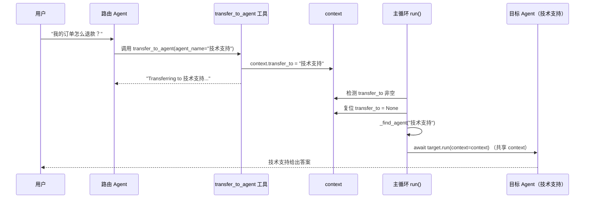
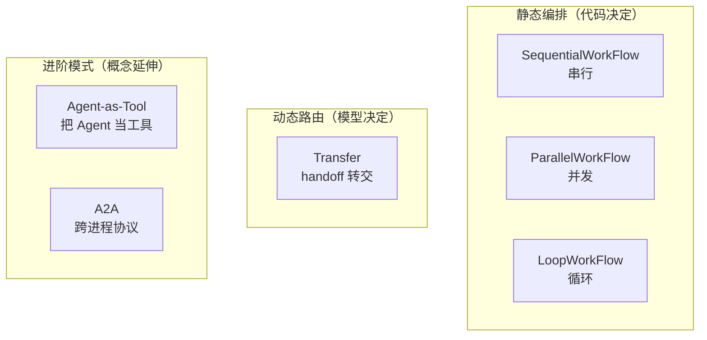

# 第 20 章 Transfer 与多智能体（里程碑）

> 本章源码精读模块：`orchestration/_transfer.py`（63 行）+ `agent.py` §transfer（L199~205、L752~786）+ `context.transfer_to`
> 这是本教程第二个里程碑章节（继第 8 章 ReAct 之后），完成「完整多智能体」能力

---

## 一、核心问题

第 19 章的三种工作流（Sequential/Parallel/Loop）能组织多个 Agent，但它们有一个共同的局限：**调度是「写死」的**——谁先谁后、跑几轮，都是代码预先决定的，Agent **自己无法根据任务内容动态决定「该把活交给谁」**。

想象一个客服系统：有「售前咨询」「技术支持」「投诉处理」三个专业 Agent。当用户问「我的订单怎么退款？」时，**不该由外部代码判断该交给谁**，而应该让一个「路由 Agent」根据问题内容，**主动把任务转交给「投诉处理」Agent**。

本章引入 **Transfer（转交）** 机制，实现**模型驱动的动态路由**：

- `create_transfer_tool` 动态生成一个 `transfer_to_agent` 工具；
- 当前 Agent 调用它，把 `context.transfer_to` 设为目标名；
- 主循环检测到 `transfer_to`，**递归地**把任务转交给目标 Agent。

**关键认知**：Transfer 是「编排」和「单智能体」的**粘合剂**——它让 Agent 在运行时自己决定「下一个接手的是谁」，这是从「静态编排」迈向「动态多智能体」的关键一跃。

---

## 二、学习目标

学完本章，你能：

1. 说清 Transfer 与第 19 章工作流的本质区别（模型动态路由 vs 代码静态调度）；
2. 写出 `create_transfer_tool`，理解「动态生成工具 + enum 约束 + first-write-wins」三重设计；
3. 理解 `context.transfer_to` 的转交闭环（设置 → 检测 → 复位 → 递归 run）；
4. 说清 `_get_transfer_targets` 的目标范围（子 + 父 + 兄弟）；
5. 理解 `_find_agent` 的整树查找机制；
6. 亲手跑一个「路由 Agent 转交给专业 Agent」的实验。

---

## 三、原理讲解

### 3.1 Transfer vs 工作流：动态 vs 静态

| 维度 | 第 19 章工作流 | Transfer |
|---|---|---|
| 调度者 | 外部代码（写死顺序/并发/循环） | 模型（运行时决定交给谁） |
| 决策依据 | 代码逻辑 | 任务内容 + 各 Agent 的 description |
| 灵活性 | 低（改需求要改代码） | 高（模型读 description 自适应） |
| 本质 | **静态编排** | **动态路由** |

**核心区别**：工作流是「**你**告诉 Agent 怎么协作」；Transfer 是「**模型**自己决定怎么协作」。后者更接近真实的多智能体——Agent 之间通过「转交」对话，而不是被外部指挥。

### 3.2 Transfer 的闭环机制

Transfer 靠 `context.transfer_to` 这个字段在 Agent 之间「接力」：

```text
当前 Agent（路由）
   ↓ 模型调用 transfer_to_agent(agent_name="技术支持")
   ↓ 工具内部：context.transfer_to = "技术支持"
   ↓ 主循环  检测到 transfer_to 非空
   ↓ 复位 context.transfer_to = None（防止死循环）
   ↓ _find_agent("技术支持") 找到目标
   ↓ await target.run(context=context)  ← 递归转交，共享同一 context
目标 Agent（技术支持）
   ↓ 继续用同一个 context 执行
```

**关键点**：转交时 `target.run(context=context)` **共享同一个 `context`**——目标 Agent 能看到完整的对话历史（谁问了什么、之前做了什么），这是「上下文连续」的保证。

### 3.3 Agent 树与转交边界

多智能体在本项目里组织成**树结构**：一个 Agent 可以有 `sub_agents`（子），也可以有 `parent`（父）。转交目标由 `_get_transfer_targets` 决定：

```text
        [父 Agent]
       /    |    \
  [自己] [兄弟A] [兄弟B]
    |
  [子1] [子2]
```

转交目标 = **子 agents** + **父 agent** + **兄弟 agents**（可选，`disallow_transfer_to_peers` 控制）。

`disallow_transfer_to_peers`（默认 `False`）是一个**安全开关**：设为 `True` 时，禁止转交给兄弟 Agent，只允许转交给「自己的子」或「父」。这在某些层级化场景里能防止「同级 Agent 互相踢皮球」。

---

## 四、配图

### 图 1：transfer_to_agent 转交时序（本章核心图）



**解读**：这条时序图是 Transfer 机制的完整闭环。注意「路由 Agent」和「主循环 run()」实为**同一对象**——本图把它们拆成两个 participant，是为了区分「**模型调工具**」（上半段）和「**循环检测转交**」（下半段）两个阶段。核心是**「工具只负责设置 `transfer_to`，主循环负责真正转交」**——工具是「信号」，转交是「动作」。二者分离，让转交逻辑集中在主循环一处，而非散落在工具里。

### 图 2：六种多智能体模式对比总览



**解读**：这张总览图定位了 Transfer 在「多智能体模式光谱」中的位置——它是从「静态编排」（第 19 章）通往「动态路由」的桥梁，再往上才是 Agent-as-Tool 和 A2A（跨进程）等进阶模式。本项目源码只实现了前四种（三种工作流 + Transfer），后两种仅作概念延伸。

---

## 五、源码精读

### 5.1 `create_transfer_tool`（`_transfer.py` L14~63）

```python
def create_transfer_tool(target_agents: list[Agent]) -> FunctionTool:
    if not target_agents:
        raise ValueError("Target_agents cannot be empty for transfer tool.")

    target_names = [agent.name for agent in target_agents]
    agent_descriptions = []
    for agent in target_agents:
        desc = agent.description
        if not desc and agent.instruction is not None:
            desc = agent.instruction[:100].replace("\n", " ")
        if not desc:
            desc = "No description available."
        if len(desc) > 100:
            desc = desc[:100] + "..."
        agent_descriptions.append(f" - {agent.name}: {desc}")

    agent_info = "\n".join(agent_descriptions)

    @tool(name="transfer_to_agent", description=f"""Transfers work to another agent.
Use this tool when the current question belongs to another agent's specialty.
Available agents:
{agent_info}
""")
    def transfer_to_agent(context: ExecutionContext, agent_name: str) -> str:
        if agent_name not in target_names:
            return f"Error: '{agent_name}' is not valid. Available: {target_names}"
        if context.transfer_to is None:
            context.transfer_to = agent_name
            return f"Transferring to {agent_name}..."
        else:
            return f"Transfer already requested to {context.transfer_to}"

    tool_definition = transfer_to_agent.tool_definition
    if tool_definition is None:
        raise RuntimeError("Transfer tool definition was not generated")
    tool_definition["function"]["parameters"]["properties"]["agent_name"]["enum"] = target_names
    return transfer_to_agent
```

五个要点：

1. **description 动态内嵌目标清单**（L21~33 构建清单 + L35~41 内嵌 description）：工具的 `description` 里列了「Available agents: 每个 agent 的 name + 一句话描述」。这让**模型在调用前就知道「有哪些专业 Agent、各自擅长什么」**，从而做出正确的路由决策。这是「用提示词引导模型路由」的落点。
2. **description 兜底链**（L23~30）：`description` 为空则取 `instruction` 前 100 字符，再空则用占位文案，超 100 字符截断加 `...`。保证 description 一定可用且不过长。
3. **first-write-wins**（L49~53）：`context.transfer_to` 只在 `None` 时才设置。一旦设置过，后续调用返回「已转交」提示，**不覆盖**——防止模型反复转交导致混乱。
4. **enum 约束**（L56~61）：直接改写 `tool_definition` 里 `agent_name` 参数的 schema，加上 `enum: target_names`。这样模型**只能从合法目标名里选**，从协议层杜绝「转交给不存在的 Agent」。
5. **`TYPE_CHECKING` 导入**（L10~11）：`Agent` 只在类型检查时导入。真实原因是本文件用 `from __future__ import annotations` 让注解**惰性化**（`Agent` 只出现在类型标注里，运行时不需要真对象），而 `_sequential/_parallel/_loop` 这些同包文件则是运行时直接 `from ..agent import Agent`。这种「类型标注用 `TYPE_CHECKING`、运行时真需要才 import」的区分，是避免不必要的运行时依赖的常见做法。

### 5.2 转交检测（`agent.py` L199~205）

```python
# Check for agent transfer
if context.transfer_to:
    target_name = context.transfer_to
    context.transfer_to = None          # 复位，防止死循环
    target = self._find_agent(target_name)
    if target:
        return await target.run(context=context, verbose=verbose)
```

三个要点：

1. **检测点**（L200）：在每轮 `step` 循环结束后检测 `context.transfer_to`。转交发生在「当前 Agent 已经产出了转交意图」之后。
2. **立即复位**（L202）：拿到目标名后立刻把 `transfer_to` 设回 `None`。**这是防死循环的关键**——否则目标 Agent 会再次看到 `transfer_to` 非空，无限转交。
3. **递归 run**（L205）：`await target.run(context=context)`——**共享同一个 context**，目标 Agent 直接接续当前对话。这是「上下文连续」的保证。

### 5.3 目标范围与查找（`agent.py` L752~786）

```python
def _get_transfer_targets(self) -> list[Agent]:
    targets: list[Agent] = []
    targets.extend(self.sub_agents)              # 1. 子
    if self.parent:                               # 2. 父
        targets.append(self.parent)
        if not self.disallow_transfer_to_peers:   # 3. 兄弟（可选）
            for sibling in self.parent.sub_agents:
                if sibling.name != self.name:
                    targets.append(sibling)
    return targets

def _find_agent(self, name: str) -> Agent | None:
    root = self
    while root.parent:
        root = root.parent                       # 回溯到根
    return root._find_in_subtree(name)           # 从根递归查找

def _find_in_subtree(self, name: str) -> Agent | None:
    if self.name == name:
        return self
    for sub in self.sub_agents:
        if found := sub._find_in_subtree(name):
            return found
    return None
```

要点：

1. **目标范围三层**（L757~768）：子 → 父 → 兄弟（兄弟受 `disallow_transfer_to_peers` 约束）。注意**不包括「子 Agent 的子」**（转交不跨代穿透）。
2. **`_find_agent` 回溯到根**（L774~776）：因为转交可能指向树中任意位置的 Agent，所以先回溯到根，再从根做全树递归查找。
3. **`_find_in_subtree` 用海象运算符**（L784）：`if found := sub._find_in_subtree(name)`——递归查找 + 提前返回，简洁的树遍历。

---

## 六、动手实验

参考示例： examples/transfer_to_agent.py

### 实验 1：观察 `create_transfer_tool` 生成的工具结构

```python
from scratchagent import Agent, create_transfer_tool

# 三个专业 Agent（仅演示 description 如何进入工具，无需 model）
support = Agent(name="技术支持", description="处理技术故障、接口报错")
billing = Agent(name="投诉处理", description="处理退款、投诉、纠纷")

tool = create_transfer_tool([support, billing])
# 观察工具 description 里内嵌了目标清单
print(tool.tool_definition["function"]["description"])
# 观察 agent_name 参数被加了 enum 约束
print(tool.tool_definition["function"]["parameters"]["properties"]["agent_name"]["enum"])
```

**观察点**：工具 description 里出现了「Available agents: 技术支持/投诉处理」的清单，且 `agent_name` 的 schema 被注入了 `["技术支持", "投诉处理"]` 的 enum——模型只能从这两个名字里选。

### 实验 2：验证 first-write-wins

```python
from scratchagent.context import ExecutionContext
from scratchagent import Agent, create_transfer_tool

support = Agent(name="技术支持", description="处理技术故障")
tool = create_transfer_tool([support])
ctx = ExecutionContext()

# 模拟两次转交
transfer_fn = tool.func
print(transfer_fn(ctx, "技术支持"))   # 第一次：Transferring to 技术支持...
print(transfer_fn(ctx, "技术支持"))   # 第二次：Transfer already requested to 技术支持
```

**观察点**：第二次调用返回「已转交」，`context.transfer_to` 不会被覆盖——这就是 first-write-wins 的效果。

### 实验 3：转交到不存在的 Agent

```python
from scratchagent.context import ExecutionContext
from scratchagent import Agent, create_transfer_tool

support = Agent(name="技术支持", description="处理技术故障")
tool = create_transfer_tool([support])
ctx = ExecutionContext()

print(tool.func(ctx, "财务"))  # Error: '财务' is not valid. Available: ['技术支持']
```

**观察点**：非法目标名返回错误提示，且**不会**设置 `context.transfer_to`。这是 enum 约束之外的又一层「运行时校验」防线。

---

## 七、本章自检

- [ ] 我能说清 Transfer（模型动态路由）与第 19 章工作流（代码静态调度）的本质区别。
- [ ] 我能写出 `create_transfer_tool`，理解「动态 description + enum 约束 + first-write-wins」三重设计。
- [ ] 我理解 `context.transfer_to` 的转交闭环：设置 → 检测 → **立即复位** → 递归 run。
- [ ] 我能说清为什么「立即复位 transfer_to」是防死循环的关键。
- [ ] 我理解转交目标的三层范围（子 + 父 + 兄弟），以及 `disallow_transfer_to_peers` 的作用。
- [ ] 我能说清 `_find_agent` 为什么先回溯到根再做全树查找。
