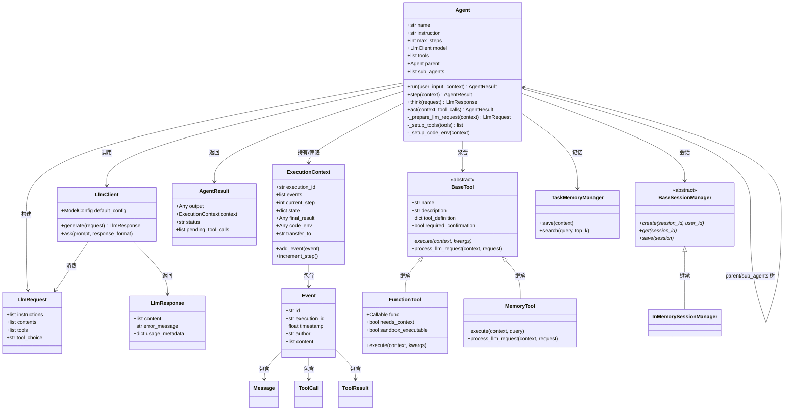
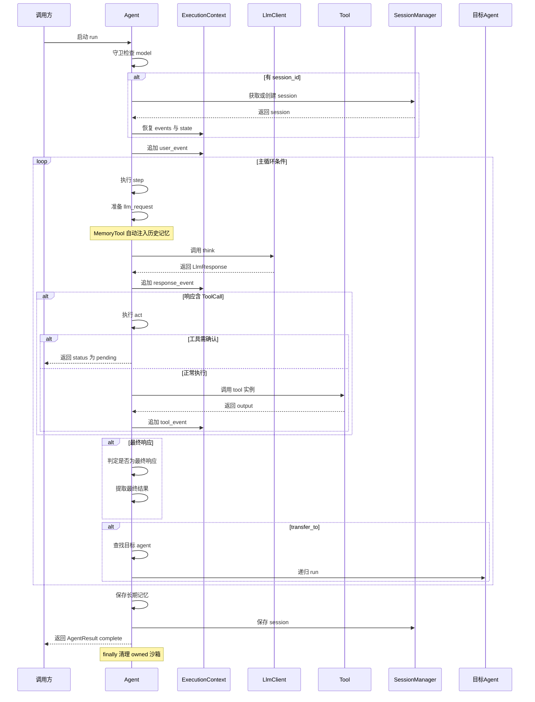
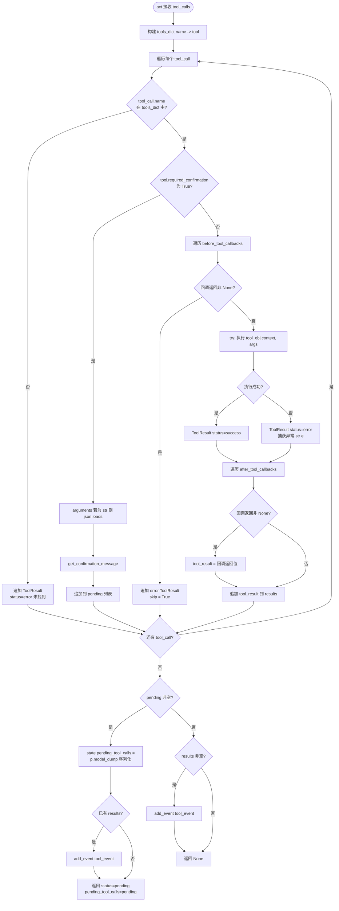
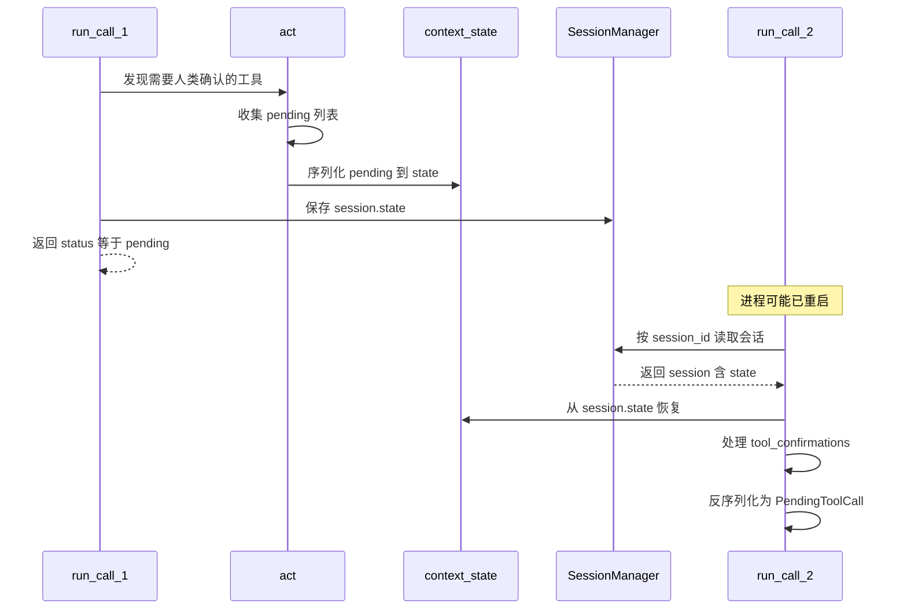

# scratchagent/agent.py 深度解读

> 文件路径：`D:/00_persist/agent-from-scratch/src/scratchagent/agent.py`
> 全文件共 **802 行**，是 `scratchagent` 框架的**核心入口模块**，定义了 `Agent` 类——一个具备工具调用能力、可循环执行的研究型智能体。

---

## 一、文件定位与整体结构

`agent.py` 是整个框架的"大脑"，它把散落在各子模块（`llm`、`memory`、`tools`、`sandbox`、`skills`）的能力**组装**成一个可运行的智能体。

文件结构分五个部分：

| 行区间     | 内容                   | 作用                     |
| ------- | -------------------- | ---------------------- |
| 1–57    | 模块文档 + 依赖导入          | 声明对子模块的依赖              |
| 60–111  | `Agent.__init__`     | 构造器，装配所有组件             |
| 116–235 | `run()`              | 主执行循环（核心入口）            |
| 237–288 | `step()` / `think()` | 单步"思考→行动"循环            |
| 289–416 | `act()`              | 工具执行 + 人类确认            |
| 418–502 | 请求构建 / 结果判定          | LLM 请求准备与最终结果提取        |
| 501–577 | `_setup_tools()`     | 工具装配（含结构化输出、沙箱工具、记忆工具） |
| 579–670 | 代码环境（E2B 沙箱）         | 沙箱创建、技能上传、工具注册         |
| 672–751 | 确认处理 / 日志            | human-in-the-loop 与日志  |
| 752–802 | 多智能体                 | transfer 转移、子智能体树管理    |

---

## 二、逐段代码解读

### 2.1 依赖导入（第 1–57 行）

```python
from __future__ import annotations        # 使所有类型注解延迟求值，支持 PEP 604 等新语法
import asyncio                            # 异步运行时
import json                               # 解析 LLM 返回的 JSON 参数
import logging                            # 日志
from collections.abc import Callable, Iterable   # 抽象基类，用于类型标注
from pathlib import Path, PurePosixPath   # 路径处理（沙箱内用 POSIX 路径）
from typing import Any
from pydantic import BaseModel            # 结构化输出类型

from .context import (
    AgentResult, ExecutionContext, PendingToolCall, ToolConfirmation,
)
from .llm import LlmClient, LlmRequest, LlmResponse
from .memory import BaseSessionManager, TaskMemoryManager
from .sandbox import close_e2b_sandbox, create_e2b_sandbox, register_sandbox_tools
from .skills import SkillInfo, discover_skills, generate_skills_prompt
from .tools import (
    BaseTool, FunctionTool, MemoryTool,
    base_e2b_tool, execute_python_in_e2b, format_tool_definition, upload_file_to_e2b,
)
from .types import ContentItem, Event, Message, ToolCall, ToolResult

logger = logging.getLogger(__name__)      # 以模块名 "scratchagent.agent" 作为 logger 名
```

**解读要点**：

- 导入清单精确反映了 `Agent` 类的职责边界：它依赖 `context`（状态）、`llm`（大模型）、`memory`（记忆）、`sandbox`（沙箱）、`skills`（技能）、`tools`（工具）、`types`（数据结构）。
- 全部使用**相对导入**（`.context` 等），说明这是标准包结构。
- `from __future__ import annotations` 让所有注解变成字符串，避免运行时求值带来的循环导入和性能开销。

---

### 2.2 `Agent` 类构造器（第 60–111 行）

```python
class Agent:
    def __init__(
        self,
        model: LlmClient | None = None,   # 模型客户端，默认 None（run 时守卫）
        tools: list[BaseTool] | None = None,
        instruction: str = "",             # 系统指令（system prompt）
        name: str = "agent",               # 智能体名字（多智能体用于寻址）
        max_steps: int = 10,               # 最大循环步数
        description: str = "",             # 描述（transfer 时展示）
        output_type: type[BaseModel] | None = None,   # 结构化输出 schema
        before_tool_callbacks: list[Callable] | None = None,
        after_tool_callbacks: list[Callable] | None = None,
        session_manager: BaseSessionManager | None = None,
        memory_manager: TaskMemoryManager | None = None,
        before_llm_callbacks: list[Callable] | None = None,
        code_execution: str | None = None, # 代码执行环境标识（"e2b"）
        skills_path: str | None = None,    # 技能目录
        sub_agents: list[Agent] | None = None,   # 子智能体（多智能体）
        disallow_transfer_to_peers: bool = False,
    ):
```

构造器内部的装配逻辑（第 86–111 行）：

```python
        self.model = model
        self.instruction = instruction
        self.name = name
        self.max_steps = max_steps
        self.description = description
        self.output_type = output_type
        self.output_tool_name: str | None = None   # 结构化输出时注入的工具名

        self.session_manager = session_manager
        self.memory_manager = memory_manager
        self.before_tool_callbacks = before_tool_callbacks or []
        self.after_tool_callbacks = after_tool_callbacks or []
        self.before_llm_callbacks = before_llm_callbacks or []
        self.code_execution = code_execution
        self.skills_path = skills_path

        self.sub_agents = sub_agents or []
        self.disallow_transfer_to_peers = disallow_transfer_to_peers
        self.parent: Agent | None = None   # 父智能体指针，构造树形结构

        self._sandbox_tools: list[FunctionTool] = []   # 标记为沙箱可执行的工具
        self.tools = self._setup_tools(tools or [])    # 核心：装配工具

        if self.sub_agents:                 # 校验并建立父子关系
            self._validate_and_set_sub_agents()
```

**解读要点**：

- 所有依赖都通过构造器**依赖注入**，而非在类内部硬编码，这是良好的可测试设计。
- `parent` 指针 + `sub_agents` 列表构成了一棵**智能体树**，为多智能体 transfer 提供结构基础（详见 2.10 节）。
- `self.tools = self._setup_tools(...)` 是构造器的关键步骤：它不只是简单赋值，而是会**自动追加**结构化输出工具、沙箱工具、记忆工具（见 2.8 节）。

---

### 2.3 主执行循环 `run()`（第 116–235 行）

这是整个框架**最核心的方法**。完整逻辑如下：

```python
    async def run(
        self,
        user_input: str | None = None,
        context: ExecutionContext | None = None,
        session_id: str | None = None,
        user_id: str | None = None,
        tool_confirmations: list[ToolConfirmation] | None = None,
        verbose: bool = False,
    ) -> AgentResult:
```

#### 步骤 1：守卫 + 会话恢复（126–132）

```python
        if self.model is None:
            raise ValueError("Agent requires a model to run.")

        session = None
        if session_id and self.session_manager:
            session = await self.session_manager.get_or_create(session_id, user_id)
```

- `model is None` 会直接抛异常——这是对 `__init__` 中 `model` 设为可选（`None`）的补偿性守卫，保证运行时一定有模型。
- 只有当**同时**提供 `session_id` 和 `session_manager` 时才做会话恢复。

#### 步骤 2：构建 / 复用执行上下文（134–144）

```python
        if context is None:
            context = ExecutionContext(
                session=session,
                session_manager=self.session_manager,
                memory_manager=self.memory_manager,
            )
            if session:
                context.events = list(session.events)   # 从会话恢复历史事件
                context.state = dict(session.state)     # 恢复状态（如 pending_tool_calls）
        elif context.memory_manager is None:
            context.memory_manager = self.memory_manager
```

**关键点**：`context` 可以在多个 `run` 调用、多个智能体之间**传递**。若外部传入 `context`，则复用其事件历史与状态，实现多智能体的上下文接力。

#### 步骤 3：搭建代码环境（147–148）

```python
        if self.code_execution == "e2b" and context.code_env is None:
            await self._setup_code_env(context)
```

- 在恢复待处理工具调用**之前**先搭沙箱，因为待确认的工具可能就是沙箱工具。

#### 步骤 4：处理工具确认（human-in-the-loop）（151–167）

```python
        if tool_confirmations:
            await self._process_confirmations(context, tool_confirmations)
            pending = [
                PendingToolCall.model_validate(item)
                for item in context.state.get("pending_tool_calls", [])
            ]
            if pending:   # 仍有未确认的工具，继续挂起
                if session and self.session_manager:
                    session.events = list(context.events)
                    session.state = dict(context.state)
                    await self.session_manager.save(session)
                return AgentResult(output=None, context=context,
                                   status="pending", pending_tool_calls=pending)
```

- 这是**人类介入循环（human-in-the-loop）**的实现：当工具需要确认时，`run()` 会中途返回 `status="pending"`，由外部（用户）决策后再次调用 `run()` 传入 `tool_confirmations`。

#### 步骤 5：追加用户输入事件（169–175）

```python
        if user_input:
            user_event = Event(
                execution_id=context.execution_id,
                author="user",
                content=[Message(role="user", content=user_input)],
            )
            context.add_event(user_event)
```

#### 步骤 6：主循环（181–207）

```python
        terminal = False
        try:
            while not context.final_result and context.current_step < self.max_steps:
                result = await self.step(context, verbose=verbose)

                # 若单步执行产生 pending（工具待确认），立即返回
                if result and result.status == "pending":
                    if session and self.session_manager:
                        session.events = list(context.events)
                        session.state = dict(context.state)
                        await self.session_manager.save(session)
                    return result

                # 检查最后事件是否为最终响应
                if context.events:
                    last_event = context.events[-1]
                    if self._is_final_response(last_event):
                        context.final_result = self._extract_final_result(last_event)

                # 处理多智能体转移
                if context.transfer_to:
                    target_name = context.transfer_to
                    context.transfer_to = None
                    target = self._find_agent(target_name)
                    if target:
                        return await target.run(context=context, verbose=verbose)
```

**循环退出条件**有两个（`while` 的条件）：
1. `context.final_result` 非空（已得到最终答案）；
2. `context.current_step >= self.max_steps`（达到步数上限）。

**循环体逻辑**：
1. 执行一步 `step()`（think → act）；
2. 若该步产生待确认的工具调用，立即中断返回 `pending`；
3. 检查最后一个事件是否为"最终响应"，是则提取最终结果；
4. 检查是否有 transfer 请求（多智能体），有则**递归**调用目标智能体的 `run()`。

#### 步骤 7：收尾（208–235）

```python
            terminal = True
            # 保存记忆（长期记忆，失败不致命）
            if self.memory_manager:
                try:
                    await self.memory_manager.save(context)
                except Exception as e:
                    logger.warning(f"Failed to save memory:{e}")

            # 保存会话
            if session and self.session_manager:
                session.events = list(context.events)
                session.state = dict(context.state)
                await self.session_manager.save(session)

            return AgentResult(output=context.final_result,
                               context=context, status="complete")
        finally:
            # 清理自己拥有的 E2B 沙箱
            if terminal and context.code_env_owned and context.code_env is not None:
                try:
                    await asyncio.to_thread(close_e2b_sandbox, context.code_env)
                except Exception as exc:
                    logger.warning("Failed to clean up owned E2B sandbox: %s", exc)
                finally:
                    context.code_env = None
                    context.code_env_owned = False
```

**设计亮点**：
- 记忆保存放在 `try/except` 中，失败仅记录 warning，**不阻断**主流程——记忆是"尽力而为"的辅助功能。
- `finally` 块用 `terminal` 标志区分"正常结束"和"中途返回 pending/transfer"两种情况：只有正常结束（`terminal=True`）且沙箱是自己创建的（`code_env_owned=True`）才清理，避免误关他人传入的沙箱。
- `asyncio.to_thread` 将阻塞的沙箱清理操作丢到线程池，不阻塞事件循环。

---

### 2.4 单步循环 `step()`（第 237–280 行）

```python
    async def step(self, context, verbose=False) -> AgentResult | None:
        # 1. 准备 LLM 请求
        llm_request = await self._prepare_llm_request(context)

        # 2. 运行 before-llm 回调（可能直接返回响应，跳过真实 LLM 调用）
        for callback in self.before_llm_callbacks:
            cb_result = callback(context, llm_request)
            if hasattr(cb_result, "__await__"):   # 兼容同步/异步回调
                cb_result = await cb_result
            if cb_result is not None:
                if not isinstance(cb_result, LlmResponse):
                    raise TypeError("before_llm_callbacks must return LlmResponse or None")
                llm_response = cb_result
                break
        else:
            llm_response = await self.think(llm_request)

        if verbose:
            self._log_response(llm_response)

        # 3. 记录 LLM 响应事件
        response_event = Event(
            execution_id=context.execution_id,
            author=self.name,
            content=llm_response.content,
        )
        context.add_event(response_event)

        # 4. 提取工具调用并执行
        tool_calls = [c for c in llm_response.content if isinstance(c, ToolCall)]
        if tool_calls:
            result = await self.act(context, tool_calls, verbose=verbose)
            if result and result.status == "pending":
                return result

        # 5. 步数 +1
        context.increment_step()
        return None
```

**解读要点**：

- `step()` 是标准的 **"思考→行动"（think-act）** 单步循环。
- `for...else` 语法巧妙：如果所有 `before_llm_callbacks` 都返回 `None`（即没有拦截），`else` 分支才真正调用 `think()` 请求 LLM。这允许**缓存、上下文优化器等回调直接提供响应**。
- 回调统一用 `hasattr(cb_result, "__await__")` 判断是否协程，从而**同时兼容同步和异步回调**——这是本项目反复使用的模式。

`think()`（282–287）极其简洁，就是调用模型客户端：

```python
    async def think(self, llm_request: LlmRequest) -> LlmResponse:
        model = self.model
        if model is None:
            raise ValueError("Agent requires a model to think.")
        return await model.generate(llm_request)
```

---

### 2.5 工具执行 `act()`（第 289–416 行）

```python
    async def act(self, context, tool_calls, verbose=False) -> AgentResult | None:
        tools_dict = {tool.name: tool for tool in self.tools}
        results: list[ToolResult] = []
        pending: list[PendingToolCall] = []
```

对每个工具调用（300–382）依次处理，逻辑分五个分支：

**分支 1：工具不存在（301–310）**

```python
            if tool_call.name not in tools_dict:
                results.append(ToolResult(
                    tool_call_id=tool_call.tool_call_id, name=tool_call.name,
                    status="error", content=[f"Tool '{tool_call.name}' not found"]))
                continue
```

**分支 2：需要人类确认（314–326）**

```python
            tool_obj = tools_dict[tool_call.name]
            if tool_obj.required_confirmation:
                arguments = tool_call.arguments
                if isinstance(arguments, str):
                    arguments = json.loads(arguments)
                message = tool_obj.get_confirmation_message(arguments)
                pending.append(PendingToolCall(tool_call=tool_call,
                                               confirmation_message=message))
                continue
```

**分支 3：before-tool 回调拦截（329–346）**

```python
            skip = False
            for callback in self.before_tool_callbacks:
                callback_result = callback(context, tool_call)
                if hasattr(callback_result, "__await__"):
                    callback_result = await callback_result
                if callback_result is not None:   # 回调返回非 None 表示拦截
                    results.append(ToolResult(
                        tool_call_id=tool_call.tool_call_id, name=tool_call.name,
                        status="error", content=[callback_result]))
                    skip = True
                    break
            if skip:
                continue
```

- 典型用例：`approval_callback` 对危险工具（`delete_file` 等）返回拒绝信息，从而阻止执行。

**分支 4：执行工具（349–367）**

```python
            try:
                arguments = tool_call.arguments
                if isinstance(arguments, str):
                    arguments = json.loads(arguments)
                output = await tool_obj(context, **arguments)
                tool_result = ToolResult(
                    tool_call_id=tool_call.tool_call_id, name=tool_call.name,
                    status="success", content=[output])
            except Exception as e:
                tool_result = ToolResult(
                    tool_call_id=tool_call.tool_call_id, name=tool_call.name,
                    status="error", content=[str(e)])
```

- 工具执行失败**不抛异常**，而是封装成 `status="error"` 的 `ToolResult` 回传给 LLM，让 LLM 自行决定下一步——这是 Agent 容错的关键设计。

**分支 5：after-tool 回调（370–375）**

```python
            for callback in self.after_tool_callbacks:
                callback_result = callback(context, tool_result)
                if hasattr(callback_result, "__await__"):
                    callback_result = await callback_result
                if callback_result is not None:
                    tool_result = callback_result
```

- 典型用例：`search_compressor` 对搜索结果做向量压缩，替换原始 `tool_result`。

**收尾（384–416）**：

```python
        if pending:   # 有待确认工具，挂起
            context.state["pending_tool_calls"] = [p.model_dump() for p in pending]
            if results:
                tool_event = Event(execution_id=context.execution_id,
                                   author=self.name, content=results)
                context.add_event(tool_event)
            return AgentResult(output=None, context=context,
                               status="pending", pending_tool_calls=pending)

        if results:   # 记录工具结果
            tool_event = Event(execution_id=context.execution_id,
                               author=self.name, content=results)
            context.add_event(tool_event)
        return None
```

- 待确认的工具调用会被**序列化到 `context.state["pending_tool_calls"]`**，这样即使进程中断、会话持久化后，也能在下一次 `run()` 时恢复。

---

### 2.6 请求构建 `_prepare_llm_request()`（第 418–466 行）

```python
    async def _prepare_llm_request(self, context) -> LlmRequest:
        # 1. 扁平化所有事件内容
        flat_contents: list[ContentItem] = []
        for event in context.events:
            flat_contents.extend(event.content)

        # 2. 组装指令
        instructions: list[str] = []
        if self.instruction:
            instructions.append(self.instruction)
        sandbox_prompt = self._get_sandbox_tools_prompt()
        if sandbox_prompt:
            instructions.append(sandbox_prompt)

        # 3. 技能提示
        if self.skills_path:
            try:
                skills = discover_skills(self.skills_path)
                skills_prompt = generate_skills_prompt(skills)
                if skills_prompt:
                    instructions.append(skills_prompt)
            except Exception:
                pass   # 技能发现失败不影响主流程

        # 4. 筛选暴露给 LLM 的工具（无 tool_definition 的不暴露）
        llm_tools = [t for t in self.tools if t.tool_definition is not None]

        # 5. 确定 tool_choice 策略
        if self.output_tool_name:
            tool_choice = "required"   # 结构化输出：强制调用 final_answer 工具
        elif llm_tools:
            tool_choice = "auto"
        else:
            tool_choice = None

        request = LlmRequest(
            instructions=instructions, contents=flat_contents,
            tools=llm_tools, tool_choice=tool_choice)

        # 6. 让工具钩子修改请求（关键：触发 MemoryTool 的自动记忆注入）
        for tool_obj in self.tools:
            await tool_obj.process_llm_request(context, request)

        return request
```

**解读要点**：

- 第 463–464 行的 `process_llm_request` 循环是整个框架的**隐藏亮点**：`MemoryTool` 覆写了该方法，会在请求发出前自动把相似的历史经验注入到 instructions 中，实现"记忆自动增强"，而 `Agent` 本身对此无感知。
- 工具暴露策略：`tool_definition is None` 的工具（如 `MemoryTool`）**不暴露给 LLM**，仅做自动注入。

---

### 2.7 最终结果判定（第 468–499 行）

```python
    def _is_final_response(self, event: Event) -> bool:
        if self.output_tool_name:   # 结构化输出模式：必须找到成功的 final_answer 工具结果
            for item in event.content:
                if (isinstance(item, ToolResult)
                        and item.name == self.output_tool_name
                        and item.status == "success"):
                    return True
            return False

        # 普通模式：既无工具调用也无工具结果，即纯文本回复
        has_tool_calls = any(isinstance(c, ToolCall) for c in event.content)
        has_tool_results = any(isinstance(c, ToolResult) for c in event.content)
        return not has_tool_calls and not has_tool_results
```

`_extract_final_result()`（484–499）：

```python
    def _extract_final_result(self, event: Event) -> Any:
        if self.output_tool_name:   # 结构化输出：返回 final_answer 工具的第一个内容
            for item in event.content:
                if (isinstance(item, ToolResult)
                        and item.name == self.output_tool_name
                        and item.status == "success" and item.content):
                    return item.content[0]

        for item in event.content:   # 普通模式：返回 assistant 文本
            if isinstance(item, Message) and item.role == "assistant":
                return item.content
        return None
```

**核心机制**：框架通过"让 LLM 调用一个名为 `final_answer` 的工具"来实现结构化输出——当 LLM 成功调用该工具时，即视为给出最终答案。这是对"函数调用"机制的一种巧妙的语义借用。

---

### 2.8 工具装配 `_setup_tools()`（第 501–577 行）

```python
    def _setup_tools(self, tools) -> list[BaseTool]:
        prepared_tools: list[BaseTool] = []
        for candidate in tools:
            if isinstance(candidate, BaseTool):
                prepared_tools.append(candidate)
            elif callable(candidate):
                prepared_tools.append(FunctionTool(candidate))   # 裸函数 → 包装
            else:
                raise TypeError(...)
```

**步骤 1：结构化输出工具（518–547）**——若设置了 `output_type`，自动注入 `final_answer` 工具：

```python
        if self.output_type is not None:
            output_schema = self.output_type.model_json_schema()
            output_schema.pop("title", None)
            output_schema.pop("$defs", None)
            tool_definition = format_tool_definition(
                "final_answer",
                "Return the final structured answer matching the required schema.",
                {"type": "object",
                 "properties": {"output": output_schema},
                 "required": ["output"]})

            captured_type = self.output_type
            def _parse_output(output):
                if isinstance(output, dict):
                    return captured_type.model_validate(output)
                return output

            final_answer_tool = FunctionTool(
                func=_parse_output, name="final_answer",
                description="Return the final structured answer...",
                tool_definition=tool_definition)
            prepared_tools.append(final_answer_tool)
            self.output_tool_name = "final_answer"
```

- `_parse_output` 用**闭包捕获 `captured_type`**，在工具执行时把 LLM 返回的 dict 校验成 `output_type` 实例。

**步骤 2：沙箱工具校验（549–564）**

```python
        invalid_sandbox_tools: list[str] = []
        for tool in prepared_tools:
            if not isinstance(tool, FunctionTool) or not tool.sandbox_executable:
                continue
            if self.code_execution != "e2b":   # 标记为沙箱可执行但未启用沙箱 → 报错
                invalid_sandbox_tools.append(tool.name)
                continue
            self._sandbox_tools.append(tool)
        if invalid_sandbox_tools:
            raise ValueError(...)
```

**步骤 3：注入代码执行工具（566–570）**

```python
        if self.code_execution == "e2b":
            prepared_tools.extend(
                [execute_python_in_e2b, base_e2b_tool, upload_file_to_e2b])
```

**步骤 4：注入记忆工具（572–576）**

```python
        if self.memory_manager and not any(
                tool.name == "recall_memory" for tool in prepared_tools):
            prepared_tools.append(MemoryTool())
```

- 若调用方已手动注册 `recall_memory`，则不重复添加。

**总结**：`_setup_tools` 把"用户传入工具 + 结构化输出工具 + 沙箱工具 + 记忆工具"四类工具**统一装配**成一个工具列表。

---

### 2.9 代码执行环境（E2B 沙箱）（第 579–670 行）

#### 2.9.1 显式准备环境 `prepare_code_env()`（579–597）

```python
    async def prepare_code_env(self, context, *, caller_owns_sandbox=False):
        if self.code_execution != "e2b":
            raise ValueError(...)
        if context.code_env is not None:
            raise ValueError(...)
        await self._setup_code_env(context)
        context.code_env_owned = not caller_owns_sandbox
```

- 供需要"在 `run()` 结束后检查沙箱文件"的调用方使用，调用方自行负责清理。

#### 2.9.2 内部搭建 `_setup_code_env()`（599–616）

```python
    async def _setup_code_env(self, context) -> None:
        sandbox = await asyncio.to_thread(create_e2b_sandbox)
        try:
            await asyncio.to_thread(
                register_sandbox_tools, sandbox, self._sandbox_tools)
            if self.skills_path:
                skills = discover_skills(self.skills_path)
                await asyncio.to_thread(self._upload_skills, sandbox, skills)
        except Exception:
            try:
                await asyncio.to_thread(close_e2b_sandbox, sandbox)
            except Exception as exc:
                logger.warning("Failed to clean up E2B sandbox: %s", exc)
            raise
        context.code_env = sandbox
        context.code_env_owned = True
```

- 沙箱创建、工具注册、技能上传都通过 `asyncio.to_thread` 丢到线程池，因为 E2B SDK 是阻塞调用。
- 任一步失败都会**回滚关闭沙箱**再重新抛出，避免资源泄漏。

#### 2.9.3 技能上传 `_upload_skills()`（618–653）

```python
    def _upload_skills(self, sandbox, skills: list[SkillInfo]) -> None:
        for skill in skills:
            skill_name = skill.name
            # 安全校验：拒绝非法技能名（含路径分隔符、".." 等，防目录穿越）
            if (not skill_name or skill_name in {".", ".."}
                    or "/" in skill_name or "\\" in skill_name
                    or PurePosixPath(skill_name).name != skill_name):
                raise ValueError(f"Invalid skill name: {skill_name!r}")

            skill_root = Path(skill.path).resolve()
            if not skill_root.is_dir():
                raise ValueError(...)

            remote_root = PurePosixPath("/home/user/skills") / skill_name
            for source_path in sorted(skill_root.rglob("*")):
                if source_path.is_symlink() or not source_path.is_file():
                    continue   # 跳过符号链接和非文件，防安全风险
                relative_path = source_path.relative_to(skill_root)
                remote_path = remote_root.joinpath(*relative_path.parts)
                try:
                    payload = source_path.read_bytes()
                    sandbox.files.write(str(remote_path), payload)
                except Exception as exc:
                    raise RuntimeError(...) from exc
```

**安全设计**：技能名校验 + 跳过符号链接，防止**路径穿越攻击**和**恶意符号链接**进入沙箱。

---

### 2.10 多智能体转移（第 752–802 行）

#### 2.10.1 转移目标枚举 `_get_transfer_targets()`（753–771）

```python
    def _get_transfer_targets(self) -> list[Agent]:
        targets: list[Agent] = []
        targets.extend(self.sub_agents)   # 1. 子智能体
        if self.parent:
            targets.append(self.parent)    # 2. 父智能体
            if not self.disallow_transfer_to_peers:
                for sibling in self.parent.sub_agents:   # 3. 兄弟智能体（可选）
                    if sibling.name != self.name:
                        targets.append(sibling)
        return targets
```

- 转移范围是：**子 + 父 + 兄弟**（兄弟可被 `disallow_transfer_to_peers` 禁用）。

#### 2.10.2 按名字查找 `_find_agent()`（773–787）

```python
    def _find_agent(self, name: str) -> Agent | None:
        root = self
        while root.parent:      # 先回溯到根节点
            root = root.parent
        return root._find_in_subtree(name)

    def _find_in_subtree(self, name: str) -> Agent | None:
        if self.name == name:
            return self
        for sub in self.sub_agents:   # 递归深度优先查找
            if found := sub._find_in_subtree(name):
                return found
        return None
```

- `_find_agent` 先上升到**根智能体**，再从根递归向下查找，保证能跨子树寻址。

#### 2.10.3 校验子智能体 `_validate_and_set_sub_agents()`（789–802）

```python
    def _validate_and_set_sub_agents(self) -> None:
        seen_names = set()
        for sub in self.sub_agents:
            if sub.name in seen_names:
                raise ValueError(f"Duplicate sub-agent name: '{sub.name}'")
            seen_names.add(sub.name)
            if sub.parent is not None:
                raise ValueError(f"Agent '{sub.name}' already has parent '{sub.parent.name}'")
            sub.parent = self
```

- 保证：同一父下**名字唯一**、每个智能体**最多一个父**——维持树结构合法性。

---

## 三、类关系图




---

## 四、执行时序图

下图展示一次典型 `run()` 调用中"think → act → 工具执行 → 最终响应"的完整时序：




---

### 4.1 Agent 逻辑判断图

下图完整呈现 `run()` 主循环与 `step()`/`act()` 内部的所有判断分支与跳转关系：

```mermaid
flowchart TD
    Start([调用 run user_input, context, session_id]) --> GuardModel{model 是否为 None?}

    GuardModel -- 是 --> Err1[抛 ValueError<br/>Agent requires a model to run]
    GuardModel -- 否 --> ChkSession{session_id 且<br/>session_manager 存在?}

    ChkSession -- 是 --> GetSession[get_or_create session_id, user_id]
    GetSession --> RestoreCtx[构建/复用 ExecutionContext<br/>恢复 events 与 state]
    ChkSession -- 否 --> BuildCtx[构建 ExecutionContext<br/>沿用传入 context 或新建]
    BuildCtx --> RestoreCtx

    RestoreCtx --> ChkE2B{code_execution == e2b<br/>且 code_env 为空?}
    ChkE2B -- 是 --> SetupSandbox[_setup_code_env 创建沙箱<br/>注册工具/上传技能]
    SetupSandbox --> ChkConfirm
    ChkE2B -- 否 --> ChkConfirm{存在 tool_confirmations?}

    ChkConfirm -- 是 --> ProcessConfirm[_process_confirmations]
    ProcessConfirm --> ChkStillPending{处理完仍存在<br/>pending_tool_calls?}
    ChkStillPending -- 是 --> SavePending[save session] --> RetPending[返回 status=pending]
    ChkStillPending -- 否 --> ChkUserInput
    ChkConfirm -- 否 --> ChkUserInput{存在 user_input?}

    ChkUserInput -- 是 --> AddUserEvent[add_event user_event]
    AddUserEvent --> LoopStart
    ChkUserInput -- 否 --> LoopStart

    LoopStart{while 循环条件:<br/>not final_result 且<br/>current_step < max_steps}

    LoopStart -- 条件满足 --> Step[step context<br/>prepare_llm_request + think]
    Step --> ChkStepPending{step 返回<br/>status == pending?}
    ChkStepPending -- 是 --> SavePending2[save session] --> RetPending2[返回 result]
    ChkStepPending -- 否 --> ChkFinal{最后一个 event<br/>是最终响应?}

    ChkFinal -- 是 --> Extract[_extract_final_result<br/>写入 context.final_result]
    Extract --> ChkTransfer
    ChkFinal -- 否 --> ChkTransfer

    ChkTransfer{context.transfer_to<br/>非空?}
    ChkTransfer -- 是 --> FindAgent[_find_agent target_name]
    FindAgent --> ChkTarget{找到目标 agent?}
    ChkTarget -- 是 --> RecRun[递归 target.run context]
    ChkTarget -- 否 --> LoopBack
    ChkTransfer -- 否 --> LoopBack[回到循环起点]

    LoopBack --> LoopStart

    LoopStart -- 条件不满足 --> Terminate[terminal = True]

    Terminate --> SaveMem{存在 memory_manager?}
    SaveMem -- 是 --> TryMem[try: memory_manager.save context<br/>except: 记 warning]
    TryMem --> SaveSess
    SaveMem -- 否 --> SaveSess

    SaveSess{session 且 session_manager?}
    SaveSess -- 是 --> Persist[保存 events 与 state 到 session]
    Persist --> RetComplete
    SaveSess -- 否 --> RetComplete[返回 AgentResult<br/>output=final_result<br/>status=complete]

    RetComplete --> Finally{terminal 且 code_env_owned<br/>且 code_env 非空?}
    Finally -- 是 --> Cleanup[close_e2b_sandbox<br/>置空 code_env]
    Cleanup --> End([结束])
    Finally -- 否 --> End
```



### 4.2 act() 工具执行分支图

下图细化 `act()` 内部对**单个工具调用**的处理分支（对应第 289–416 行）：




---

## 四·五、human-in-the-loop 序列化机制详解

> 设计总结第 3 点提到"中断点可序列化到 `context.state` 后跨进程恢复"。本节专门展开这一机制的完整实现细节。

### 核心结论

序列化**不是**框架自研的序列化器，而是**借用了 Pydantic 的 `model_dump()` / `model_validate()` 能力**，把 `PendingToolCall` 对象转成"可 JSON 化的纯字典"，塞进 `ExecutionContext.state` 这个普通 dict 里。而 `state` 会随 `Session` 一起被 `SessionManager.save()` 持久化。

关键点：**`state` 是 Agent 框架与外部持久化层之间的"数据契约"**——框架只保证存进去的是可序列化数据，真正的落盘（数据库/文件/Redis）由 `BaseSessionManager` 的实现方决定。

### 1. 序列化的触发点：`act()` 中挂起

当工具需要确认时（`agent.py` 第 384–401 行）：

```python
if pending:
    # Store pending calls in context state
    context.state["pending_tool_calls"] = [p.model_dump() for p in pending]  # ← 序列化
    ...
    return AgentResult(..., status="pending", pending_tool_calls=pending)
```

`p.model_dump()` 是 Pydantic 的序列化方法。`pending` 里的每个元素是 `PendingToolCall`（`context.py` 第 47–51 行）：

```python
class PendingToolCall(BaseModel):
    tool_call: "ToolCall"          # 嵌套的 Pydantic 模型
    confirmation_message: str
```

因为 `PendingToolCall` 继承 `BaseModel`，`model_dump()` 会**递归**把嵌套的 `ToolCall`（也是 `BaseModel`，`types.py` 第 21–27 行）一并转成 dict：

```python
class ToolCall(BaseModel):
    type: Literal["tool_call"] = "tool_call"
    tool_call_id: str
    name: str
    arguments: str | dict[str, Any]   # 注意：可能是 str 或 dict
```

**序列化后的 `state` 结构**大致如下：

```json
{
  "pending_tool_calls": [
    {
      "tool_call": {
        "type": "tool_call",
        "tool_call_id": "call_abc123",
        "name": "delete_file",
        "arguments": {"path": "/tmp/x.txt"}
      },
      "confirmation_message": "The Agent wants to execute 'delete_file'..."
    }
  ]
}
```

### 2. 跨进程恢复的三条路径

#### 路径 1：会话恢复（进程重启后重新加载）

`run()` 第 129–132 行，通过 `session_manager` 拿到持久化的 `Session`，再把它的 `state` 复制回 context：

```python
session = await self.session_manager.get_or_create(session_id, user_id)
...
context = ExecutionContext(session=session, ...)
context.events = list(session.events)   # 恢复事件
context.state = dict(session.state)     # ← 恢复 state（含 pending_tool_calls）
```

`Session`（`memory/_session.py` 第 12–20 行）本身持有一个 `state: dict[str, Any]`，随 `save()` 一起落盘：

```python
class Session(BaseModel):
    session_id: str
    events: list[Event]
    state: dict[str, Any] = Field(default_factory=dict)
    ...
```

#### 路径 2：反序列化回对象

当调用方再次调用 `run(tool_confirmations=[...])` 时，`run()` 第 151–156 行把 dict **还原**成 `PendingToolCall` 对象：

```python
if tool_confirmations:
    await self._process_confirmations(context, tool_confirmations)
    pending = [
        PendingToolCall.model_validate(item)      # ← 反序列化
        for item in context.state.get("pending_tool_calls", [])
    ]
```

`model_validate()` 是 Pydantic 的反序列化方法，dict → `PendingToolCall`（含嵌套的 `ToolCall`）。

#### 路径 3：确认处理中的再次序列化

`_process_confirmations()`（`agent.py` 第 672–742 行）处理完确认后，会**再次**把剩余的待确认项写回 `state`（第 733–736 行）：

```python
if remaining:
    context.state["pending_tool_calls"] = [p.model_dump() for p in remaining]
else:
    context.state.pop("pending_tool_calls", None)
    # 全部处理完则记录工具事件
```

### 3. 为什么能跨进程？——数据契约的三个前提

1. **`state` 是纯数据容器**（`dict[str, Any]`），不是持有对象引用。框架存入的 `model_dump()` 结果全是 `str/int/dict/list` 等 JSON 原生类型。

2. **Pydantic 模型双向可转换**：`BaseModel` 天然支持 `model_dump()` ↔ `model_validate()` 的对称转换，且嵌套模型递归处理，无需手写序列化逻辑。

3. **持久化边界由 SessionManager 定义**。框架本身只操作内存里的 `state`，真正的"跨进程"依赖实现方。

### 4. 一个需要指出的边界（准确性问题）

> "跨进程恢复"是**有条件**的。

**框架提供的机制**：

- `state` 里的数据是可序列化的（Pydantic `model_dump` 保证）；
- `Session` 通过 `SessionManager.save()` 持久化。

**框架没有提供的**：

- 一个真正落盘（数据库/文件）的 `SessionManager` 实现。内置的 `InMemorySessionManager` 只在内存中，进程结束数据就没了。

**结论**：要真正实现"跨进程恢复"，需要自定义一个 `BaseSessionManager` 子类，把 `Session`（含 `state`）序列化到 Redis / 数据库 / 文件。框架已铺好路——`state` 是干净的 JSON 数据，`Session` 是 `BaseModel`，可直接 `session.model_dump_json()` 存库，下次 `Session.model_validate_json(...)` 读回。

### 5. 完整的序列化/恢复链路图




### 6. `ToolConfirmation`：这套机制的对称参与者

用户侧的回填对象 `ToolConfirmation`（`context.py` 第 65–70 行）同样是 `BaseModel`：

```python
class ToolConfirmation(BaseModel):
    tool_call_id: str
    approved: bool
    modified_arguments: dict | None = None   # 用户可修改参数后再批准
```

它通过 `tool_call_id` 与挂起的 `PendingToolCall` 对应，`approved=True` 时用 `modified_arguments`（若有）覆盖原参数再执行（`agent.py` 第 697–722 行）。

这体现了整套设计的对称性：**所有跨边界的对象都是 Pydantic 模型，序列化/反序列化由 Pydantic 统一承担**。

---

## 五、关键设计总结

1. **think-act 循环**：`run()` 外层循环驱动 `step()`，`step()` 内部执行一次"思考→行动"，通过 `context.final_result` 和 `current_step` 双条件控制终止。

2. **事件溯源（Event Sourcing）**：所有交互（用户消息、LLM 响应、工具调用、工具结果）都追加为 `Event` 存入 `context.events`，既支持会话持久化，也支持多智能体上下文接力。

3. **human-in-the-loop**：通过 `required_confirmation` + `PendingToolCall` + `ToolConfirmation` 实现工具执行前的人工审批，中断点可序列化到 `context.state` 后跨进程恢复。（序列化机制详见「四·五、human-in-the-loop 序列化机制详解」章节）

4. **回调插拔机制**：`before_llm_callbacks` / `before_tool_callbacks` / `after_tool_callbacks` 三类回调，统一兼容同步/异步，用于上下文优化、危险工具审批、搜索结果压缩等横切关注点。

5. **容错设计**：工具执行异常被捕获为 `status="error"` 回传给 LLM；记忆保存失败不阻断主流程；沙箱搭建失败自动回滚清理。

6. **结构化输出**：通过注入 `final_answer` 工具 + `tool_choice="required"` 借用函数调用机制实现结构化输出，`_parse_output` 负责 Pydantic 校验。

7. **多智能体树**：`parent` + `sub_agents` 构成树，支持子/父/兄弟间的 transfer 转移，配合 `_find_agent` 的根回溯查找实现跨子树寻址。

8. **安全边界**：技能上传时对技能名做路径穿越校验、跳过符号链接；沙箱清理通过 `code_env_owned` 标志区分归属。
